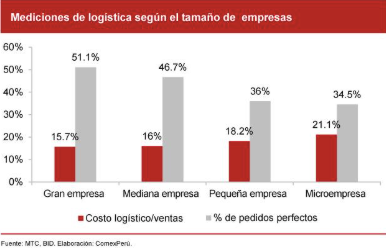
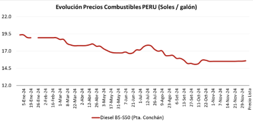
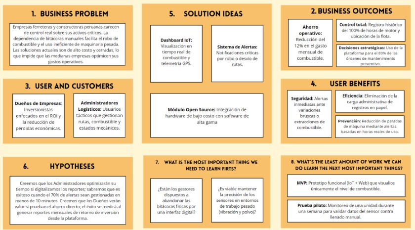

# Capítulo I: Introducción

## 1.1. Startup Profile

### 1.1.1. Descripción de la Startup

InfraTrack es un equipo formado por estudiantes de Ingeniería de Software de la Universidad Peruana de Ciencias Aplicadas (UPC), unidos por el compromiso de crear soluciones tecnológicas de código abierto que impulsen la eficiencia operativa en sectores industriales de alta demanda.

**¿Por qué nace InfraTrack?**
- Surge como respuesta a la falta de precisión y transparencia en el control de activos críticos, con el objetivo de transformar la logística tradicional en un ecosistema conectado y basado en datos reales.

**¿Qué propone la startup?**
- Ante la incertidumbre en los costos operativos y el mantenimiento de flotas, InfraTrack desarrolla una plataforma web de monitoreo inteligente, especialmente diseñada para el sector ferretero y de construcción.
- El sistema integra tecnología IoT para capturar datos precisos en tiempo real: ubicación por GPS, horas de uso y consumo de combustible mediante sensores integrados.
- Esta solución permite:
  - Centralizar reportes y generar alertas automáticas.
  - Facilitar la toma de decisiones estratégicas.
  - Garantizar la optimización del rendimiento logístico de cada vehículo.

A continuación, nuestra misión, visión y valores:

<table style="border-collapse:collapse; width:100%;">
  <tr>
    <th style="background-color:#c00000; color:white; text-align:center; border:2px solid #fff;">Misión</th>
    <th style="background-color:#c00000; color:white; text-align:center; border:2px solid #fff;">Visión</th>
    <th style="background-color:#c00000; color:white; text-align:center; border:2px solid #fff;">Valores</th>
  </tr>
  <tr>
    <td style="text-align:justify; vertical-align:top; border:2px solid #fff;">
      Nuestra misión en <b>“InfraTrack”</b> es optimizar la gestión de maquinaria pesada y vehículos de carga mediante una plataforma de monitoreo inteligente, confiable y de código abierto que brinde transparencia y control absoluto sobre los activos críticos.
    </td>
    <td style="text-align:justify; vertical-align:top; border:2px solid #fff;">
      Nuestra visión en <b>“InfraTrack”</b> es consolidarnos como la startup referente en soluciones tecnológicas para la gestión logística en el sector construcción de Latinoamérica, destacando por nuestro enfoque en IoT y solidez técnica.
    </td>
    <td style="vertical-align:top; border:2px solid #fff;">
      <ul>
        <li>Transparencia</li>
        <li>Responsabilidad</li>
        <li>Innovación</li>
        <li>Compromiso</li>
        <li>Ética Profesional</li>
      </ul>
    </td>
  </tr>
</table>

### 1.1.2. Perfiles de integrantes del equipo

<table style="border-collapse:collapse; width:100%;">
  <tr>
    <th style="background-color:#c00000; color:white; text-align:center; border:2px solid #fff;">Código</th>
    <th style="background-color:#c00000; color:white; text-align:center; border:2px solid #fff;">Descripción</th>
    <th style="background-color:#c00000; color:white; text-align:center; border:2px solid #fff;">Foto</th>
  </tr>
  <tr>
    <td style="border:2px solid #fff; text-align:center; vertical-align:top;">U202319440</td>
    <td style="border:2px solid #fff; text-align:justify; vertical-align:top;">
      <b>Dhilsen Armil Mallqui Vilca</b> Estudiante de Ingeniería de Software en la UPC. Me apasiona el desarrollo de soluciones digitales de alto impacto que optimizan la eficiencia operativa mediante tecnologías emergentes. En InfraTrack, aplico mis conocimientos en ingeniería para automatizar el control de activos y el monitoreo IoT, transformando la gestión logística en el sector industrial con un enfoque en la rentabilidad y la innovación tecnológica.
    </td>
    <td style="border:2px solid #fff; text-align:center; vertical-align:top;">
      
    </td>
  </tr>
  <tr>
    <td style="border:2px solid #fff; text-align:center; vertical-align:top;">U202316049</td>
    <td style="border:2px solid #fff; text-align:justify; vertical-align:top;">
      <b>Jefferson Bayron Morales Yapuchura</b> Estudiante de Ingeniería de Software con un enfoque proactivo en la resolución de problemas y el desarrollo de soluciones escalables. Me defino como un entusiasta del aprendizaje continuo, lo que me permite navegar con agilidad entre lenguajes y frameworks emergentes.
    </td>
    <td style="border:2px solid #fff; text-align:center; vertical-align:top;">
      
    </td>
  </tr>
  <tr>
    <td style="border:2px solid #fff; text-align:center; vertical-align:top;">U20201B441</td>
    <td style="border:2px solid #fff; text-align:justify; vertical-align:top;">
      <b>Aldair Joaquin Ramos Aguirre</b> Estudiante de Ingeniería de Software en la Universidad Peruana de Ciencias Aplicadas (UPC), con conocimientos en programación en Python, Java y C++. Interesado en aplicar mis conocimientos académicos en este proyecto,, contribuyendo al desarrollo de soluciones tecnológicas y fortaleciendo mis habilidades profesionales.
    </td>
    <td style="border:2px solid #fff; text-align:center; vertical-align:top;">
      
    </td>
  </tr>
</table>

## 1.2. Solution Profile

InfraTrack es una plataforma integral de monitoreo técnico que combina hardware y software para brindar visibilidad total sobre la operación de maquinaria pesada en el sector ferretero y de construcción.

**¿Cómo funciona?**
- Se despliegan nodos IoT que recolectan datos en tiempo real desde sensores de nivel de combustible y módulos GPS instalados en cada unidad.
- Estos datos se envían a una base de datos centralizada mediante protocolos de comunicación ligeros y seguros.
- Un dashboard administrativo procesa y visualiza la información, permitiendo:
  - Ver el estado y ubicación de cada unidad.
  - Emitir notificaciones críticas ante variaciones bruscas de combustible (posibles robos).
  - Calcular el tiempo de vida útil de los componentes y programar mantenimientos preventivos.

**Ventajas clave:**
- Al ser una herramienta de código abierto, InfraTrack garantiza una implementación de bajo costo, accesible incluso para pequeñas y medianas empresas.
- Permite digitalizar inventarios móviles y operaciones logísticas sin depender de licencias privadas ni soluciones comerciales costosas.
- Facilita la toma de decisiones estratégicas basadas en datos reales, optimizando la eficiencia operativa y reduciendo riesgos financieros.

### 1.2.1. Antecedentes y problemática

Para la elaboración de esta descripción se utiliza la técnica de The 5 ‘W’s y 2 ‘H’s:

**What (¿Qué?)**
- El sector construcción en el Perú enfrenta graves deficiencias operativas por la falta de monitoreo en maquinaria pesada. El problema central es la opacidad en el uso de activos, donde el robo de combustible y el ralentí excesivo generan pérdidas masivas.
- Se estima que el combustible representa hasta el 40 % de los costos operativos totales en transporte y maquinaria (Asociación Automotriz del Perú, 2023).
- La ausencia de datos en tiempo real provoca una planificación logística ineficiente, un desgaste prematuro de las unidades por falta de mantenimiento preventivo y una reducción directa en los márgenes de utilidad de las empresas ferreteras y constructoras.

**Why (¿Por qué?)**
- Esto persiste debido al alto costo de los sistemas comerciales cerrados y la informalidad en el control de flotas.
- En el Perú, aproximadamente el 70 % de las mype del sector construcción aún utilizan bitácoras de papel para registrar el uso de sus unidades (INEI, 2022).
- La brecha tecnológica en pequeñas ferreterías industriales impide que estas compitan con grandes consorcios.
- Predomina la cultura de "mantenimiento correctivo" (reparar solo cuando se malogra) por falta de indicadores de uso real.

**Who (¿Quién?)**
- Los principales afectados son los dueños de empresas ferreteras y gestores de flotas que ven sus presupuestos excedidos por consumos no justificados.
- Según CAPECO (2023), la eficiencia en el uso de maquinaria es crítica para la competitividad de las medianas empresas constructoras frente a grandes proyectos de inversión pública y privada.
- Se requiere el involucramiento de ingenieros de software, operadores de maquinaria (quienes deben interactuar con el sistema) y analistas de datos que transformen la información de los sensores en decisiones estratégicas.

**Where (¿Dónde?)**
- La problemática es crítica en proyectos de infraestructura en provincias, donde el control presencial es difícil.
- El Perú ocupa el puesto 83 de 160 en el Índice de Desempeño Logístico, evidenciando fallas estructurales en el seguimiento de activos de transporte a nivel nacional (World Bank, 2023).
- En zonas remotas, la falta de conectividad dificulta el seguimiento por GPS convencional, lo que hace necesarios sistemas que puedan almacenar datos localmente y sincronizarlos eficientemente para evitar la pérdida de trazabilidad del combustible.

**When (¿Cuándo?)**
- La digitalización es urgente debido a la volatilidad del precio del combustible, que en el último año mostró variaciones de hasta el 25 % (Petroperú, 2024).
- Si no se actúa ahora, la falta de adopción de tecnologías IoT dejará a las empresas locales fuera del mercado, incapaces de cumplir con los estándares internacionales de eficiencia energética y reducción de huella de carbono que las grandes obras ya están exigiendo.

**How (¿Cómo?)**
- Actualmente, la gestión depende de la confianza en el operador o medidores analógicos manipulables.
- InfraTrack propone usar sensores IoT para capturar datos de ubicación y consumo en tiempo real.
- La digitalización podría reducir los tiempos de inactividad de la maquinaria en un 15 % mediante alertas basadas en horas de motor reales.
- Al ser una plataforma open source, InfraTrack reduce las barreras de entrada económicas, permitiendo que incluso pequeñas flotas accedan a telemetría avanzada sin pagar licencias mensuales exorbitantes de software propietario.

**How much (¿Cuánto?)**
- El mal manejo de flota y el robo de combustible representan una pérdida de entre el 10 % y 15 % del presupuesto de un proyecto (GERENS, 2023).
- A nivel nacional, la ineficiencia logística le resta al Perú entre el 2 % y 3 % de su PBI potencial (Consejo Nacional de Competitividad, 2021).
- La implementación de sistemas de monitoreo inteligente permite un retorno de inversión (ROI) rápido, ya que el ahorro de solo un 5 % en el consumo de combustible suele cubrir el costo de implementación tecnológica en menos de seis meses.

  
Gráfico 1: Estructura de costos operativos en el área de Logística

  

  
Gráfico 2: Variación porcentual del precio del combustible en el mercado local.

  

### 1.2.2. Lean UX Process

#### 1.2.2.1. Lean UX Problem Statements

**Dominio del Problema**

El proyecto se sitúa en la intersección de la logística industrial y el Internet de las Cosas (IoT), enfocado en el monitoreo técnico de activos críticos para el sector ferretero y de construcción en el Perú. Actualmente, existe una opacidad crítica en la gestión de maquinaria pesada debido a la dependencia de procesos manuales y sistemas analógicos. Esta falta de visibilidad en tiempo real sobre variables como el consumo de combustible y la ubicación satelital genera ineficiencias operativas y brechas de seguridad, impactando negativamente en la rentabilidad y competitividad de las empresas.

**Alcance del Problema**

La problemática es de alcance nacional, afectando especialmente a empresas con operaciones descentralizadas en zonas de difícil acceso. En estos lugares, la ausencia de trazabilidad exacta del rendimiento de las unidades incrementa los costos variables y provoca desgaste prematuro de los activos por la incapacidad de ejecutar un mantenimiento basado en el uso real.

**Segmentos de Cliente (Actores Involucrados)**
- <b>Dueños de Empresas Ferreteras:</b> Perfiles estratégicos cuyo foco es la optimización del ROI (retorno de inversión) y la preservación de la vida útil de sus activos costosos.
- <b>Administradores Logísticos:</b> Perfiles tácticos encargados de la continuidad operativa, el cumplimiento de cronogramas y la mitigación de riesgos como el robo de combustible o desviaciones de ruta.

**Puntos de Dolor (Pain Points)**

<table style="border-collapse:collapse; width:100%;">
  <tr>
    <th style="background-color:#c00000; color:white; text-align:center; border:2px solid #fff;">Dueños de Empresas Ferreteras</th>
    <th style="background-color:#c00000; color:white; text-align:center; border:2px solid #fff;">Administradores Logísticos</th>
  </tr>
  <tr>
    <td style="vertical-align:top; border:2px solid #fff;">
      <ul>
        <li><b>Pérdidas económicas invisibles:</b> Fugas de capital debido al robo de combustible ("ordeño") que no pueden ser probadas sin datos exactos.</li>
        <li><b>Baja rentabilidad de los activos:</b> Incertidumbre sobre si la maquinaria está siendo utilizada al 100% de su capacidad o si hay tiempos muertos excesivos.</li>
        <li><b>Riesgo de inversión:</b> Desgaste acelerado de maquinaria costosa por falta de una cultura de mantenimiento basada en datos.</li>
      </ul>
    </td>
    <td style="vertical-align:top; border:2px solid #fff;">
      <ul>
        <li><b>Falta de datos en tiempo real:</b> Dependencia de reportes manuales entregados por los operarios que suelen contener errores o datos manipulados.</li>
        <li><b>Dificultad en la toma de decisiones:</b> Imposibilidad de optimizar rutas o asignar tareas de forma eficiente sin conocer la ubicación exacta y el nivel de combustible actual.</li>
        <li><b>Gestión reactiva:</b> Se enteran de las fallas o falta de combustible cuando la unidad ya se detuvo, generando retrasos en la cadena de suministro o en la obra.</li>
      </ul>
    </td>
  </tr>
</table>

**Brecha Detectada (Gap)**

Se identifica la ausencia de una solución digital de código abierto (Open Source) que integre hardware IoT de bajo costo con una plataforma web de alta gama. Esta brecha tecnológica margina a las medianas empresas, impidiéndoles acceder a la telemetría avanzada que actualmente solo está disponible en sistemas comerciales cerrados de alto costo.

#### 1.2.2.2. Lean UX Assumptions

**Business Outcomes (Resultados de Negocio)**

Nuestra propuesta parte de la premisa de que la ineficiencia logística en el sector ferretero y de construcción no se debe únicamente a una mala gestión del personal, sino principalmente a la ausencia de una infraestructura tecnológica capaz de capturar y procesar datos operativos en tiempo real. InfraTrack busca transformar la gestión de activos críticos mediante el uso de sensores IoT, monitoreo GPS y automatización de procesos logísticos.

Los principales indicadores de impacto esperados son los siguientes:

- <b>Optimización Energética:</b> Reducir entre un 10 % y 15 % el gasto mensual de combustible mediante la detección temprana de consumos irregulares y tiempos de ralentí excesivo.
- <b>Reducción de Pérdidas Operativas:</b> Disminuir las pérdidas asociadas al robo de combustible y uso indebido de maquinaria pesada.
- <b>Trazabilidad de Activos:</b> Reducir la diferencia entre el combustible facturado y el consumo real registrado por el sistema a un margen de error menor al 2 %.
- <b>Continuidad Operativa:</b> Incrementar la disponibilidad mecánica de la flota mediante un modelo de mantenimiento preventivo basado en horas reales de motor.
- <b>Incremento de la Rentabilidad:</b> Mejorar la eficiencia operativa y el retorno de inversión (ROI) de las empresas mediante decisiones basadas en datos reales y automatizados.
- <b>Digitalización Logística:</b> Reducir la dependencia de procesos manuales y bitácoras físicas en la administración de flotas y maquinaria.

---

**Customer Behavior Outcomes (Resultados de Comportamiento del Usuario)**

Esperamos que los administradores logísticos y dueños de empresas adopten nuevos comportamientos operativos dentro de la plataforma InfraTrack, permitiendo optimizar la toma de decisiones y mejorar el control de activos críticos.

Los principales comportamientos esperados son:

- <b>Monitorear</b> diariamente el estado operativo y ubicación de las unidades desde el dashboard centralizado.
- <b>Revisar</b> alertas automáticas relacionadas con variaciones bruscas de combustible o desvíos de ruta.
- <b>Programar</b> mantenimientos preventivos utilizando métricas reales de horas de motor.
- <b>Analizar</b> reportes históricos para optimizar rutas y rendimiento de maquinaria.
- <b>Reducir</b> el uso de bitácoras manuales migrando hacia registros digitales automatizados.
- <b>Supervisar</b> múltiples activos simultáneamente desde una sola interfaz web.
- <b>Detectar</b> patrones de ralentí excesivo para disminuir el desperdicio energético.
- <b>Tomar</b> decisiones logísticas basadas en telemetría en tiempo real.
- <b>Consultar</b> información de consumo y ubicación antes de asignar tareas o despachos.
- <b>Utilizar</b> reportes técnicos para justificar futuras inversiones o ampliaciones de flota.

**User Outcomes (Resultados para el Usuario)**

El usuario principal, el administrador logístico, encontrará en InfraTrack un ecosistema digital de monitoreo que se integra naturalmente en su flujo de trabajo diario, especialmente durante la planificación de despachos, supervisión remota de obras y control de maquinaria pesada.

El valor fundamental que recibirá el usuario será la tranquilidad operativa y la capacidad de tomar decisiones inmediatas basadas en datos reales, eliminando la dependencia de reportes manuales susceptibles a errores o manipulaciones.

La plataforma proporcionará:

- Visualización centralizada de ubicación GPS y estado operativo de las unidades.
- Alertas automáticas ante descensos anómalos de combustible.
- Indicadores de mantenimiento preventivo basados en horas reales de uso.
- Reportes históricos y métricas comparativas para análisis estratégico.
- Supervisión simultánea de múltiples activos críticos desde cualquier ubicación.

La interacción del sistema estará diseñada bajo un enfoque proactivo: el usuario no tendrá que buscar información manualmente, sino que el sistema emitirá notificaciones críticas en tiempo real para facilitar la respuesta inmediata ante incidentes operativos.

La interfaz priorizará:

- Legibilidad de datos técnicos complejos.
- Jerarquía visual clara.
- Diseño minimalista y profesional.
- Navegación intuitiva orientada a la toma rápida de decisiones.

---

**Impactos y Riesgos de Diseño**

Reconocemos que existe un riesgo inicial de resistencia tecnológica por parte del personal operativo, especialmente en entornos acostumbrados al uso de registros manuales y supervisión tradicional.

Sin embargo, consideramos que el impacto estratégico de InfraTrack supera ampliamente estos riesgos, debido a que la plataforma permitirá:

- Incrementar la competitividad tecnológica de las empresas.
- Facilitar el cumplimiento de estándares modernos de control logístico.
- Mejorar la transparencia operativa en proyectos de infraestructura.
- Reducir pérdidas económicas asociadas a ineficiencias y malas prácticas.
- Optimizar la sostenibilidad energética mediante reducción de consumo innecesario de combustible.

Adicionalmente, proyectamos que la optimización de rutas, reducción del ralentí y mantenimiento preventivo contribuirán a disminuir la huella de carbono de la flota, alineando la rentabilidad empresarial con objetivos de sostenibilidad ambiental y eficiencia energética.

#### 1.2.2.3. Lean UX Hypothesis Statements (Box 6)

*   **Hipótesis 1: Control de combustible y detección de mermas**
    *   **Creemos que lograremos** una reducción del 15 % en los costos operativos mensuales por pérdida de combustible.
    *   **Si** los Administradores Logísticos.
    *   **Obtienen** la capacidad de detectar extracciones no autorizadas en tiempo real.
    *   **Con** un sistema de alertas automáticas conectado a sensores de nivel en los tanques de la maquinaria.

*   **Hipótesis 2: Optimización del mantenimiento preventivo**
    *   **Creemos que lograremos** un incremento del 20 % en la disponibilidad mecánica de la flota.
    *   **Si** los Gestores de Flota.
    *   **Obtienen** la seguridad de programar mantenimientos basados en el uso real del motor sin margen de error humano.
    *   **Con** un módulo de telemetría que registra y reporta horas-motor exactas vía IoT.

*   **Hipótesis 3: Reducción del Ralentí (Motor encendido sin trabajar)**
    *   **Creemos que lograremos** una disminución del 10 % en el consumo innecesario de energía y emisiones de CO2.
    *   **Si** los Administradores Logísticos.
    *   **Obtienen** visibilidad sobre los tiempos de inactividad excesiva de cada operador.
    *   **Con** un reporte analítico de "Tiempos de Ralentí" generado por la plataforma InfraTrack.

*   **Hipótesis 4: Trazabilidad y Seguridad de Activos**
    *   **Creemos que lograremos** reducir a cero las desviaciones de ruta no autorizadas y el uso indebido de maquinaria.
    *   **Si** los Dueños de Empresas Constructoras.
    *   **Obtienen** control geográfico total y remoto sobre sus activos críticos en zonas de obra.
    *   **Con** un dashboard de monitoreo GPS con geocercas y rastreo en vivo.

*   **Hipótesis 5: Toma de decisiones basada en rentabilidad**
    *   **Creemos que lograremos** mejorar el retorno de inversión (ROI) por activo en un 12 % anual.
    *   **Si** los Dueños de Ferreterías y Constructoras.
    *   **Obtienen** reportes consolidados que contrastan el combustible facturado frente al consumo real.
    *   **Con** una plataforma centralizada de analítica logística de código abierto.

*   **Hipótesis 6: Digitalización y transparencia operativa**
    *   **Creemos que lograremos** eliminar el 90 % de los errores de registro en las bitácoras de campo.
    *   **Si** los Supervisores Logísticos.
    *   **Obtienen** acceso inmediato a datos históricos sin depender de reportes manuales en papel.
    *   **Con** registros digitales automatizados sincronizados directamente desde los nodos IoT.

#### 1.2.2.4. Lean UX Canvas

  
  

## 1.3. Segmentos objetivo

### 1.3.1. Segmento 1: Dueños de Empresas Ferreterías y Constructoras

**Descripción:**
Este segmento está compuesto por inversionistas y propietarios de medianas empresas (MYPE) dedicadas a la comercialización de materiales y ejecución de obras civiles. Su principal interés radica en la rentabilidad del negocio y el control exhaustivo de sus activos de capital.

**Perfil Demográfico:**
- **Edad:** 35 a 60 años
- **Ubicación:** Zonas comerciales e industriales a nivel nacional
- **Nivel Socioeconómico:** B y C
- **Ocupación:** Empresarios, gerentes generales y socios fundadores

**Comportamiento Estratégico:**
Priorizan la reducción de costos operativos y la protección de su patrimonio contra pérdidas por robos o mermas de combustible. Buscan herramientas que ofrezcan un retorno de inversión (ROI) claro y medible.

**Sustento Estadístico:**
En el sector construcción, el combustible representa hasta el 40 % de los costos operativos totales. El mal manejo de flota y el robo de combustible ("ordeño") pueden generar una pérdida directa de entre el 10 % y 15 % del presupuesto total de un proyecto.

---

### 1.3.2. Segmento 2: Administradores Logísticos y Gestores de Flota

**Descripción:**
Este segmento incluye a los profesionales responsables de la operatividad diaria de la maquinaria. Son el nexo entre el campo y la gerencia, encargándose de que los recursos se utilicen de manera eficiente.

**Perfil Demográfico:**
- **Edad:** 25 a 45 años
- **Ubicación:** Principalmente en bases logísticas y sedes de proyectos de infraestructura
- **Nivel Socioeconómico:** B y C
- **Ocupación:** Ingenieros industriales, bachilleres en logística o técnicos en administración de flotas

**Comportamiento Operativo:**
Son usuarios intensivos de herramientas de gestión y hojas de cálculo. Enfrentan la presión de cumplir cronogramas y sufren por la falta de veracidad en los reportes manuales entregados por los operarios.

**Sustento Estadístico:**
Aproximadamente el 70 % de las MYPE del sector construcción en el Perú aún dependen de bitácoras de papel para el registro de uso de sus unidades. La implementación de sistemas de monitoreo digital puede reducir los tiempos de inactividad técnica en un 15 % mediante el uso de alertas basadas en telemetría real.
