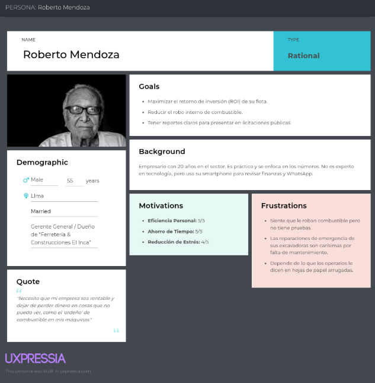
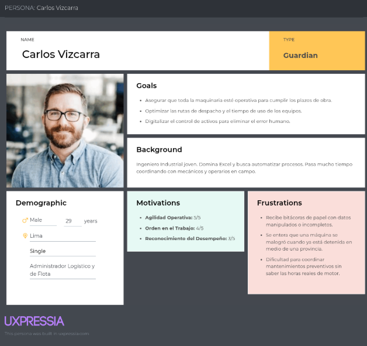
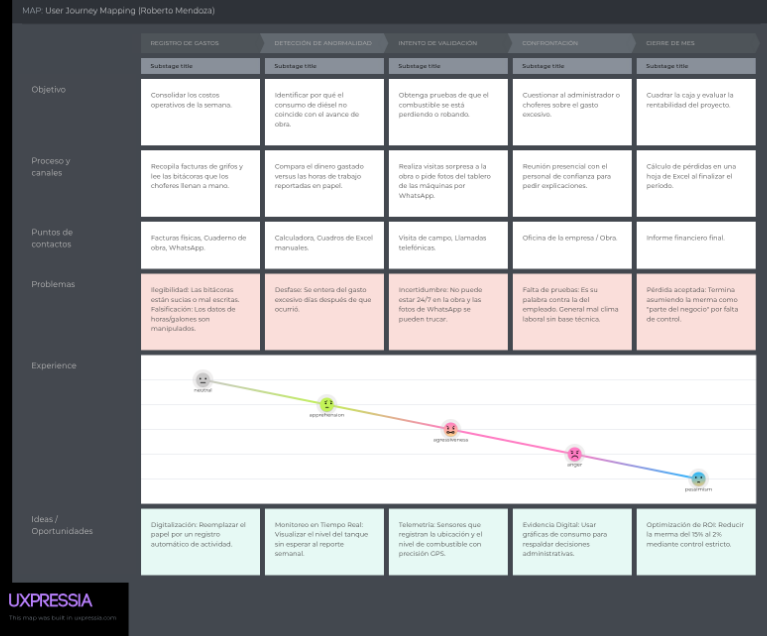
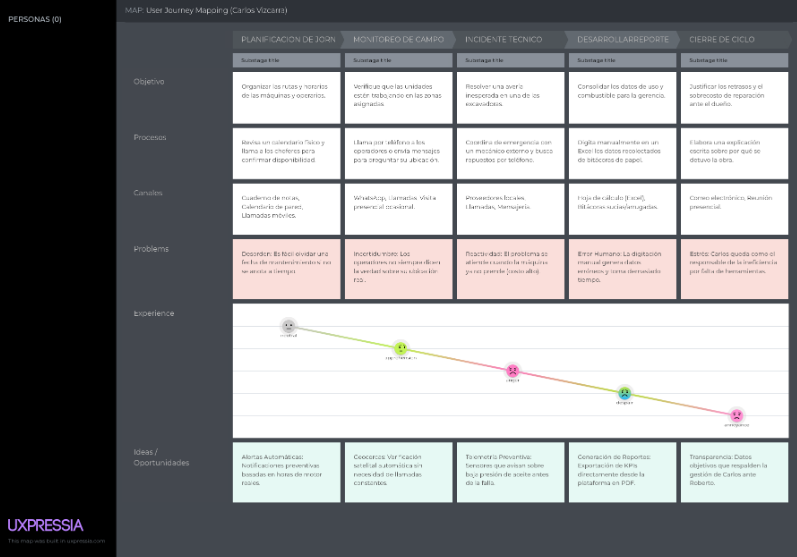
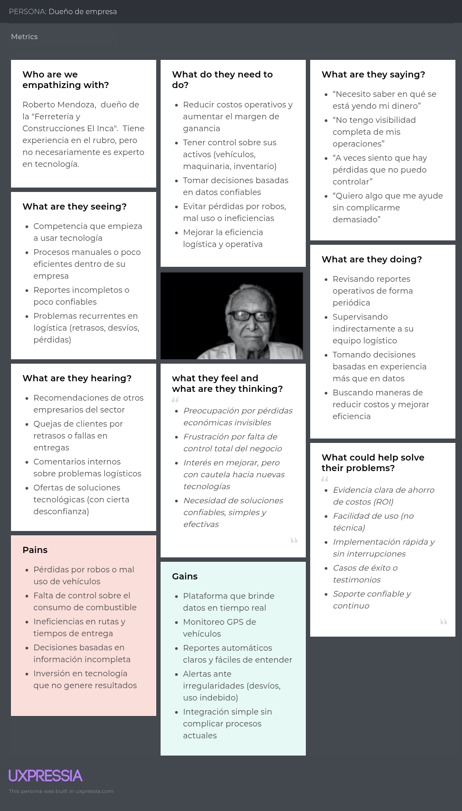
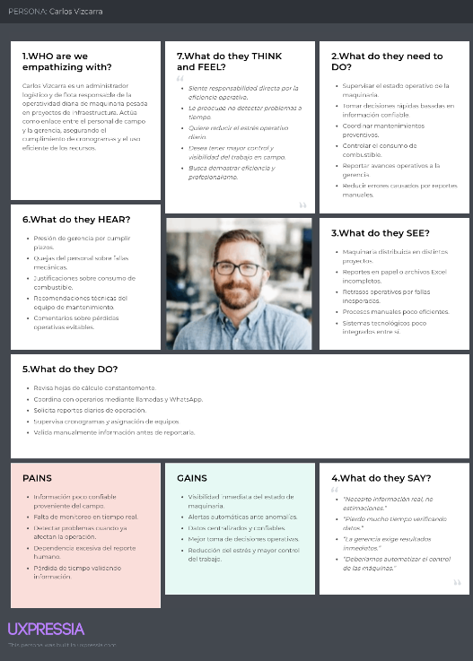

# Capítulo II: Requirements Elicitation & Analysis

## 2.1. Competidores

### 2.1.1. Análisis competitivo

<table style="width: 100%; border-collapse: collapse; font-family: Arial, sans-serif; box-shadow: 0 2px 8px rgba(0,0,0,0.1);">
	<thead>
		<tr style="background-color: #2c3e50; color: white;">
			<th colspan="6" style="padding: 16px; font-size: 16px; font-weight: bold; text-align: left; border: 1px solid #34495e;">Competitive Analysis Landscape</th>
		</tr>
		<tr style="background-color: #ecf0f1;">
			<th style="padding: 12px; text-align: left; border: 1px solid #bdc3c7; font-weight: bold; color: #2c3e50;">¿Por qué llevar a cabo este análisis?</th>
			<td colspan="5" style="padding: 12px; border: 1px solid #bdc3c7; color: #2c3e50; line-height: 1.5;">Este análisis nos permite identificar fortalezas, debilidades y oportunidades estratégicas de InfraTrack frente a soluciones existentes de monitoreo de flotas y maquinaria pesada, con el fin de definir una ventaja competitiva sostenible basada en tecnología open source, bajo costo operativo y especialización en control de combustible.</td>
		</tr>
		<tr style="background-color: #34495e;">
			<th style="padding: 12px; border: 1px solid #2c3e50; color: white;"></th>
			<th style="padding: 12px; border: 1px solid #2c3e50; color: white;"></th>
			<th style="padding: 12px; border: 1px solid #2c3e50; color: white; font-weight: bold; text-align: center;">InfraTrack</th>
			<th style="padding: 12px; border: 1px solid #2c3e50; color: white; font-weight: bold; text-align: center;">Samsara</th>
			<th style="padding: 12px; border: 1px solid #2c3e50; color: white; font-weight: bold; text-align: center;">Geotab</th>
			<th style="padding: 12px; border: 1px solid #2c3e50; color: white; font-weight: bold; text-align: center;">Tenna</th>
		</tr>
	</thead>
	<tbody>
		<tr style="background-color: #fff;">
			<th rowspan="2" style="padding: 12px; border: 1px solid #bdc3c7; background-color: #e8f4f8; font-weight: bold; color: #2c3e50; vertical-align: top;">Perfil</th>
			<th style="padding: 12px; border: 1px solid #bdc3c7; background-color: #f8f9fa; font-weight: bold; color: #2c3e50; text-align: left; font-size: 13px;">Overview</th>
			<td style="padding: 12px; border: 1px solid #bdc3c7; color: #2c3e50; font-size: 13px;">Plataforma open source IoT para monitoreo de maquinaria pesada, combustible y GPS con dashboard centralizado.</td>
			<td style="padding: 12px; border: 1px solid #bdc3c7; color: #2c3e50; font-size: 13px;">SaaS empresarial de monitoreo de flotas basadas en IoT y analytics.</td>
			<td style="padding: 12px; border: 1px solid #bdc3c7; color: #2c3e50; font-size: 13px;">Sistema telemático global para gestión de vehículos y análisis operacional.</td>
			<td style="padding: 12px; border: 1px solid #bdc3c7; color: #2c3e50; font-size: 13px;">Plataforma especializada en tracking y gestión de equipos de construcción.</td>
		</tr>
		<tr style="background-color: #fff;">
			<th style="padding: 12px; border: 1px solid #bdc3c7; background-color: #f8f9fa; font-weight: bold; color: #2c3e50; text-align: left; font-size: 13px;">Ventaja competitiva</th>
			<td style="padding: 12px; border: 1px solid #bdc3c7; color: #2c3e50; font-size: 13px;">Bajo costo, open source, personalizable y orientado a detección de robo de combustible.</td>
			<td style="padding: 12px; border: 1px solid #bdc3c7; color: #2c3e50; font-size: 13px;">Alta escalabilidad y analítica avanzada basada en datos masivos.</td>
			<td style="padding: 12px; border: 1px solid #bdc3c7; color: #2c3e50; font-size: 13px;">Ecosistema consolidado e integración con múltiples fabricantes.</td>
			<td style="padding: 12px; border: 1px solid #bdc3c7; color: #2c3e50; font-size: 13px;">Especialización directa en maquinaria pesada.</td>
		</tr>
		<tr style="background-color: #fff;">
			<th rowspan="2" style="padding: 12px; border: 1px solid #bdc3c7; background-color: #e8f8f0; font-weight: bold; color: #2c3e50; vertical-align: top;">Perfil de Marketing</th>
			<th style="padding: 12px; border: 1px solid #bdc3c7; background-color: #f8f9fa; font-weight: bold; color: #2c3e50; text-align: left; font-size: 13px;">Mercado objetivo</th>
			<td style="padding: 12px; border: 1px solid #bdc3c7; color: #2c3e50; font-size: 13px;">Empresas ferreteras y pymes con maquinaria pesada.</td>
			<td style="padding: 12px; border: 1px solid #bdc3c7; color: #2c3e50; font-size: 13px;">Grandes empresas logísticas y transporte.</td>
			<td style="padding: 12px; border: 1px solid #bdc3c7; color: #2c3e50; font-size: 13px;">Corporaciones con grandes flotas vehiculares.</td>
			<td style="padding: 12px; border: 1px solid #bdc3c7; color: #2c3e50; font-size: 13px;">Empresas de construcción y minería.</td>
		</tr>
		<tr style="background-color: #fff;">
			<th style="padding: 12px; border: 1px solid #bdc3c7; background-color: #f8f9fa; font-weight: bold; color: #2c3e50; text-align: left; font-size: 13px;">Estrategias</th>
			<td style="padding: 12px; border: 1px solid #bdc3c7; color: #2c3e50; font-size: 13px;">Adopción open source, bajo costo e implementación flexible.</td>
			<td style="padding: 12px; border: 1px solid #bdc3c7; color: #2c3e50; font-size: 13px;">Modelo SaaS corporativo con ventas B2B.</td>
			<td style="padding: 12px; border: 1px solid #bdc3c7; color: #2c3e50; font-size: 13px;">Alianzas estratégicas y partners certificados.</td>
			<td style="padding: 12px; border: 1px solid #bdc3c7; color: #2c3e50; font-size: 13px;">Marketing sectorial especializado.</td>
		</tr>
		<tr style="background-color: #fff;">
			<th rowspan="3" style="padding: 12px; border: 1px solid #bdc3c7; background-color: #f0e8f8; font-weight: bold; color: #2c3e50; vertical-align: top;">Perfil de Producto</th>
			<th style="padding: 12px; border: 1px solid #bdc3c7; background-color: #f8f9fa; font-weight: bold; color: #2c3e50; text-align: left; font-size: 13px;">Productos & Servicios</th>
			<td style="padding: 12px; border: 1px solid #bdc3c7; color: #2c3e50; font-size: 13px;">Sensores IoT, monitoreo GPS, alertas de combustible, dashboard web.</td>
			<td style="padding: 12px; border: 1px solid #bdc3c7; color: #2c3e50; font-size: 13px;">Tracking vehicular, cámaras, seguridad y analítica AI.</td>
			<td style="padding: 12px; border: 1px solid #bdc3c7; color: #2c3e50; font-size: 13px;">Gestión de flotas, mantenimiento predictivo y telemetría.</td>
			<td style="padding: 12px; border: 1px solid #bdc3c7; color: #2c3e50; font-size: 13px;">Seguimiento de activos, mantenimiento y localización de maquinaria.</td>
		</tr>
		<tr style="background-color: #fff;">
			<th style="padding: 12px; border: 1px solid #bdc3c7; background-color: #f8f9fa; font-weight: bold; color: #2c3e50; text-align: left; font-size: 13px;">Precios & Costos</th>
			<td style="padding: 12px; border: 1px solid #bdc3c7; color: #2c3e50; font-size: 13px;">Bajo costo.</td>
			<td style="padding: 12px; border: 1px solid #bdc3c7; color: #2c3e50; font-size: 13px;">Alto costo por suscripción mensual.</td>
			<td style="padding: 12px; border: 1px solid #bdc3c7; color: #2c3e50; font-size: 13px;">Costos medios-altos + hardware certificado.</td>
			<td style="padding: 12px; border: 1px solid #bdc3c7; color: #2c3e50; font-size: 13px;">Costos medios con licencias propietarias.</td>
		</tr>
		<tr style="background-color: #fff;">
			<th style="padding: 12px; border: 1px solid #bdc3c7; background-color: #f8f9fa; font-weight: bold; color: #2c3e50; text-align: left; font-size: 13px;">Canales de distribución</th>
			<td style="padding: 12px; border: 1px solid #bdc3c7; color: #2c3e50; font-size: 13px;">Plataforma web open source + despliegue propio.</td>
			<td style="padding: 12px; border: 1px solid #bdc3c7; color: #2c3e50; font-size: 13px;">Web + apps móviles propietarias.</td>
			<td style="padding: 12px; border: 1px solid #bdc3c7; color: #2c3e50; font-size: 13px;">Web + apps móviles oficiales.</td>
			<td style="padding: 12px; border: 1px solid #bdc3c7; color: #2c3e50; font-size: 13px;">Web + app móvil empresarial.</td>
		</tr>
		<tr style="background-color: #fff;">
			<th rowspan="4" style="padding: 12px; border: 1px solid #bdc3c7; background-color: #f8e8e8; font-weight: bold; color: #2c3e50; vertical-align: top;">Análisis SWOT</th>
			<th style="padding: 12px; border: 1px solid #bdc3c7; background-color: #f8f9fa; font-weight: bold; color: #27ae60; text-align: left; font-size: 13px;">Fortalezas</th>
			<td style="padding: 12px; border: 1px solid #bdc3c7; color: #2c3e50; font-size: 13px;">Open source, económico, adaptable, enfoque en robo de combustible.</td>
			<td style="padding: 12px; border: 1px solid #bdc3c7; color: #2c3e50; font-size: 13px;">Escalabilidad global y analítica avanzada.</td>
			<td style="padding: 12px; border: 1px solid #bdc3c7; color: #2c3e50; font-size: 13px;">Alta confiabilidad y experiencia en el mercado.</td>
			<td style="padding: 12px; border: 1px solid #bdc3c7; color: #2c3e50; font-size: 13px;">Especialización en maquinaria pesada.</td>
		</tr>
		<tr style="background-color: #fff;">
			<th style="padding: 12px; border: 1px solid #bdc3c7; background-color: #f8f9fa; font-weight: bold; color: #e74c3c; text-align: left; font-size: 13px;">Debilidades</th>
			<td style="padding: 12px; border: 1px solid #bdc3c7; color: #2c3e50; font-size: 13px;">Menor madurez tecnológica y ecosistema reducido.</td>
			<td style="padding: 12px; border: 1px solid #bdc3c7; color: #2c3e50; font-size: 13px;">Alto costo y dependencia del proveedor.</td>
			<td style="padding: 12px; border: 1px solid #bdc3c7; color: #2c3e50; font-size: 13px;">Complejidad de implementación.</td>
			<td style="padding: 12px; border: 1px solid #bdc3c7; color: #2c3e50; font-size: 13px;">Menor flexibilidad tecnológica.</td>
		</tr>
		<tr style="background-color: #fff;">
			<th style="padding: 12px; border: 1px solid #bdc3c7; background-color: #f8f9fa; font-weight: bold; color: #f39c12; text-align: left; font-size: 13px;">Oportunidades</th>
			<td style="padding: 12px; border: 1px solid #bdc3c7; color: #2c3e50; font-size: 13px;">Digitalización de pymes industriales y mercados emergentes.</td>
			<td style="padding: 12px; border: 1px solid #bdc3c7; color: #2c3e50; font-size: 13px;">Expansión hacia IoT industrial.</td>
			<td style="padding: 12px; border: 1px solid #bdc3c7; color: #2c3e50; font-size: 13px;">Integración con smart cities y AI.</td>
			<td style="padding: 12px; border: 1px solid #bdc3c7; color: #2c3e50; font-size: 13px;">Crecimiento del sector construcción.</td>
		</tr>
		<tr style="background-color: #fff;">
			<th style="padding: 12px; border: 1px solid #bdc3c7; background-color: #f8f9fa; font-weight: bold; color: #c0392b; text-align: left; font-size: 13px;">Amenazas</th>
			<td style="padding: 12px; border: 1px solid #bdc3c7; color: #2c3e50; font-size: 13px;">Entrada de grandes empresas al segmento low-cost.</td>
			<td style="padding: 12px; border: 1px solid #bdc3c7; color: #2c3e50; font-size: 13px;">Competidores open source emergentes.</td>
			<td style="padding: 12px; border: 1px solid #bdc3c7; color: #2c3e50; font-size: 13px;">Nuevas startups IoT flexibles.</td>
			<td style="padding: 12px; border: 1px solid #bdc3c7; color: #2c3e50; font-size: 13px;">Plataformas SaaS más completas.</td>
		</tr>
	</tbody>
</table>

### 2.1.2. Estrategias y tácticas frente a competidores

A partir del análisis competitivo realizado, se identificó que el mercado de monitoreo de maquinaria pesada está dominado por soluciones propietarias orientadas a grandes corporaciones, caracterizadas por altos costos de licenciamiento, dependencia tecnológica del proveedor y baja flexibilidad de personalización.

En este contexto, InfraTrack define un conjunto de estrategias y tácticas orientadas a explotar oportunidades del mercado, mitigar amenazas competitivas y capitalizar su principal diferenciador: una plataforma open source especializada en monitoreo técnico de maquinaria pesada.

---

- **Diferenciación basada en Open Source**
  
  InfraTrack emplea una estrategia de diferenciación tecnológica al ofrecer una plataforma de código abierto que elimina costos de licenciamiento y reduce la dependencia hacia proveedores externos. Esta estrategia permite a las empresas adaptar el sistema a sus necesidades operativas específicas, representando una alternativa flexible frente a soluciones cerradas ofrecidas por los competidores.

- **Enfoque en un nicho específico**
  
  En lugar de competir directamente con plataformas generalistas de gestión de flotas, InfraTrack centra su propuesta en el monitoreo técnico de maquinaria pesada y el control de combustible. Esta especialización permite atender problemas concretos como la detección de posibles robos o pérdidas operativas, generando mayor valor para empresas que requieren soluciones adaptadas a su realidad industrial.

- **Liderazgo en costos de adopción**
  
  InfraTrack aprovecha la oportunidad existente en pequeñas y medianas empresas que no pueden acceder a plataformas enterprise debido a sus altos costos. Mediante el uso de hardware IoT accesible y software libre, la startup reduce significativamente la inversión inicial requerida para iniciar procesos de digitalización operativa.

- **Construcción de comunidad open source**
  
  Como táctica complementaria, InfraTrack fomenta la participación de desarrolladores y colaboradores externos mediante repositorios abiertos y documentación accesible. Esto promueve la innovación continua, mejora la calidad del sistema y reduce costos de desarrollo a largo plazo.

- **Implementación progresiva y rápida**
  
  InfraTrack busca disminuir las barreras de entrada mediante procesos de instalación simples y dashboards preconfigurados. Esta táctica facilita la adopción por parte de organizaciones con baja madurez tecnológica, permitiendo obtener beneficios operativos desde etapas tempranas.

- **Especialización en detección de anomalías operativas**
  
  La plataforma prioriza funcionalidades críticas como alertas en tiempo real ante variaciones bruscas de combustible y monitoreo constante de ubicación. Esta táctica responde directamente a necesidades detectadas en el sector industrial, diferenciando a InfraTrack de soluciones más generales.

- **Alianzas estratégicas locales**
  
  Finalmente, InfraTrack plantea establecer colaboraciones con proveedores de hardware IoT, técnicos de mantenimiento y empresas del sector industrial. Estas alianzas permiten ampliar el alcance del sistema sin requerir grandes inversiones comerciales, fortaleciendo su posicionamiento competitivo.

## 2.2. Entrevistas

### 2.2.1. Diseño de entrevistas

Para obtener información correspondiente con respecto a las necesidades que requieren cada segmento objetivo hemos realizado preguntas específicas para ellos.

---

#### **Segmento Objetivo 1: Dueños de empresas ferreteras**

- ¿Cuáles son actualmente los principales costos operativos que impactan la rentabilidad de su empresa?

- ¿Qué nivel de visibilidad tiene sobre el uso y estado de sus activos (vehículos, maquinaria, inventario)?

- ¿Qué herramientas o sistemas utiliza actualmente para monitorear sus operaciones logísticas?

- ¿Ha identificado pérdidas asociadas a ineficiencias, robos o mal uso de recursos? ¿Con qué frecuencia ocurren?

- ¿Qué tan importante es para usted contar con datos en tiempo real para la toma de decisiones?

- ¿Qué indicadores clave (KPIs) considera más relevantes para evaluar el desempeño de su empresa?

- ¿Cuáles son los principales desafíos que enfrenta en la gestión de su flota o activos?

- ¿Estaría dispuesto a invertir en una solución tecnológica que optimice costos y mejore la trazabilidad? ¿Bajo qué condiciones?

- ¿Qué características valoraría más en una plataforma de monitoreo (ej. alertas, reportes, integración, facilidad de uso)?

- ¿Cómo evalúa el retorno de inversión (ROI) al implementar nuevas tecnologías en su negocio?

---

#### **Segmento Objetivo 2: Administradores logísticos**

- ¿Cómo gestiona actualmente el seguimiento de rutas y ubicación de vehículos?

- ¿Qué dificultades enfrenta al coordinar las operaciones logísticas en tiempo real?

- ¿Con qué frecuencia se presentan desviaciones de ruta o uso no autorizado de vehículos?

- ¿Qué tipo de información le gustaría recibir automáticamente para mejorar su gestión diaria?

- ¿Qué herramientas digitales utiliza actualmente y qué limitaciones presentan?

- ¿Cómo controla el consumo de combustible y detecta posibles irregularidades?

- ¿Cuánto tiempo dedica a la generación de reportes y análisis de datos operativos?

- ¿Qué tan útil sería para usted recibir alertas automáticas ante incidencias (retrasos, desvíos, fallas)?

- ¿Qué funcionalidades considera indispensables en una plataforma de monitoreo logístico?

- ¿Qué tan fácil o difícil le resulta adoptar nuevas tecnologías en su trabajo diario?

### 2.2.2. Registro de entrevistas
# Entrevista 1

## Datos del entrevistado
- **Nombre completo:** Rogelio Guerra  
- **Edad:** 53 años  
- **Distrito de residencia:** Surco - Perú  

## Datos del video
- **Link:** https://shorturl.at/ZfgV5  
- **Duración:** 09:26  
- **Timing de inicio:** 0:00  

## Resumen
Rogelio Guerra es un empresario del rubro de ferretería y alquiler de maquinaria para obras, quien se identifica dentro de un nivel socioeconómico medio. Utiliza un dispositivo iPhone como herramienta principal de comunicación, lo que evidencia familiaridad con tecnología moderna, aunque su negocio aún no está completamente digitalizado.
En cuanto a la operación de su empresa, identifica como principales costos la compra y reposición de productos, el mantenimiento y reparación de maquinaria, el consumo de combustible, los sueldos del personal y el alquiler del local. Estos factores impactan directamente en la rentabilidad del negocio, mostrando una estructura de costos tradicional y dependiente de activos físicos.
Actualmente, su nivel de visibilidad sobre los activos (maquinaria, inventario y vehículos) es bajo, ya que la gestión se realiza de forma manual. Esto genera dependencia en la confianza hacia operarios y clientes, lo cual incrementa el riesgo operativo. Para el monitoreo, utiliza herramientas básicas como un sistema TOS para ventas, además de WhatsApp y llamadas telefónicas para la comunicación y seguimiento logístico, reflejando un ecosistema tecnológico fragmentado.
El entrevistado reconoce la existencia de pérdidas ocasionadas por ineficiencias, mal uso de recursos, fallas técnicas o comportamientos inadecuados del personal. Aunque no ocurren constantemente, sí representan un problema relevante. En este contexto, destaca la importancia crítica de contar con datos en tiempo real para mejorar la toma de decisiones, optimizar la programación y garantizar el cumplimiento con los clientes.
Entre los indicadores clave que utiliza, resalta las ventas diarias, ya que le permiten gestionar mejor la rotación de productos y mantener márgenes adecuados. También considera relevante el control del uso de maquinaria debido a los costos asociados a su mantenimiento.
Respecto a los desafíos, menciona la falta de conocimiento sobre la ubicación exacta de los activos, el limitado control sobre inventarios, la dificultad para programar mantenimientos y la dependencia de reportes externos para detectar fallas. Asimismo, señala problemas en la coordinación manual de entregas y recojos, lo que genera ineficiencias.
Rogelio muestra una actitud abierta hacia la adopción de tecnología, siempre que esta sea amigable, confiable y orientada a soluciones concretas. Valora especialmente funcionalidades como geolocalización (GPS), monitoreo del uso de maquinaria, gestión de mantenimiento y reportes simples de ingresos y operaciones. Percibe que una solución tecnológica podría reducir costos, optimizar el tiempo, evitar robos, mejorar la utilización de activos y elevar la calidad del servicio al cliente.
En términos de comportamiento, se trata de un perfil práctico, orientado a resultados y con alta dependencia en la experiencia operativa. Sus decisiones están influenciadas por la necesidad de control, eficiencia y rentabilidad. Prefiere herramientas simples, accesibles y que no generen complejidad adicional en su trabajo diario.

---

# Entrevista 2

## Datos del entrevistado
- **Nombre completo:** Carolina Valos  
- **Edad:** 25 años  
- **Distrito de residencia:** Surquillo - Perú  

## Datos del video
- **Link:** https://shorturl.at/lEiyg  
- **Duración:** 04:00  
- **Timing de inicio:** 0:00  

## Resumen
Carolina Valos trabaja en la administración de flotas de maquinaria pesada y pertenece a un nivel socioeconómico medio (clase C). Utiliza un smartphone Honor X8, lo que refleja un uso funcional de la tecnología en su día a día laboral.
Actualmente, la gestión de operaciones logísticas se realiza mediante herramientas no integradas: GPS en algunos vehículos, Excel para reportes y WhatsApp para la comunicación con conductores. Esta fragmentación genera una baja centralización de la información, lo que dificulta la toma de decisiones oportunas y obliga a validar datos manualmente.
Uno de los principales problemas que enfrenta es la falta de visibilidad en tiempo real. Las desviaciones de ruta, retrasos y usos no autorizados ocurren varias veces al mes, y muchas veces se detectan de forma tardía mediante reportes históricos. Asimismo, el control de combustible se basa en comprobantes entregados por conductores, lo que limita la detección temprana de irregularidades.
Carolina dedica entre 2 a 3 horas diarias a la recopilación y análisis de información operativa, evidenciando una carga operativa alta y procesos poco eficientes. En este contexto, considera muy valioso contar con alertas automáticas que permitan reaccionar rápidamente ante incidencias y prevenir impactos en el servicio al cliente.
Entre las funcionalidades más importantes que valora en una solución tecnológica destacan: monitoreo en tiempo real, historial de rutas, alertas automáticas, control de combustible, mantenimiento preventivo y reportes automatizados, todo dentro de una plataforma simple e intuitiva accesible desde el celular.
En términos de comportamiento, muestra una alta apertura hacia nuevas tecnologías, siempre que sean fáciles de usar y realmente simplifiquen su trabajo. Su perfil es analítico y operativo, enfocado en eficiencia, control y mejora continua de los procesos logísticos.

# Entrevista 3

## Datos del entrevistado
- **Nombre completo:** Sebastian Henriquez  
- **Edad:** 35 años  
- **Distrito de residencia:** Barranco - Perú  

## Datos del video
- **Link:**  
- **Duración:** 6:34  
- **Timing de inicio:** 0:00  

## Resumen

Sebastian explicó que actualmente realiza el seguimiento de rutas y ubicación de vehículos mediante sistemas GPS instalados en las unidades, complementando la información con reportes enviados por los operadores a través de WhatsApp y llamadas telefónicas. Además, utiliza hojas de Excel para consolidar datos relacionados con recorridos, tiempos de operación y paradas.
Mencionó que una de las principales dificultades en la coordinación logística es la falta de información inmediata y totalmente confiable, debido a que algunos operadores olvidan reportar incidencias y en ocasiones ocurren fallas en el sistema GPS. Esto afecta la capacidad de reaccionar rápidamente ante retrasos o cambios de ruta.
Respecto al control de operaciones, indicó que las desviaciones de ruta y el uso no autorizado de vehículos no ocurren diariamente, pero sí varias veces al mes. Estas situaciones incluyen rutas alternativas no informadas, paradas no autorizadas y uso fuera del horario permitido, lo que genera mayores costos operativos y desgaste de los equipos.
El entrevistado señaló que le sería de gran utilidad recibir alertas automáticas relacionadas con desvíos de ruta, exceso de velocidad, ralentí prolongado, consumo inusual de combustible, mantenimientos próximos y retrasos frente al cronograma establecido.
También comentó que actualmente utiliza herramientas como Excel, Google Sheets, sistemas GPS básicos y WhatsApp, pero considera que la información se encuentra dispersa en diferentes plataformas, obligándolo a realizar consolidaciones manuales que consumen tiempo y pueden generar errores.
En cuanto al control de combustible, explicó que compara los vales de abastecimiento con el kilometraje, las horas de operación y el rendimiento histórico de cada unidad para detectar posibles irregularidades o usos no autorizados.
Asimismo, indicó que dedica entre 2 y 4 horas diarias a la generación de reportes y análisis de datos operativos, principalmente por la necesidad de consolidar información manualmente y verificar su consistencia.
Finalmente, destacó que las alertas automáticas serían muy beneficiosas para actuar rápidamente ante incidencias y optimizar recursos. Considera indispensables funcionalidades como monitoreo GPS en tiempo real, historial de rutas, alertas configurables, control de combustible, programación de mantenimientos, dashboards con KPIs y reportes automáticos. También afirmó que la adopción de nuevas tecnologías resulta sencilla siempre que las herramientas sean intuitivas, útiles y cuenten con capacitación y soporte técnico.

### 2.2.3. Análisis de entrevistas

#### Análisis del Segmento 1

**Segmento 1 - Entrevista 1**

A partir de la entrevista realizada a Rogelio Guerra, propietario de una ferretería en el distrito de Surco que también ofrece alquiler de maquinaria, se identificó que los principales costos operativos que afectan la rentabilidad del negocio están asociados a la reposición de inventario, el mantenimiento y reparación de maquinaria, los gastos de transporte y combustible, y la gestión del personal.

El entrevistado evidenció un nivel limitado de visibilidad sobre el uso, la ubicación y el estado de sus activos. Actualmente, el control de inventario, alquileres y operaciones logísticas se realiza principalmente con herramientas manuales, como hojas de cálculo, registros físicos y coordinación por aplicaciones de mensajería instantánea.

También señaló pérdidas ocasionales relacionadas con retrasos en entregas, mal uso de equipos, daños en maquinaria y diferencias de inventario, lo que confirma la existencia de ineficiencias operativas. Destacó que contar con información en tiempo real es clave para mejorar la toma de decisiones, considerando como indicadores principales el volumen de ventas, la rotación de productos, el nivel de utilización de maquinaria, los costos de mantenimiento y los tiempos de entrega.

Entre los desafíos más relevantes mencionó el control del alquiler de equipos, la trazabilidad de activos y la programación adecuada de mantenimientos preventivos. Finalmente, manifestó disposición para adoptar soluciones tecnológicas que optimicen costos y mejoren la gestión operativa, siempre que sean accesibles, fáciles de implementar y demuestren un retorno de inversión claro.

#### Análisis del Segmento 2

**Segmento 2 - Entrevista 1**

El entrevistado, responsable de la gestión operativa de vehículos y maquinaria, indicó que actualmente las operaciones logísticas se administran mediante herramientas no integradas, principalmente sistemas GPS básicos, hojas de cálculo y comunicación directa con conductores por llamadas o aplicaciones de mensajería.

Esta situación limita la visibilidad en tiempo real y dificulta la detección oportuna de retrasos, desvíos de ruta y posibles usos no autorizados de los vehículos. Asimismo, el control del consumo de combustible y el monitoreo del desempeño operativo se realizan de forma reactiva, con reportes manuales que demandan varias horas diarias para su consolidación y análisis.

El entrevistado resaltó la necesidad de implementar una solución tecnológica centralizada que automatice el monitoreo, genere alertas ante incidencias y facilite la elaboración de reportes. También señaló que la adopción de nuevas tecnologías es viable siempre que sean intuitivas, reduzcan la carga operativa y aporten valor directo a la toma de decisiones logísticas.

#### Detalle breve por participante

- **Participante S1 (Dueño de ferretería):** utiliza smartphone **Samsung Galaxy A14** para coordinación operativa y una laptop **Lenovo IdeaPad** para hojas de cálculo y control de inventario.
- **Participante S2 (Administrador logístico):** utiliza rastreador GPS **Teltonika FMB920** en unidades de transporte y smartphone **Xiaomi Redmi Note 12** para seguimiento y alertas.

## 2.3. Needfinding

### 2.3.1. User Personas

	Segmento 1: Dueños de Empresas Ferreteras y Constructoras

  
  

	Segmento 2: Administradores Logísticos y Gestores de Flota

  
  

### 2.3.2. User Task Matrix

<table style="width: 100%; border-collapse: collapse; font-family: Arial, sans-serif; margin-top: 8px;">
	<thead>
		<tr style="background-color: #c7d3de; color: #1f2933;">
			<th style="border: 1px solid #222; padding: 10px; text-align: center;">Tarea del Usuario</th>
			<th style="border: 1px solid #222; padding: 10px; text-align: center;">Roberto (Dueño)</th>
			<th style="border: 1px solid #222; padding: 10px; text-align: center;">Carlos (Admin)</th>
			<th style="border: 1px solid #222; padding: 10px; text-align: center;">Frecuencia</th>
		</tr>
	</thead>
	<tbody>
		<tr style="background-color: #efefef; color: #222;">
			<td style="border: 1px solid #222; padding: 10px; text-align: center;">Monitorear ubicación GPS en tiempo real</td>
			<td style="border: 1px solid #222; padding: 10px; text-align: center;">Media</td>
			<td style="border: 1px solid #222; padding: 10px; text-align: center;">Crítica</td>
			<td style="border: 1px solid #222; padding: 10px; text-align: center;">Diaria</td>
		</tr>
		<tr style="background-color: #efefef; color: #222;">
			<td style="border: 1px solid #222; padding: 10px; text-align: center;">Visualizar reportes de consumo de diésel</td>
			<td style="border: 1px solid #222; padding: 10px; text-align: center;">Crítica</td>
			<td style="border: 1px solid #222; padding: 10px; text-align: center;">Alta</td>
			<td style="border: 1px solid #222; padding: 10px; text-align: center;">Semanal</td>
		</tr>
		<tr style="background-color: #efefef; color: #222;">
			<td style="border: 1px solid #222; padding: 10px; text-align: center;">Recibir alertas de "ordeño" de combustible</td>
			<td style="border: 1px solid #222; padding: 10px; text-align: center;">Crítica</td>
			<td style="border: 1px solid #222; padding: 10px; text-align: center;">Crítica</td>
			<td style="border: 1px solid #222; padding: 10px; text-align: center;">Instantánea</td>
		</tr>
		<tr style="background-color: #efefef; color: #222;">
			<td style="border: 1px solid #222; padding: 10px; text-align: center;">Programar mantenimientos preventivos</td>
			<td style="border: 1px solid #222; padding: 10px; text-align: center;">Baja</td>
			<td style="border: 1px solid #222; padding: 10px; text-align: center;">Crítica</td>
			<td style="border: 1px solid #222; padding: 10px; text-align: center;">Mensual</td>
		</tr>
	</tbody>
</table>

### 2.3.3. User Journey Mapping

#### Segmento 1:

#### Segmento 2:

### 2.3.4. Empathy Mapping

#### Segmento 1(Roberto Mendoza):

#### Segmento 2(Carlos Vizcarra):

## 2.4. Big Picture EventStorming

## 2.5. Ubiquitous Language

En esta sección se definen los términos clave que utilizaremos para describir participantes, componentes y procesos de la aplicación web/móvil de InfraTrack.

- **Administrador logístico:** usuario operativo responsable de monitorear unidades, gestionar alertas, analizar datos y tomar decisiones en tiempo real.
- **Dueño de empresa:** usuario estratégico enfocado en indicadores de rentabilidad (ROI), eficiencia operativa y control de activos.
- **Asset (Activo):** vehículo o maquinaria pesada registrada en el sistema.
- **Node IoT:** dispositivo físico instalado en la unidad que captura y transmite datos.
- **Node ID:** identificador único del dispositivo IoT vinculado a una unidad.
- **Data Telemetry:** conjunto de datos recolectados en tiempo real (combustible, GPS, horas de motor).
- **Event:** registro generado cuando ocurre una condición relevante (alerta, cambio de estado o anomalía).
- **Alert:** notificación emitida ante una condición crítica definida por el sistema o por el usuario.
- **Dashboard (Panel de control):** vista central con KPIs, estado general de la flota y alertas críticas.
- **Navbar:** barra superior con acceso a los módulos principales.
- **Sidebar:** menú lateral persistente de navegación.
- **GPS Tracking (Rastreo GPS):** tecnología que permite ubicar y seguir la posición geográfica de las unidades en tiempo real mediante coordenadas GPS.
- **API Integration:** proceso por el cual InfraTrack expone datos mediante una API para integrarse con sistemas externos, como ERP, plataformas de mantenimiento o herramientas de gestión de proyectos.
- **Maintenance History:** registro detallado de reparaciones, revisiones y mantenimientos realizados a cada unidad; permite evaluar su vida útil y planificar mantenimientos futuros.
