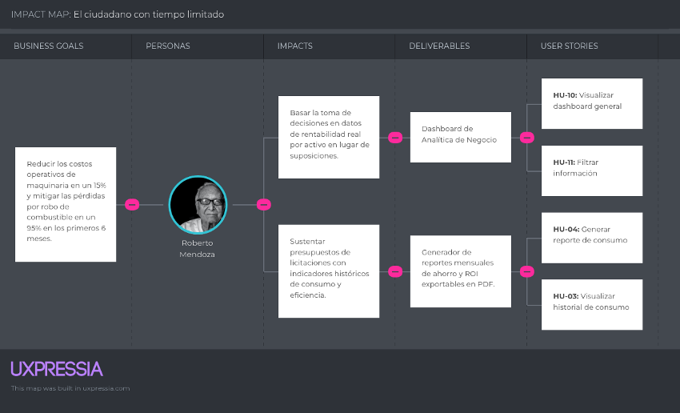
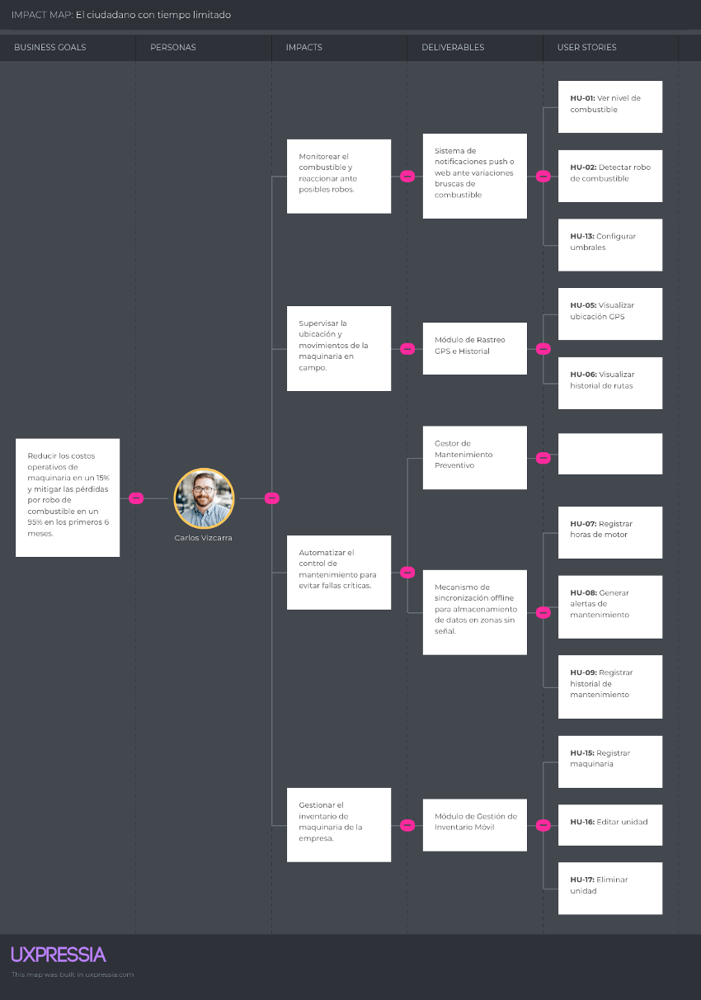

# Capítulo III: Requirements Specification

## 3.1. User Stories

### Epics

| Epic / Story ID | Título de la Épica | Descripción |
| :--- | :--- | :--- |
| **EP-01** | Gestión de Combustible | Agrupa las funcionalidades enfocadas en el monitoreo en tiempo real del nivel de diésel, la detección automática de caídas bruscas (robos u "ordeño") y la generación de reportes e historiales de consumo para optimizar los gastos operativos. |
| **EP-02** | Rastreo Satelital y Geocercas | Contiene las historias relacionadas con la geolocalización de la maquinaria, el trazado de rutas históricas y la creación de perímetros virtuales (geocercas) para asegurar que los activos no salgan de las zonas de operación autorizadas. |
| **EP-03** | Control de Uso y Mantenimiento | Enfocada en la telemetría del motor para registrar las horas reales de trabajo, detectar tiempos de ralentí ineficientes y automatizar las alertas de mantenimiento preventivo, evitando así fallas críticas en la maquinaria. |
| **EP-04** | Business Intelligence y Analytics | Abarca la consolidación de los datos operativos en tableros de control (dashboards) gerenciales. Permite a los dueños de empresas visualizar KPIs, comparar el rendimiento entre unidades y evaluar la huella de carbono de la flota. |
| **EP-05** | Notificaciones y Alertas Críticas | Centraliza el motor de reglas y avisos del sistema. Permite configurar umbrales personalizados, horarios laborales, niveles de severidad y el envío de notificaciones en tiempo real (vía web o correo electrónico) ante eventos anómalos. |
| **EP-06** | Administración de Activos | Gestiona el inventario digital de la empresa. Incluye el registro (CRUD) de la maquinaria, la vinculación lógica con el hardware (Nodos loT), y la asignación de operadores, fotos y tipos de combustible a cada unidad. |
| **EP-07** | Seguridad y Control de Acceso | Reúne los requerimientos para proteger la plataforma y sus datos. Incluye la autenticación de usuarios (login/registro), gestión de roles, recuperación de contraseñas, cierres por inactividad y logs de auditoría para trazabilidad de acciones. |
| **EP-08** | Landing Page e Infraestructura loT | Comprende dos frentes: la página de aterrizaje (Landing Page) para exponer la propuesta de valor y captar leads, y la infraestructura técnica del backend necesaria para recibir, procesar y validar las tramas de datos de los sensores físicos. |
| **EP-09** | Personalización y UX | Historias orientadas a la accesibilidad y mejora de la experiencia de usuario (User Experience), permitiendo adaptar la interfaz del sistema mediante la selección del idioma y la configuración del modo oscuro/claro. |

### User Stories

| Epic / Story ID | Título | Descripción | Criterios de Aceptación | Relacionado con (Epic ID) |
|-----------------|--------|-------------|------------------------|--------------------------|
| HU-01 | Ver nivel de combustible | Como administrador logístico, quiero visualizar el nivel de combustible en tiempo real para monitorear el consumo de cada unidad. | Dado que el usuario accede al dashboard, cuando selecciona una unidad, entonces el sistema muestra el nivel actual de combustible. | EP-01 |
| HU-02 | Detectar robo de combustible | Como administrador logístico, quiero recibir alertas ante caídas bruscas de combustible para detectar posibles robos. | Dado que el nivel de combustible disminuye abruptamente, cuando supera el umbral definido, entonces el sistema envía una alerta inmediata. | EP-01 |
| HU-03 | Visualizar historial de consumo | Como administrador logístico, quiero consultar el historial de consumo para analizar patrones de uso. | Dado que el usuario selecciona una unidad, cuando solicita el historial, entonces el sistema muestra los datos históricos de consumo. | EP-01 |
| HU-04 | Generar reporte de consumo | Como dueño de una empresa, quiero generar reportes de consumo para evaluar los gastos operativos. | Dado que el usuario solicita un reporte, cuando selecciona un rango de fechas, entonces el sistema genera un archivo descargable. | EP-01 |
| HU-05 | Exportar historial en formato Excel/PDF | Como administrador logístico, quiero exportar las tablas de datos para presentarlas en reuniones de gerencia. | Dado que el usuario visualiza una tabla, cuando selecciona "Exportar", entonces el sistema descarga el archivo (.xlsx/.pdf). | EP-01 |
| HU-06 | Visualizar ubicación GPS | Como administrador logístico, quiero visualizar la ubicación de las unidades en tiempo real para supervisar rutas. | Dado que el usuario accede al mapa, cuando el sistema carga los datos, entonces muestra la ubicación actual de las unidades. | EP-02 |
| HU-07 | Visualizar historial de rutas | Como administrador logístico, quiero consultar el historial de rutas para auditorías operativas. | Dado que el usuario selecciona un rango de fechas, cuando consulta rutas, entonces el sistema muestra el recorrido histórico. | EP-02 |
| HU-08 | Geocercas de Seguridad | Como administrador logístico, quiero definir zonas permitidas para las unidades para evitar usos no autorizados. | Dado que el usuario dibuja un área en el mapa, cuando la unidad sale del perímetro, entonces el sistema genera una alerta. | EP-02 |
| HU-09 | Última ubicación conocida | Como administrador logístico, quiero ver el último punto registrado para labores de recuperación. | Dado que la unidad pierde señal, cuando el sistema carga el mapa, entonces resalta el último punto recibido. | EP-02 |
| HU-10 | Registrar horas de motor | Como sistema, quiero registrar automáticamente las horas de uso para controlar el mantenimiento. | Dado que la máquina está en operación, cuando acumula horas de uso, entonces el sistema registra automáticamente el tiempo. | EP-03 |
| HU-11 | Generar alertas de mantenimiento | Como administrador logístico, quiero recibir alertas de mantenimiento preventivo para evitar fallas. | Dado que se alcanza el límite de horas de uso, cuando se cumple el umbral, entonces el sistema genera una alerta. | EP-03 |
| HU-12 | Historial de mantenimiento | Como administrador logístico, quiero registrar los servicios realizados para llevar control histórico. | Dado que el usuario registra un servicio, cuando guarda la información, entonces el sistema almacena el registro. | EP-03 |
| HU-13 | Detectar ralentí excesivo | Como administrador logístico, quiero identificar máquinas encendidas sin movimiento para reducir el desperdicio de combustible. | Dado que el GPS marca velocidad cero, cuando el motor sigue encendido por más de 15 min, entonces el sistema registra el evento. | EP-03 |
| HU-14 | Visualizar dashboard general | Como dueño de una empresa, quiero visualizar indicadores clave para tomar decisiones estratégicas. | Dado que el usuario accede al dashboard, cuando se cargan los datos, entonces el sistema muestra los KPIs principales. | EP-04 |
| HU-15 | Filtrar información | Como administrador logístico, quiero aplicar filtros para analizar información específica. | Dado que el usuario aplica filtros, cuando selecciona criterios, entonces el sistema actualiza la información mostrada. | EP-04 |
| HU-16 | Comparativa de Flota | Como dueño de una empresa, quiero comparar el consumo entre unidades para identificar ineficiencias. | Dado que el usuario accede a analíticas, cuando selecciona varias unidades, entonces el sistema muestra la gráfica. | EP-04 |
| HU-17 | Dashboard de Sostenibilidad | Como dueño de una empresa, quiero ver la estimación de emisiones para cumplir estándares ambientales. | Dado que el sistema tiene el dato de combustible, cuando calcula el reporte, entonces muestra la huella de CO2. | EP-04 |
| HU-18 | Notificaciones en tiempo real | Como administrador logístico, quiero recibir notificaciones en tiempo real para reaccionar ante eventos críticos. | Dado que ocurre un evento crítico, cuando el sistema lo detecta, entonces se envía una notificación inmediata. | EP-05 |
| HU-19 | Configurar umbrales | Como administrador logístico, quiero configurar umbrales personalizados para adaptar las alertas. | Dado que el usuario accede a configuración, cuando define un umbral, entonces el sistema guarda los valores. | EP-05 |
| HU-20 | Historial de alertas | Como administrador logístico, quiero revisar alertas pasadas para su análisis. | Dado que el usuario accede al historial, cuando consulta, entonces el sistema muestra las alertas registradas. | EP-05 |
| HU-21 | Notificación por correo electrónico | Como administrador logístico, quiero recibir alertas por email para estar enterado fuera de la plataforma. | Dado que ocurre una alerta crítica, cuando el sistema procesa el evento, entonces envía un correo automático. | EP-05 |
| HU-22 | Configurar horario de operación | Como administrador logístico, quiero definir el horario laboral para detectar usos fuera de jornada. | Dado que el usuario configura el horario, cuando la máquina opera fuera de rango, entonces el sistema envía una alerta. | EP-05 |
| HU-41 | Prioridad de alertas | Como administrador logístico, quiero clasificar alertas por severidad para atender primero las críticas. | Dado que ocurre un evento, cuando el sistema lo categoriza, entonces muestra un código de colores (Rojo/Amarillo). | EP-05 |
| HU-23 | Registrar maquinaria | Como administrador logístico, quiero registrar nuevas unidades para gestionarlas en el sistema. | Dado que el usuario ingresa los datos, cuando guarda la información, entonces el sistema registra la unidad. | EP-06 |
| HU-24 | Editar unidad | Como administrador logístico, quiero modificar información para mantener datos actualizados. | Dado que el usuario edita la información, cuando guarda cambios, entonces el sistema actualiza los datos. | EP-06 |
| HU-25 | Eliminar unidad | Como administrador logístico, quiero eliminar unidades para depurar el sistema. | Dado que el usuario selecciona eliminar, cuando confirma la acción, entonces el sistema elimina la unidad. | EP-06 |
| HU-26 | Estado de conexión del Nodo | Como administrador logístico, quiero saber si un nodo está en línea para asegurar la recepción de datos. | Dado que el usuario revisa el listado, cuando el nodo deja de transmitir, entonces muestra "Desconectado". | EP-06 |
| HU-27 | Vincular Nodo a Maquinaria | Como administrador logístico, quiero asociar un ID de hardware a una unidad para iniciar el monitoreo. | Dado que el usuario registra la unidad, cuando ingresa el código del sensor, entonces el sistema vincula ambos. | EP-06 |
| HU-28 | Actualización masiva de datos | Como administrador logístico, quiero editar varios estados a la vez para optimizar los tiempos de gestión. | Dado que el usuario selecciona múltiples unidades, cuando aplica la actualización masiva, entonces el sistema actualiza los estados en un solo paso. | EP-06 |
| HU-29 | Perfil de Operador | Como administrador logístico, quiero registrar quién conduce cada unidad para asignar responsabilidades. | Dado que el usuario accede a la unidad, cuando selecciona un operario, entonces el sistema guarda la asignación. | EP-06 |
| HU-42 | Registro de tipo de combustible | Como administrador logístico, quiero especificar el tipo de combustible para calcular costos precisos. | Dado que el usuario registra una unidad, cuando selecciona el carburante, entonces el sistema guarda la densidad. | EP-06 |
| HU-43 | Galería de fotos del activo | Como administrador logístico, quiero subir fotos de la maquinaria para tener un registro visual de su estado. | Dado que el usuario edita la unidad, cuando carga las imágenes, entonces el sistema las almacena en una galería. | EP-06 |
| HU-30 | Registro de usuario | Como usuario, quiero registrarme en la plataforma para acceder a las funcionalidades. | Dado que el usuario completa el formulario, cuando envía los datos, entonces el sistema crea la cuenta. | EP-07 |
| HU-31 | Login | Como usuario, quiero iniciar sesión para acceder a mis funcionalidades. | Dado que el usuario ingresa credenciales válidas, cuando intenta acceder, entonces el sistema permite el ingreso. | EP-07 |
| HU-32 | Roles de usuario | Como sistema, quiero asignar roles para controlar accesos. | Dado que el usuario tiene un rol asignado, cuando accede al sistema, entonces visualiza funciones según permisos. | EP-07 |
| HU-33 | Log de Auditoría de Usuario | Como administrador, quiero ver un registro de cambios para mantener la integridad de la información. | Dado que un usuario edita o elimina, cuando se guarda la acción, entonces el sistema registra fecha, hora y autor. | EP-07 |
| HU-34 | Recuperar Contraseña | Como usuario, quiero restablecer mi contraseña para recuperar acceso en caso de olvido. | Dado que el usuario solicita el cambio, cuando ingresa su email, entonces el sistema envía un enlace seguro. | EP-07 |
| HU-44 | Cierre de sesión automático | Como sistema, quiero cerrar la sesión por inactividad para proteger la información en equipos compartidos. | Dado que el usuario no registra actividad, cuando pasan 30 min, entonces el sistema redirige al login. | EP-07 |
| HU-45 | Verificación de correo | Como sistema, quiero validar el email del nuevo usuario para evitar registros de cuentas falsas. | Dado que un usuario se registra, cuando completa el formulario, entonces el sistema envía un código de activación. | EP-07 |
| HU-35 | Propuesta de valor | Como visitante, quiero conocer la propuesta del sistema para entender sus beneficios. | Dado que el usuario accede al sitio, cuando navega, entonces visualiza la información del producto. | EP-08 |
| HU-36 | Formulario de contacto | Como visitante, quiero enviar mis datos para obtener información. | Dado que el usuario completa el formulario, cuando lo envía, entonces el sistema registra la solicitud. | EP-08 |
| HU-37 | Acceso a la app | Como visitante, quiero acceder a la plataforma para comenzar a usar el sistema. | Dado que el usuario hace clic en el botón principal, cuando selecciona la opción, entonces es redirigido a la aplicación. | EP-08 |
| HU-38 | Recepción de datos IoT | Como desarrollador, quiero recibir datos de sensores para almacenarlos en el sistema. | Dado que el sensor envía datos, cuando el sistema recibe la solicitud, entonces almacena la información correctamente. | EP-08 |
| HU-39 | Consulta de datos API | Como desarrollador, quiero exponer datos para integraciones externas. | Dado que un cliente realiza una solicitud, cuando consulta datos, entonces el sistema responde correctamente. | EP-08 |
| HU-40 | Validación de datos de entrada | Como sistema, quiero validar la coherencia de los datos para evitar errores en los reportes. | Dado que el sensor envía un dato fuera de rango, cuando el sistema lo recibe, entonces lo descarta y genera un log. | EP-08 |
| HU-46 | Calibración de sensores | Como técnico, quiero ajustar los parámetros desde la web para corregir desviaciones en la lectura del sensor. | Dado que el sensor está vinculado, cuando el técnico ingresa el factor de corrección, entonces se aplica el ajuste. | EP-08 |
| HU-47 | Modo Offline de la App | Como administrador logístico, quiero ver los últimos datos cargados sin internet para consultas rápidas en zonas sin señal. | Dado que el dispositivo pierde conexión, cuando el usuario abre la app, entonces muestra la info en caché. | EP-08 |
| HU-48 | Dashboard de Hardware | Como desarrollador, quiero monitorear el voltaje de los nodos IoT para prevenir apagones de los sensores. | Dado que el nodo envía telemetría, cuando el nivel de batería es bajo, entonces el sistema genera una alerta técnica. | EP-08 |
| HU-49 | Modo Oscuro / Claro | Como usuario, quiero cambiar el tema visual para mejorar la visibilidad según la iluminación del entorno. | Dado que el usuario accede a preferencias, cuando cambia el switch de tema, entonces la interfaz actualiza colores. | EP-09 |
| HU-50 | Selección de idioma | Como usuario, quiero cambiar el idioma de la interfaz para facilitar el uso a personal extranjero. | Dado que el usuario selecciona un idioma, cuando confirma el cambio, entonces el sistema traduce las etiquetas. | EP-09 |

## 3.2. Impact Mapping
**Beto Mendoza (Dueño)** 

**Carlos Vizcarra (Gestor de Flota)** 

## 3.3. Product Backlog

### 3.3. Product Backlog.

Se utilizó la escala Fibonacci para la estimación de los Story Points. En total se tuvieron 203 Story Points.

### 3.3. Product Backlog.

Se utilizó la escala Fibonacci para la estimación de los Story Points. En total se tuvieron 203 Story Points.

| #Orden | Epic / Story ID | Título | Descripción | Story Points (1/2/3/5/8) |
| :---: | :---: | :--- | :--- | :---: |
| 1 | HU-01 | Ver nivel de combustible | Como administrador logístico, quiero visualizar el nivel de combustible en tiempo real para monitorear el consumo de cada unidad. | 5 |
| 2 | HU-02 | Detectar robo de combustible | Como administrador logístico, quiero recibir alertas ante caídas bruscas de combustible para detectar posibles robos. | 8 |
| 3 | HU-03 | Historial de consumo | Como administrador logístico, quiero consultar el historial de consumo para analizar patrones de uso. | 5 |
| 4 | HU-04 | Reportes de consumo | Como dueño de una empresa, quiero generar reportes de consumo para evaluar los gastos operativos. | 5 |
| 5 | HU-05 | Exportar (Excel/PDF) | Como administrador logístico, quiero exportar las tablas de datos para presentarlas en reuniones de gerencia. | 3 |
| 6 | HU-06 | Visualizar ubicación GPS | Como administrador logístico, quiero visualizar la ubicación de las unidades en tiempo real para supervisar rutas. | 5 |
| 7 | HU-07 | Historial de rutas | Como administrador logístico, quiero consultar el historial de rutas para auditorías operativas. | 5 |
| 8 | HU-08 | Geocercas de Seguridad | Como administrador logístico, quiero definir zonas permitidas para las unidades para evitar usos no autorizados. | 8 |
| 9 | HU-09 | Última ubicación conocida | Como administrador logístico, quiero ver el último punto registrado para labores de recuperación. | 3 |
| 10 | HU-10 | Registrar horas de motor | Como sistema, quiero registrar automáticamente las horas de uso para controlar el mantenimiento. | 3 |
| 11 | HU-11 | Alertas de mantenimiento | Como administrador logístico, quiero recibir alertas de mantenimiento preventivo para evitar fallas. | 5 |
| 12 | HU-12 | Historial mantenimiento | Como administrador logístico, quiero registrar los servicios realizados para llevar control histórico. | 2 |
| 13 | HU-13 | Detectar ralentí excesivo | Como administrador logístico, quiero identificar máquinas encendidas sin movimiento para reducir el desperdicio de combustible. | 5 |
| 14 | HU-14 | Dashboard general | Como dueño de una empresa, quiero visualizar indicadores clave para tomar decisiones estratégicas. | 8 |
| 15 | HU-15 | Filtrar información | Como administrador logístico, quiero aplicar filtros para analizar información específica. | 3 |
| 16 | HU-16 | Comparativa de Flota | Como dueño de una empresa, quiero comparar el consumo entre unidades para identificar ineficiencias. | 5 |
| 17 | HU-17 | Dashboard Sostenibilidad | Como dueño de una empresa, quiero ver la estimación de emisiones para cumplir estándares ambientales. | 5 |
| 18 | HU-18 | Notificaciones en tiempo real | Como administrador logístico, quiero recibir notificaciones en tiempo real para reaccionar ante eventos críticos. | 5 |
| 19 | HU-19 | Configurar umbrales | Como administrador logístico, quiero configurar umbrales personalizados para adaptar las alertas. | 3 |
| 20 | HU-20 | Historial de alertas | Como administrador logístico, quiero revisar alertas pasadas para su análisis. | 3 |
| 21 | HU-21 | Notificación por email | Como administrador logístico, quiero recibir alertas por email para estar enterado fuera de la plataforma. | 3 |
| 22 | HU-22 | Horario laboral | Como administrador logístico, quiero definir el horario laboral para detectar usos fuera de jornada. | 3 |
| 23 | HU-23 | Registrar maquinaria | Como administrador logístico, quiero registrar nuevas unidades para gestionarlas en el sistema. | 3 |
| 24 | HU-24 | Editar unidad | Como administrador logístico, quiero modificar información para mantener datos actualizados. | 2 |
| 25 | HU-25 | Eliminar unidad | Como administrador logístico, quiero eliminar unidades para depurar el sistema. | 2 |
| 26 | HU-26 | Estado de conexión del Nodo | Como administrador logístico, quiero saber si un nodo está en línea para asegurar la recepción de datos. | 3 |
| 27 | HU-27 | Vincular Nodo a Maquinaria | Como administrador logístico, quiero asociar un ID de hardware a una unidad para iniciar el monitoreo. | 3 |
| 28 | HU-28 | Actualización masiva | Como administrador logístico, quiero editar varios estados a la vez para optimizar los tiempos de gestión. | 5 |
| 29 | HU-29 | Perfil de Operador | Como administrador logístico, quiero registrar quién conduce cada unidad para asignar responsabilidades. | 2 |
| 30 | HU-30 | Registro de usuario | Como usuario, quiero registrarme en la plataforma para acceder a las funcionalidades. | 2 |
| 31 | HU-31 | Login | Como usuario, quiero iniciar sesión para acceder a mis funcionalidades. | 3 |
| 32 | HU-32 | Roles de usuario | Como sistema, quiero asignar roles para controlar accesos. | 5 |
| 33 | HU-33 | Log de Auditoría | Como administrador, quiero ver un registro de cambios para mantener la integridad de la información. | 5 |
| 34 | HU-34 | Recuperar Contraseña | Como usuario, quiero restablecer mi contraseña para recuperar acceso en caso de olvido. | 2 |
| 35 | HU-35 | Propuesta de valor | Como visitante, quiero conocer la propuesta del sistema para entender sus beneficios. | 2 |
| 36 | HU-36 | Formulario contacto | Como visitante, quiero enviar mis datos para obtener información. | 2 |
| 37 | HU-37 | Recepción de datos IoT | Como desarrollador, quiero recibir datos de sensores para almacenarlos en el sistema. | 8 |
| 38 | HU-38 | Acceso a la app | Como visitante, quiero acceder a la plataforma para comenzar a usar el sistema. | 2 |
| 39 | HU-39 | Consulta de datos API | Como desarrollador, quiero exponer datos para integraciones externas. | 5 |
| 40 | HU-40 | Validación de datos | Como sistema, quiero validar la coherencia de los datos para evitar errores en los reportes. | 5 |
| 41 | HU-41 | Prioridad de alertas | Como administrador logístico, quiero clasificar alertas por severidad para atender primero las críticas. | 2 |
| 42 | HU-42 | Tipo de combustible | Como administrador logístico, quiero especificar el tipo de combustible para calcular costos precisos. | 2 |
| 43 | HU-43 | Galería de fotos | Como administrador logístico, quiero subir fotos de la maquinaria para tener un registro visual de su estado. | 5 |
| 44 | HU-44 | Cierre de sesión auto | Como sistema, quiero cerrar la sesión por inactividad para proteger la información en equipos compartidos. | 2 |
| 45 | HU-45 | Verificación de correo | Como sistema, quiero validar el email del nuevo usuario para evitar registros de cuentas falsas. | 3 |
| 46 | HU-46 | Calibración de sensores | Como técnico, quiero ajustar los parámetros desde la web para corregir desviaciones en la lectura del sensor. | 8 |
| 47 | HU-47 | Modo Offline | Como administrador logístico, quiero ver los últimos datos cargados sin internet para consultas rápidas en zonas sin señal. | 8 |
| 48 | HU-48 | Dashboard de Hardware | Como desarrollador, quiero monitorear el voltaje de los nodos IoT para prevenir apagones de los sensores. | 5 |
| 49 | HU-49 | Modo Oscuro / Claro | Como usuario, quiero cambiar el tema visual para mejorar la visibilidad según la iluminación del entorno. | 2 |
| 50 | HU-50 | Selección de idioma | Como usuario, quiero cambiar el idioma de la interfaz para facilitar el uso a personal extranjero. | 5 |
