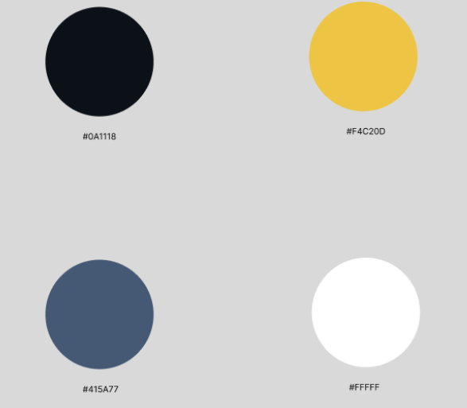
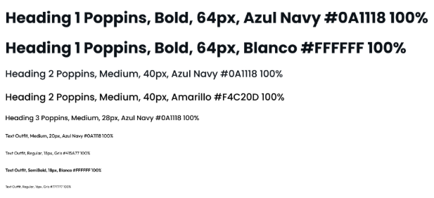

# Capítulo IV: Product Design

## 4.1. Style Guidelines

### 4.1.1. General Style Guidelines
**Paleta de colores:**

La selección cromática de InfraTrack ha sido diseñada para equilibrar la estética de una plataforma de alta tecnología con la funcionalidad que requiere el sector industrial y de construcción. Cada color cumple un rol estratégico en la interfaz:

<table style="border-collapse:collapse; min-width:400px;">
	<tr>
		<th style="background-color:#0A1118; color:#fff; padding:8px; border:2px solid #fff;">Color</th>
		<th style="background-color:#0A1118; color:#fff; padding:8px; border:2px solid #fff;">Código</th>
		<th style="background-color:#0A1118; color:#fff; padding:8px; border:2px solid #fff;">Uso y Significado</th>
	</tr>
	<tr>
		<td style="background-color:#0A1118; width:60px; border:2px solid #fff;"></td>
		<td style="text-align:center; border:2px solid #fff;">#0A1118</td>
		<td style="border:2px solid #fff;">Azul Oscuro — Pilar de la identidad. Para títulos principales, logotipo y textos en negrita. Transmite autoridad, seguridad y estabilidad.</td>
	</tr>
	<tr>
		<td style="background-color:#F4C20D; width:60px; border:2px solid #fff;"></td>
		<td style="text-align:center; border:2px solid #fff;">#F4C20D</td>
		<td style="border:2px solid #fff;">Amarillo Vibrante — Color de acento y resaltado visual. Para botones de acción (CTA), iconos de estado y elementos que requieren atención inmediata.</td>
	</tr>
	<tr>
		<td style="background-color:#415A77; width:60px; border:2px solid #fff;"></td>
		<td style="text-align:center; border:2px solid #fff;">#415A77</td>
		<td style="border:2px solid #fff;">Gris — Cuerpo de texto y descripciones secundarias. Reduce el contraste agresivo, mejora la legibilidad y evita la fatiga visual.</td>
	</tr>
	<tr>
		<td style="background-color:#FFFFFF; width:60px; border:2px solid #fff;"></td>
		<td style="text-align:center; border:2px solid #fff;">#FFFFFF</td>
		<td style="border:2px solid #fff;">Blanco — Fondo de la plataforma. Proporciona contraste, orden, limpieza y amplitud.</td>
	</tr>
</table>

	

<h3 style="color:#fff; margin-top:0;">Tipografía</h3>

	La tipografía de nuestra aplicación ha sido seleccionada para garantizar una legibilidad técnica impecable y una estética moderna. 
	<b>Poppins</b> se utiliza para títulos, encabezados y botones, gracias a su estructura geométrica y profesional. 
	<b>Outfit</b> se emplea en textos y párrafos, asegurando una lectura cómoda de datos complejos. 
	El tamaño base es de <b>18px</b> en desktop y <b>16px</b> en móvil, usando la unidad <b>rem</b> para escalabilidad y responsividad. 
	Los pesos visuales varían según la jerarquía, empleando azul navy para títulos y gris técnico para el cuerpo de texto, reduciendo la fatiga visual.

	<table style="border-collapse:collapse; min-width:320px;">
		<tr>
			<th style="background-color:#0A1118; color:#fff; padding:8px; border:2px solid #fff;">Parámetro</th>
			<th style="background-color:#0A1118; color:#fff; padding:8px; border:2px solid #fff;">Valor</th>
		</tr>
		<tr>
			<td style="border:2px solid #fff; text-align:left;">Tamaño base</td>
			<td style="border:2px solid #fff; text-align:center;">18px (desktop) / 16px (móvil)</td>
		</tr>
		<tr>
			<td style="border:2px solid #fff; text-align:left;">Tipografía</td>
			<td style="border:2px solid #fff; text-align:center;">Poppins (títulos), Outfit (texto)</td>
		</tr>
		<tr>
			<td style="border:2px solid #fff; text-align:left;">Interlineado</td>
			<td style="border:2px solid #fff; text-align:center;">1.5 (párrafos) / 1.2 (títulos)</td>
		</tr>
		<tr>
			<td style="border:2px solid #fff; text-align:left;">Pesos</td>
			<td style="border:2px solid #fff; text-align:center;">Bold (Títulos), Medium (Subtítulos/Botones), Regular (Cuerpo)</td>
		</tr>
	</table>

PESOS:

	

<h3 style="color:#fff; margin-bottom:8px;">Tono de comunicación y lenguaje</h3>

	InfraTrack utiliza un lenguaje <b>directo, técnico y confiable</b>. Al ser una plataforma de monitoreo de activos críticos, el tono debe ser <b>serio y asertivo</b>. 
	Sin embargo, como solución Open Source nacida en un entorno académico, mantenemos un matiz <b>innovador y colaborativo</b>, evitando tecnicismos innecesarios que puedan alejar a los dueños de MYPE.

<h3 style="color:#fff; margin-bottom:8px;">Branding y logo</h3>

	El logotipo combina un isotipo de <b>engranaje</b> y <b>nodos conectados</b> (simbolizando el IoT) con el nombre <b>InfraTrack</b>. 
	Se utiliza el amarillo para resaltar la palabra <b>"Track"</b>, enfatizando la función principal de <b>seguimiento y trazabilidad</b>.

### 4.1.2. Web Style Guidelines

---

## 4.2. Information Architecture

### 4.2.1. Organization Systems

### 4.2.2. Labeling Systems

### 4.2.3. SEO Tags and Meta Tags

### 4.2.4. Searching Systems

### 4.2.5. Navigation Systems

---

## 4.3. Landing Page UI Design

### 4.3.1. Landing Page Wireframe

### 4.3.2. Landing Page Mock-up

---

## 4.4. Web Applications UX/UI Design

### 4.4.1. Web Applications Wireframes

### 4.4.2. Web Applications Wireflow Diagrams

### 4.4.3. Web Applications Mock-ups

### 4.4.4. Web Applications User Flow Diagrams

---

## 4.5. Web Applications Prototyping

---

## 4.6. Domain-Driven Software Architecture

### 4.6.1. Design-Level EventStorming

### 4.6.2. Software Architecture Context Diagram

### 4.6.3. Software Architecture Container Diagrams

### 4.6.4. Software Architecture Components Diagrams

---

## 4.7. Software Object-Oriented Design

### 4.7.1. Class Diagrams

---

## 4.8. Database Design

### 4.8.1. Database Diagrams
