# Capítulo V: Product Implementation, Validation & Deployment

## 5.1. Software Configuration Management

### 5.1.1. Software Development Environment Configuration

En esta sección se describen todas las herramientas, plataformas y tecnologías utilizadas por el equipo durante el desarrollo del proyecto InfraTrack. Cada integrante configuró su entorno local siguiendo estas especificaciones para garantizar consistencia en el desarrollo colaborativo.
 
| Herramienta | Propósito | URL / Versión |
|---|---|---|
| Web Storm | Editor de código principal para HTML, CSS, JavaScript y Markdown | https://www.jetbrains.com/webstorm/ |
| Git | Sistema de control de versiones distribuido | https://git-scm.com/ v2.43+ |
| GitHub | Plataforma de repositorios remotos, gestión de ramas y colaboración | https://github.com |
| Node.js | Entorno de ejecución para herramientas de frontend y scripts | v18.x LTS |
| Bootstrap 5.3 | Framework CSS para diseño responsivo de la landing page | https://getbootstrap.com v5.3 |
| Bootstrap Icons 1.11 | Librería de íconos SVG para la interfaz | https://icons.getbootstrap.com |
| Google Fonts (Outfit) | Tipografía principal del proyecto | https://fonts.google.com |
| Figma | Diseño colaborativo de wireframes, mockups y prototipos | https://figma.com |
| Vercel | Plataforma de despliegue continuo para la landing page | https://vercel.com |
| Postman | Testing y documentación de endpoints de la API REST | https://postman.com |
| draw.io / Mermaid | Elaboración de diagramas de arquitectura y flujos | https://draw.io |

Para clonar y ejecutar la landing page localmente:
 
```bash
# Clonar el repositorio desde el mismo WebStorm creando un nuevo proyecto
y pegando el link de la lading: https://github.com/1ASI0729-2610-20262-TBL-InfraTrackIot/InfraTrack-Landing-Page.git
```

### 5.1.2. Source Code Management
El equipo gestiona el código fuente a través de la organización pública de GitHub: 
**Organización:** [https://github.com/1ASI0729-2610-20262-TBL-InfraTrackIot](https://github.com/1ASI0729-2610-20262-TBL-InfraTrackIot)
 
**Repositorios del proyecto:**
 
| Repositorio | URL | Descripción |
|---|---|---|
| InfraTrack-Landing-Page | https://github.com/1ASI0729-2610-20262-TBL-InfraTrackIot/InfraTrack-Landing-Page | Landing page institucional desplegada en Vercel |
| InfraTrack-Report | https://github.com/1ASI0729-2610-20262-TBL-InfraTrackIot/InfraTrack-Report | Informe del proyecto en formato Markdown (este documento) |
 
**Estrategia de Branching — GitFlow:**
 
El equipo aplica GitFlow como estrategia de control de versiones. Las ramas son:
 
```
main          → Versión estable de producción. Solo recibe merges desde release/ o hotfix/.
develop       → Rama de integración. Recibe merges de todas las ramas feature/.
feature/[nombre] → Desarrollo de nuevas funcionalidades o secciones. Ej: feature/hero-section
release/[v]   → Preparación de la entrega. Ej: release/tb1
```
 
**Flujo de trabajo del equipo:**
 
```
1. El desarrollador crea su rama: git checkout -b feature/nombre-tarea develop
2. Desarrolla y hace commits con Conventional Commits
3. Hace push: git push origin feature/nombre-tarea
4. Abre un Pull Request hacia develop
5. El equipo revisa y aprueba
6. Se hace merge a develop
7. Para la entrega: se crea release/tb1 desde develop → merge a main → tag de versión
```
 
### 5.1.3. Source Code Style Guide & Conventions
**Conventional Commits:**
 
Todos los mensajes de commit siguen el estándar [Conventional Commits v1.0.0](https://www.conventionalcommits.org/). El formato es:
 
```
<tipo>[ámbito opcional]: <descripción corta en inglés>
 
[cuerpo opcional]
 
[footer opcional]
```
 
**Tipos de commit utilizados:**
 
| Tipo | Uso |
|---|---|
| `feat` | Nueva funcionalidad o sección |
| `fix` | Corrección de bug o error |
| `docs` | Cambios en documentación o README |
| `style` | Cambios de formato, CSS, sin afectar lógica |
| `refactor` | Reestructuración de código sin cambiar funcionalidad |
| `test` | Adición o modificación de pruebas |
| `chore` | Tareas de configuración, despliegue o dependencias |
 
**Ejemplos de commits del proyecto:**
 
```bash
feat(landing): add hero section with typing animation effect
feat(landing): add IoT operations dashboard with real-time KPI cards
feat(landing): add pricing plans section with three tiers
fix(landing): fix team photo path with spaces in filename
docs(report): add chapter I lean ux problem statements
chore(deploy): configure vercel deployment from main branch
style(landing): adjust color palette to match brand guidelines
```
 
**Convenciones de código HTML/CSS:**
 
- Indentación: 4 espacios
- Clases CSS: kebab-case (ej: `hero-section`, `floating-card-horizontal`)
- IDs: camelCase (ej: `typingTitle`, `iotTemp`)
- Comentarios de sección: `<!-- Section N: Nombre -->` para marcar bloques principales
- Imágenes: formato WebP cuando sea posible, con atributo `alt` descriptivo obligatorio
**Convenciones de JavaScript:**
 
- Variables y funciones: camelCase
- Constantes: UPPER_SNAKE_CASE
- Funciones: declarativas con `function` o arrow functions según contexto
- Sin `var`, usar `const` y `let`
**Convenciones de base de datos (SQL):**
 
- Palabras reservadas: UPPER_CASE (`SELECT`, `FROM`, `WHERE`)
- Nombres de tablas: camelCase (`telemetryData`, `iotNodes`)
- Nombres de columnas: camelCase (`fuelLevel`, `recordedAt`)
- Claves primarias: siempre `id` con tipo `BIGINT`
- Claves foráneas: `[tabla]Id` (ej: `assetId`, `nodeId`)

### 5.1.4. Software Deployment Configuration
**Landing Page — Vercel:**
 
La landing page de InfraTrack está desplegada en Vercel con integración continua desde GitHub.
 
| Parámetro | Valor |
|---|---|
| **Plataforma** | Vercel |
| **Repositorio fuente** | https://github.com/1ASI0729-2610-20262-TBL-InfraTrackIot/InfraTrack-Landing-Page |
| **Rama de producción** | `main` |
| **URL de producción** | https://infratrack-iot-inky.vercel.app/ |
| **Despliegue automático** | Activado — cada push a `main` genera un nuevo despliegue |
| **Framework detectado** | Other (HTML estático) |
 
**Proceso de despliegue paso a paso:**
 
```
1. El desarrollador trabaja en su rama feature/[nombre]
2. Hace commits con conventional commits
3. Abre Pull Request hacia develop
4. El equipo revisa y aprueba el PR
5. Se hace merge a develop (genera preview deployment en Vercel)
6. Para la entrega: se hace merge de develop a main
7. Vercel detecta el push a main automáticamente
8. Vercel construye y despliega en producción en < 60 segundos
9. La URL de producción queda disponible
```
---

## 5.2. Landing Page, Services & Applications Implementation

### 5.2.1. Sprint 1

#### 5.2.1.1. Sprint Planning 1
| Sprint # | Sprint 1 |
| :--- | :--- |
| Sprint Planning Background | |
| Date | 2026-04-20 |
| Time | 10:30 AM |
| Location | Universidad Peruana de Ciencias Aplicadas (Campus San Isidro), Reunión virtual |
| Prepared By | Mallqui Vilca, Dhilsen Armil |
| Attendees (to planning meeting) | Mallqui Vilca, Dhilsen Armil / Ramos Aguirre, Aldair Joaquin |
| Sprint Goal & User Stories | |
| Sprint 1 Goal | Nuestro enfoque está en desarrollar y desplegar una landing page funcional que presente eficazamente nuestro producto Digital Machine. Creemos que esto genera una primera interacción positiva y clara con potenciales clientes, facilitando su comprensión y conexión inicial con la propuesta de valor. Esto se confirmará cuando recibamos las primeras visitas y observemos señales básicas de interés, como clics en elementos clave, navegación dentro de la página y comentarios iniciales de usuarios o colegas. |
| Sprint 1 Velocity | 7 |
| Sum of Story Points | 45 |
#### 5.2.1.2. Aspect Leaders and Collaborators
| Team Member (Last Name, First Name) | GitHub Username | UI/UX Design (L/C) | Landing Page Development (L/C) | Quality Control (L/C) | Documentation (L/C) |
| :--- | :--- | :--- | :--- | :--- | :--- |
| Mallqui Vilca, Dhilsen Armil | Dhilsen18 | L | L | C | C |
| Ramos Aguirre, Aldair Joaquin | AldairRamos13 | C | C | L | L |
#### 5.2.1.3. Sprint Backlog 1

**Objetivo:** Crear y poner en producción una landing page operativa que satisfaga las historias de usuario del Epic EP-08, sirviendo como primer punto de contacto comercial con los segmentos objetivo.

**Board de control (Trello):** [InfraTrack — Sprint 1 Board](https://trello.com/b/PLACEHOLDER-sprint-1) *(actualizar con URL público del board)*

**(aquí va imagen: screenshot del board Trello — Sprint 1)**

**Duración:** 20 de Abril – 01 de Mayo 2026 | **Capacidad de equipo:** 80 horas — 2 integrantes

<table>
  <thead>
    <tr>
      <th colspan="1" style="text-align:left; border: 1px solid black; padding: 8px;">Sprint #</th>
      <th colspan="7" style="text-align:left; border: 1px solid black; padding: 8px;">Sprint 1</th>
    </tr>
    <tr>
      <th colspan="2" style="text-align:left; border: 1px solid black; padding: 8px;">User Story</th>
      <th colspan="6" style="text-align:left; border: 1px solid black; padding: 8px;">Work-Item / Engineering Task</th>
    </tr>
    <tr>
      <th style="border: 1px solid black; padding: 8px;">Id</th>
      <th style="border: 1px solid black; padding: 8px;">Title</th>
      <th style="border: 1px solid black; padding: 8px;">Id</th>
      <th style="border: 1px solid black; padding: 8px;">Title</th>
      <th style="border: 1px solid black; padding: 8px;">Description</th>
      <th style="border: 1px solid black; padding: 8px;">Estimation (Hours)</th>
      <th style="border: 1px solid black; padding: 8px;">Assigned To</th>
      <th style="border: 1px solid black; padding: 8px;">Status</th>
    </tr>
  </thead>
  <tbody>
    <tr>
      <td rowspan="2" style="border: 1px solid black; padding: 12px;">HU-35</td>
      <td rowspan="2" style="border: 1px solid black; padding: 12px;">Propuesta de valor</td>
      <td style="border: 1px solid black; padding: 12px;">T-S1-01</td>
      <td style="border: 1px solid black; padding: 12px;">Diseñar wireframe de sección propuesta de valor</td>
      <td style="border: 1px solid black; padding: 12px;">Elaborar en Figma el layout desktop y mobile de la sección que comunica beneficios y diferenciadores de Digital Machine.</td>
      <td style="border: 1px solid black; padding: 12px;">4</td>
      <td style="border: 1px solid black; padding: 12px;">Mallqui Vilca, Dhilsen Armil</td>
      <td style="border: 1px solid black; padding: 12px;">Done</td>
    </tr>
    <tr>
      <td style="border: 1px solid black; padding: 12px;">T-S1-02</td>
      <td style="border: 1px solid black; padding: 12px;">Implementar sección propuesta de valor en HTML/CSS</td>
      <td style="border: 1px solid black; padding: 12px;">Codificar la sección responsive con tipografía, iconografía y copy alineado al Style Guide del Capítulo IV.</td>
      <td style="border: 1px solid black; padding: 12px;">6</td>
      <td style="border: 1px solid black; padding: 12px;">Mallqui Vilca, Dhilsen Armil</td>
      <td style="border: 1px solid black; padding: 12px;">Done</td>
    </tr>
    <tr>
      <td rowspan="2" style="border: 1px solid black; padding: 12px;">HU-36</td>
      <td rowspan="2" style="border: 1px solid black; padding: 12px;">Formulario contacto</td>
      <td style="border: 1px solid black; padding: 12px;">T-S1-03</td>
      <td style="border: 1px solid black; padding: 12px;">Diseñar formulario de contacto responsive</td>
      <td style="border: 1px solid black; padding: 12px;">Definir campos, validaciones visuales y estados de error/éxito del formulario en Figma.</td>
      <td style="border: 1px solid black; padding: 12px;">4</td>
      <td style="border: 1px solid black; padding: 12px;">Ramos Aguirre, Aldair Joaquin</td>
      <td style="border: 1px solid black; padding: 12px;">Done</td>
    </tr>
    <tr>
      <td style="border: 1px solid black; padding: 12px;">T-S1-04</td>
      <td style="border: 1px solid black; padding: 12px;">Implementar lógica de validación del formulario</td>
      <td style="border: 1px solid black; padding: 12px;">Desarrollar validación en JavaScript y retroalimentación al usuario antes del envío de la solicitud.</td>
      <td style="border: 1px solid black; padding: 12px;">5</td>
      <td style="border: 1px solid black; padding: 12px;">Ramos Aguirre, Aldair Joaquin</td>
      <td style="border: 1px solid black; padding: 12px;">Done</td>
    </tr>
    <tr>
      <td rowspan="2" style="border: 1px solid black; padding: 12px;">HU-37</td>
      <td rowspan="2" style="border: 1px solid black; padding: 12px;">Acceso a la app</td>
      <td style="border: 1px solid black; padding: 12px;">T-S1-05</td>
      <td style="border: 1px solid black; padding: 12px;">Implementar botones CTA hacia la aplicación</td>
      <td style="border: 1px solid black; padding: 12px;">Crear botones de llamada a la acción en hero y navbar que redirijan a la Web Application.</td>
      <td style="border: 1px solid black; padding: 12px;">5</td>
      <td style="border: 1px solid black; padding: 12px;">Mallqui Vilca, Dhilsen Armil</td>
      <td style="border: 1px solid black; padding: 12px;">Done</td>
    </tr>
    <tr>
      <td style="border: 1px solid black; padding: 12px;">T-S1-06</td>
      <td style="border: 1px solid black; padding: 12px;">Configurar rutas de redirección por segmento</td>
      <td style="border: 1px solid black; padding: 12px;">Vincular CTAs del landing page con las vistas correspondientes en la aplicación según segmento objetivo.</td>
      <td style="border: 1px solid black; padding: 12px;">4</td>
      <td style="border: 1px solid black; padding: 12px;">Mallqui Vilca, Dhilsen Armil</td>
      <td style="border: 1px solid black; padding: 12px;">Done</td>
    </tr>
    <tr>
      <td rowspan="2" style="border: 1px solid black; padding: 12px;">HU-48</td>
      <td rowspan="2" style="border: 1px solid black; padding: 12px;">Dashboard de Hardware</td>
      <td style="border: 1px solid black; padding: 12px;">T-S1-07</td>
      <td style="border: 1px solid black; padding: 12px;">Diseñar mockup del panel IoT demostrativo</td>
      <td style="border: 1px solid black; padding: 12px;">Definir tarjetas KPI de telemetría, batería y estado de conexión para la sección demostrativa del landing.</td>
      <td style="border: 1px solid black; padding: 12px;">4</td>
      <td style="border: 1px solid black; padding: 12px;">Ramos Aguirre, Aldair Joaquin</td>
      <td style="border: 1px solid black; padding: 12px;">Done</td>
    </tr>
    <tr>
      <td style="border: 1px solid black; padding: 12px;">T-S1-08</td>
      <td style="border: 1px solid black; padding: 12px;">Implementar dashboard IoT con datos simulados</td>
      <td style="border: 1px solid black; padding: 12px;">Desarrollar componentes visuales de telemetría con actualización animada para demostrar capacidades del producto.</td>
      <td style="border: 1px solid black; padding: 12px;">6</td>
      <td style="border: 1px solid black; padding: 12px;">Ramos Aguirre, Aldair Joaquin</td>
      <td style="border: 1px solid black; padding: 12px;">Done</td>
    </tr>
    <tr>
      <td style="border: 1px solid black; padding: 12px;">—</td>
      <td style="border: 1px solid black; padding: 12px;">Constraint general</td>
      <td style="border: 1px solid black; padding: 12px;">T-S1-09</td>
      <td style="border: 1px solid black; padding: 12px;">Configurar despliegue continuo en Vercel</td>
      <td style="border: 1px solid black; padding: 12px;">Integrar repositorio Landing Page con Vercel y validar despliegue automático desde rama main.</td>
      <td style="border: 1px solid black; padding: 12px;">4</td>
      <td style="border: 1px solid black; padding: 12px;">Mallqui Vilca, Dhilsen Armil</td>
      <td style="border: 1px solid black; padding: 12px;">Done</td>
    </tr>
  </tbody>
</table>

#### 5.2.1.4. Development Evidence for Sprint Review
Dado que el alcance del primer sprint se limitó al desarrollo inicial de la landing page, en esta etapa no se contempló la ejecución de pruebas para servicios o interacciones.
#### 5.2.1.5. Execution Evidence for Sprint Review
Se evidencia el avance del Primer Sprint por medio del siguiente link: https://infratrack-iot-inky.vercel.app/
#### 5.2.1.6. Services Documentation Evidence for Sprint Review

#### 5.2.1.7. Software Deployment Evidence for Sprint Review
Link del Landing Page: https://infratrack-iot-inky.vercel.app/
#### 5.2.1.8. Team Collaboration Insights during Sprint
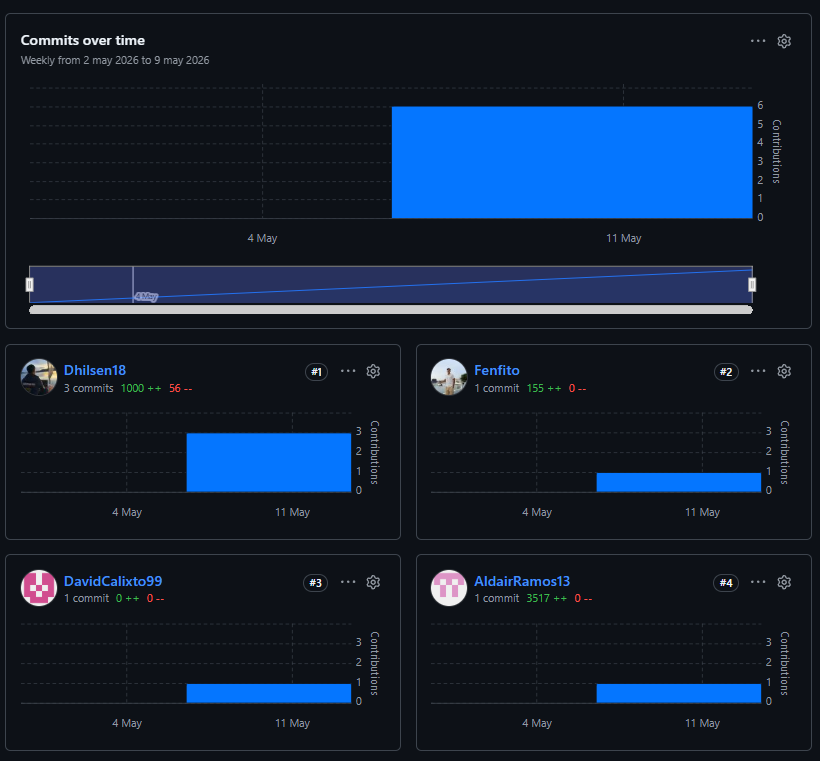

---

### 5.2.2. Sprint 2

#### 5.2.2.1. Sprint Planning 2
| Sprint # | Sprint 2 |
| :--- | :--- |
| Sprint Planning Background | |
| Date | 2026-05-02 |
| Time | 10:10 AM |
| Location | Universidad Peruana de Ciencias Aplicadas (Campus San Isidro), Reunión virtual |
| Prepared By | Ramos Aguirre, Aldair Joaquin |
| Attendees (to planning meeting) | Mallqui Vilca, Dhilsen Armil / Ramos Aguirre, Aldair Joaquin |
| Sprint Goal & User Stories | |
| Sprint 2 Goal | Nuestro enfoque está en entregar la primera versión funcional de la Web Application Digital Machine con Control Panel, gestión de flota y telemetría, integrada con la API REST. Creemos que esto permitirá validar la propuesta de valor con usuarios reales del sector construcción. Esto se confirmará cuando los administradores puedan registrar maquinaria, visualizar alertas y consultar telemetría desde la aplicación desplegada. |
| Sprint 2 Velocity | 7 |
| Sum of Story Points | 38 |
#### 5.2.2.2. Aspect Leaders and Collaborators
| Team Member (Last Name, First Name) | GitHub Username | Frontend Development (L/C) | Backend Development (L/C) | Quality Control (L/C) | Documentation (L/C) |
| :--- | :--- | :--- | :--- | :--- | :--- |
| Mallqui Vilca, Dhilsen Armil | Dhilsen18 | L | L | C | C |
| Ramos Aguirre, Aldair Joaquin | AldairRamos13 | C | C | L | L |
#### 5.2.2.3. Sprint Backlog 2

**Objetivo:** Implementar la primera versión del Frontend Web Application con módulos de registro de maquinaria, alertas, telemetría y configuración, integrada con endpoints REST del backend.

**Board de control (Trello):** [InfraTrack — Sprint 2 Board](https://trello.com/b/PLACEHOLDER-sprint-2) *(actualizar con URL público del board)*

**(aquí va imagen: screenshot del board Trello — Sprint 2)**

**Duración:** 02 de Mayo – 12 de Mayo 2026 | **Capacidad de equipo:** 96 horas — 2 integrantes

<table>
  <thead>
    <tr>
      <th colspan="1" style="text-align:left; border: 1px solid black; padding: 8px;">Sprint #</th>
      <th colspan="7" style="text-align:left; border: 1px solid black; padding: 8px;">Sprint 2</th>
    </tr>
    <tr>
      <th colspan="2" style="text-align:left; border: 1px solid black; padding: 8px;">User Story</th>
      <th colspan="6" style="text-align:left; border: 1px solid black; padding: 8px;">Work-Item / Engineering Task</th>
    </tr>
    <tr>
      <th style="border: 1px solid black; padding: 8px;">Id</th>
      <th style="border: 1px solid black; padding: 8px;">Title</th>
      <th style="border: 1px solid black; padding: 8px;">Id</th>
      <th style="border: 1px solid black; padding: 8px;">Title</th>
      <th style="border: 1px solid black; padding: 8px;">Description</th>
      <th style="border: 1px solid black; padding: 8px;">Estimation (Hours)</th>
      <th style="border: 1px solid black; padding: 8px;">Assigned To</th>
      <th style="border: 1px solid black; padding: 8px;">Status</th>
    </tr>
  </thead>
  <tbody>
    <tr>
      <td rowspan="3" style="border: 1px solid black; padding: 12px;">HU-23</td>
      <td rowspan="3" style="border: 1px solid black; padding: 12px;">Registrar maquinaria</td>
      <td style="border: 1px solid black; padding: 12px;">T-S2-01</td>
      <td style="border: 1px solid black; padding: 12px;">Diseñar formulario de registro de maquinaria</td>
      <td style="border: 1px solid black; padding: 12px;">Definir en Figma los campos técnicos, tipo de combustible y asignación de operador para el módulo de activos.</td>
      <td style="border: 1px solid black; padding: 12px;">4</td>
      <td style="border: 1px solid black; padding: 12px;">Mallqui Vilca, Dhilsen Armil</td>
      <td style="border: 1px solid black; padding: 12px;">Done</td>
    </tr>
    <tr>
      <td style="border: 1px solid black; padding: 12px;">T-S2-02</td>
      <td style="border: 1px solid black; padding: 12px;">Implementar vista de registro en Angular</td>
      <td style="border: 1px solid black; padding: 12px;">Desarrollar componente reactivo con validaciones para captura de datos de maquinaria en Asset Management.</td>
      <td style="border: 1px solid black; padding: 12px;">6</td>
      <td style="border: 1px solid black; padding: 12px;">Mallqui Vilca, Dhilsen Armil</td>
      <td style="border: 1px solid black; padding: 12px;">Done</td>
    </tr>
    <tr>
      <td style="border: 1px solid black; padding: 12px;">T-S2-03</td>
      <td style="border: 1px solid black; padding: 12px;">Integrar POST /api/v1/machinery en frontend</td>
      <td style="border: 1px solid black; padding: 12px;">Conectar formulario con endpoint REST y manejar respuestas de éxito y error en la UI.</td>
      <td style="border: 1px solid black; padding: 12px;">5</td>
      <td style="border: 1px solid black; padding: 12px;">Ramos Aguirre, Aldair Joaquin</td>
      <td style="border: 1px solid black; padding: 12px;">Done</td>
    </tr>
    <tr>
      <td rowspan="2" style="border: 1px solid black; padding: 12px;">HU-11</td>
      <td rowspan="2" style="border: 1px solid black; padding: 12px;">Generar alertas de mantenimiento</td>
      <td style="border: 1px solid black; padding: 12px;">T-S2-04</td>
      <td style="border: 1px solid black; padding: 12px;">Implementar regla de alertas por horas de uso en backend</td>
      <td style="border: 1px solid black; padding: 12px;">Desarrollar servicio que evalúe horas acumuladas y genere alertas preventivas en el bounded context Monitoring.</td>
      <td style="border: 1px solid black; padding: 12px;">6</td>
      <td style="border: 1px solid black; padding: 12px;">Mallqui Vilca, Dhilsen Armil</td>
      <td style="border: 1px solid black; padding: 12px;">Done</td>
    </tr>
    <tr>
      <td style="border: 1px solid black; padding: 12px;">T-S2-05</td>
      <td style="border: 1px solid black; padding: 12px;">Mostrar alertas preventivas en Control Panel</td>
      <td style="border: 1px solid black; padding: 12px;">Consumir API de alertas y renderizar notificaciones en el dashboard del propietario con estados de severidad.</td>
      <td style="border: 1px solid black; padding: 12px;">5</td>
      <td style="border: 1px solid black; padding: 12px;">Ramos Aguirre, Aldair Joaquin</td>
      <td style="border: 1px solid black; padding: 12px;">Done</td>
    </tr>
    <tr>
      <td rowspan="2" style="border: 1px solid black; padding: 12px;">HU-26</td>
      <td rowspan="2" style="border: 1px solid black; padding: 12px;">Estado de conexión del Nodo</td>
      <td style="border: 1px solid black; padding: 12px;">T-S2-06</td>
      <td style="border: 1px solid black; padding: 12px;">Implementar indicadores de estado IoT en backend</td>
      <td style="border: 1px solid black; padding: 12px;">Exponer endpoint que reporte estado conectado/desconectado/falla de transmisión por nodo IoT.</td>
      <td style="border: 1px solid black; padding: 12px;">5</td>
      <td style="border: 1px solid black; padding: 12px;">Mallqui Vilca, Dhilsen Armil</td>
      <td style="border: 1px solid black; padding: 12px;">Done</td>
    </tr>
    <tr>
      <td style="border: 1px solid black; padding: 12px;">T-S2-07</td>
      <td style="border: 1px solid black; padding: 12px;">Visualizar badges de conexión en lista de nodos</td>
      <td style="border: 1px solid black; padding: 12px;">Desarrollar componentes visuales con código de colores para estado de cada nodo en la vista de flota.</td>
      <td style="border: 1px solid black; padding: 12px;">4</td>
      <td style="border: 1px solid black; padding: 12px;">Ramos Aguirre, Aldair Joaquin</td>
      <td style="border: 1px solid black; padding: 12px;">Done</td>
    </tr>
    <tr>
      <td rowspan="2" style="border: 1px solid black; padding: 12px;">HU-12</td>
      <td rowspan="2" style="border: 1px solid black; padding: 12px;">Historial de mantenimiento</td>
      <td style="border: 1px solid black; padding: 12px;">T-S2-08</td>
      <td style="border: 1px solid black; padding: 12px;">Crear entidad y repositorio de mantenimiento</td>
      <td style="border: 1px solid black; padding: 12px;">Modelar persistencia de registros de servicio por unidad en base de datos relacional.</td>
      <td style="border: 1px solid black; padding: 12px;">6</td>
      <td style="border: 1px solid black; padding: 12px;">Mallqui Vilca, Dhilsen Armil</td>
      <td style="border: 1px solid black; padding: 12px;">Done</td>
    </tr>
    <tr>
      <td style="border: 1px solid black; padding: 12px;">T-S2-09</td>
      <td style="border: 1px solid black; padding: 12px;">Implementar vista de historial en configuración</td>
      <td style="border: 1px solid black; padding: 12px;">Desarrollar tabla consultable con filtros por unidad y fecha en el módulo de configuración.</td>
      <td style="border: 1px solid black; padding: 12px;">5</td>
      <td style="border: 1px solid black; padding: 12px;">Ramos Aguirre, Aldair Joaquin</td>
      <td style="border: 1px solid black; padding: 12px;">To-Review</td>
    </tr>
    <tr>
      <td rowspan="2" style="border: 1px solid black; padding: 12px;">HU-22</td>
      <td rowspan="2" style="border: 1px solid black; padding: 12px;">Configurar horario de operación</td>
      <td style="border: 1px solid black; padding: 12px;">T-S2-10</td>
      <td style="border: 1px solid black; padding: 12px;">Implementar configuración de horarios en backend</td>
      <td style="border: 1px solid black; padding: 12px;">Desarrollar endpoints para definir rangos horarios permitidos y disparar alertas por uso fuera de horario.</td>
      <td style="border: 1px solid black; padding: 12px;">6</td>
      <td style="border: 1px solid black; padding: 12px;">Mallqui Vilca, Dhilsen Armil</td>
      <td style="border: 1px solid black; padding: 12px;">Done</td>
    </tr>
    <tr>
      <td style="border: 1px solid black; padding: 12px;">T-S2-11</td>
      <td style="border: 1px solid black; padding: 12px;">Crear UI de configuración de horarios operativos</td>
      <td style="border: 1px solid black; padding: 12px;">Desarrollar formulario en Angular para que el administrador defina horarios por maquinaria.</td>
      <td style="border: 1px solid black; padding: 12px;">4</td>
      <td style="border: 1px solid black; padding: 12px;">Ramos Aguirre, Aldair Joaquin</td>
      <td style="border: 1px solid black; padding: 12px;">In-Process</td>
    </tr>
    <tr>
      <td style="border: 1px solid black; padding: 12px;">—</td>
      <td style="border: 1px solid black; padding: 12px;">Constraint general</td>
      <td style="border: 1px solid black; padding: 12px;">T-S2-12</td>
      <td style="border: 1px solid black; padding: 12px;">Ejecutar pruebas de integración frontend-backend</td>
      <td style="border: 1px solid black; padding: 12px;">Validar flujos críticos de registro, alertas y telemetría con datos de muestra en entorno de desarrollo.</td>
      <td style="border: 1px solid black; padding: 12px;">4</td>
      <td style="border: 1px solid black; padding: 12px;">Ramos Aguirre, Aldair Joaquin</td>
      <td style="border: 1px solid black; padding: 12px;">Done</td>
    </tr>
  </tbody>
</table>

#### 5.2.2.4. Development Evidence for Sprint Review

Esta sección documenta los commits vinculados a los avances más relevantes de la implementación del Sprint 2. El alcance incluyó la aplicación web **Digital Machine** (frontend Angular 21) y su integración con la **API REST** (backend Spring Boot 4), siguiendo la estrategia GitFlow con ramas `feature/[bounded-context]` integradas en `develop`. Los commits provienen de los repositorios oficiales de la organización en GitHub.

**Repositorio Frontend — InfraTrack-Frontend**

| Repository | Branch | Commit Id | Commit Message | Commited On |
|---|---|---|---|---|
| 1ASI0729-2610-20262-TBL-InfraTrackIot/InfraTrack-Frontend | feature/iam | d2801eb | feat: Implement IamService for user authentication | 2026-05-12 |
| 1ASI0729-2610-20262-TBL-InfraTrackIot/InfraTrack-Frontend | feature/iam | f5e1508 | feat: implement login page with role-based simulation and animated branding background | 2026-05-12 |
| 1ASI0729-2610-20262-TBL-InfraTrackIot/InfraTrack-Frontend | feature/control-panel | ff914b8 | feat: implement core application stores and infrastructure mappers for control panel, configuration, and telemetry modules | 2026-05-12 |
| 1ASI0729-2610-20262-TBL-InfraTrackIot/InfraTrack-Frontend | feature/control-panel | 36af5ca | feat: implement internationalization and create control panel dashboard structure | 2026-05-12 |
| 1ASI0729-2610-20262-TBL-InfraTrackIot/InfraTrack-Frontend | feature/control-panel | 6a2ac4b | feat: enhance control panel charts with tooltips and improved styling | 2026-05-12 |
| 1ASI0729-2610-20262-TBL-InfraTrackIot/InfraTrack-Frontend | feature/asset-management | 1dee508 | feat: enhance asset management with filtering, subscription plans, and improved UI components | 2026-05-12 |
| 1ASI0729-2610-20262-TBL-InfraTrackIot/InfraTrack-Frontend | origin/develop | c69865b | Merge pull request #7 from feature/telemetry into develop | 2026-05-12 |
| 1ASI0729-2610-20262-TBL-InfraTrackIot/InfraTrack-Frontend | origin/develop | bb5f7bc | Merge pull request #5 from feature/reports into develop | 2026-05-12 |
| 1ASI0729-2610-20262-TBL-InfraTrackIot/InfraTrack-Frontend | feature/iam | 9118fc9 | feat: enhance login page with internationalization support and improved branding elements | 2026-05-13 |
| 1ASI0729-2610-20262-TBL-InfraTrackIot/InfraTrack-Frontend | develop | 0b676f2 | feat: initialize Angular application with routing and basic configuration | 2026-06-07 |
| 1ASI0729-2610-20262-TBL-InfraTrackIot/InfraTrack-Frontend | feature/fleet | c862b58 | feat(feature/fleet): add ConfigurationStore and FleetStore for managing fleet and IoT data | 2026-06-07 |
| 1ASI0729-2610-20262-TBL-InfraTrackIot/InfraTrack-Frontend | feature/fleet | d861b0f | feat(feature/fleet): add entity models for FleetDriver, FleetTransport, and IotDevice | 2026-06-07 |
| 1ASI0729-2610-20262-TBL-InfraTrackIot/InfraTrack-Frontend | feature/fleet | 4ef3e13 | feat(feature/fleet): add dialog for adding IoT nodes and maintenance records | 2026-06-07 |
| 1ASI0729-2610-20262-TBL-InfraTrackIot/InfraTrack-Frontend | feature/fleet | 6c9c8dd | feat(feature/fleet): add configuration view components and styles for fleet management | 2026-06-07 |
| 1ASI0729-2610-20262-TBL-InfraTrackIot/InfraTrack-Frontend | feature/fleet | a4d3a36 | feat(feature/fleet): add fleet HTTP layer and admin IoT, transport and driver views | 2026-06-13 |
| 1ASI0729-2610-20262-TBL-InfraTrackIot/InfraTrack-Frontend | origin/develop | 0451da1 | Merge pull request #10 from feature/fleet into develop | 2026-06-13 |
| 1ASI0729-2610-20262-TBL-InfraTrackIot/InfraTrack-Frontend | feature/shared | 90e3c3a | feat(feature/shared): add shell layout, profile, i18n, HTTP policy and plan limits | 2026-06-13 |
| 1ASI0729-2610-20262-TBL-InfraTrackIot/InfraTrack-Frontend | origin/develop | f6013bc | Merge pull request #11 from feature/shared into develop | 2026-06-13 |
| 1ASI0729-2610-20262-TBL-InfraTrackIot/InfraTrack-Frontend | feature/monitoring | cefe7a8 | feat(monitoring): add new components and styles for monitoring dashboard and alerts | 2026-06-15 |
| 1ASI0729-2610-20262-TBL-InfraTrackIot/InfraTrack-Frontend | origin/develop | f7f7f6d | Merge pull request #12 from feature/monitoring into develop | 2026-06-15 |
| 1ASI0729-2610-20262-TBL-InfraTrackIot/InfraTrack-Frontend | feature/site-management | 601cc8c | feat(site-management): add worksite and transport entities with corresponding detail components and styles | 2026-06-15 |
| 1ASI0729-2610-20262-TBL-InfraTrackIot/InfraTrack-Frontend | origin/develop | 68c88fd | Merge pull request #13 from feature/site-management into develop | 2026-06-15 |
| 1ASI0729-2610-20262-TBL-InfraTrackIot/InfraTrack-Frontend | feature/iam | e0feb2c | feat: add IAM sign-up and sign-in request/response models and API endpoints | 2026-06-15 |
| 1ASI0729-2610-20262-TBL-InfraTrackIot/InfraTrack-Frontend | origin/develop | 2b20079 | Merge pull request #15 from feature/iam into develop | 2026-06-15 |
| 1ASI0729-2610-20262-TBL-InfraTrackIot/InfraTrack-Frontend | develop | 3613fd4 | feat(integration): wire app shell routes and global styles for full-stack develop | 2026-06-16 |
| 1ASI0729-2610-20262-TBL-InfraTrackIot/InfraTrack-Frontend | origin/develop | 7a7613b | fix(iam): warm up Render backend on auth pages to reduce login wait | 2026-06-16 |

**Repositorio Backend — InfraTrack-Backend**

| Repository | Branch | Commit Id | Commit Message | Commited On |
|---|---|---|---|---|
| 1ASI0729-2610-20262-TBL-InfraTrackIot/InfraTrack-Backend | feature/create-machinery | 3eacf05 | feat(fleet): add machinery creation workflow | 2026-06-10 |
| 1ASI0729-2610-20262-TBL-InfraTrackIot/InfraTrack-Backend | feature/update-machinery | 0780f67 | feat(fleet): implement machinery update functionality | 2026-06-10 |
| 1ASI0729-2610-20262-TBL-InfraTrackIot/InfraTrack-Backend | feature/register-iot-node | 90cc41b | feat(fleet): implement IoT node registration services | 2026-06-10 |
| 1ASI0729-2610-20262-TBL-InfraTrackIot/InfraTrack-Backend | feature/list-alerts | 83a5b11 | feat(monitoring): add AlertsController for managing fleet alerts API | 2026-06-10 |
| 1ASI0729-2610-20262-TBL-InfraTrackIot/InfraTrack-Backend | develop | b356bd8 | feat(monitoring): add FleetAlert and TelemetryReading aggregates for monitoring | 2026-06-11 |
| 1ASI0729-2610-20262-TBL-InfraTrackIot/InfraTrack-Backend | develop | da63f29 | feat(monitoring): create Alert and TelemetryData resources with controllers for CRUD operations | 2026-06-11 |
| 1ASI0729-2610-20262-TBL-InfraTrackIot/InfraTrack-Backend | develop | 7eb9bc3 | hotfix(monitoring): add endpoint to acknowledge alerts in AlertsController | 2026-06-11 |
| 1ASI0729-2610-20262-TBL-InfraTrackIot/InfraTrack-Backend | origin/develop | 5a47c34 | Merge pull request #15 from feature/create-maintenance-record into develop | 2026-06-11 |
| 1ASI0729-2610-20262-TBL-InfraTrackIot/InfraTrack-Backend | origin/develop | d57541f | Merge pull request #17 from feature/list-telemetry-data into develop | 2026-06-11 |
| 1ASI0729-2610-20262-TBL-InfraTrackIot/InfraTrack-Backend | origin/develop | 4374838 | Merge pull request #19 from feature/list-alerts into develop | 2026-06-11 |
| 1ASI0729-2610-20262-TBL-InfraTrackIot/InfraTrack-Backend | feature/worksites | c88fbeb | feat(site): worksites domain and persistence (v0.17.0) | 2026-06-11 |
| 1ASI0729-2610-20262-TBL-InfraTrackIot/InfraTrack-Backend | feature/create-staff-members | 530eb93 | feat(staff): implement commands and services for managing worksite staff | 2026-06-11 |
| 1ASI0729-2610-20262-TBL-InfraTrackIot/InfraTrack-Backend | feature/assign-transport-to-worksite | 9fdccf8 | feat(sitemanagement): add command and service for assigning transport to worksites | 2026-06-11 |
| 1ASI0729-2610-20262-TBL-InfraTrackIot/InfraTrack-Backend | origin/develop | 99f7b25 | Merge pull request #27 from feature/assign-transport-to-worksite into develop | 2026-06-11 |
| 1ASI0729-2610-20262-TBL-InfraTrackIot/InfraTrack-Backend | main | 920a7c6 | feat(main): add database configuration | 2026-06-12 |
| 1ASI0729-2610-20262-TBL-InfraTrackIot/InfraTrack-Backend | main | 69e73fd | Add Docker and production profile for filess.io deployment | 2026-06-12 |
| 1ASI0729-2610-20262-TBL-InfraTrackIot/InfraTrack-Backend | origin/main | 477dd17 | Merge pull request #28 from develop into main (v1.0.0) | 2026-06-11 |

Los commits del frontend evidencian la implementación progresiva por bounded contexts —IAM, Monitoring, Fleet, Site Management y Shared— alineada con las historias de usuario del Sprint 2 (registro de maquinaria, alertas, telemetría, configuración de nodos IoT y gestión de obras). Los commits del backend confirman la exposición de endpoints REST documentados en Swagger para maquinaria, nodos IoT, telemetría, alertas, mantenimiento y obras, habilitando la integración full-stack desplegada en Render.

#### 5.2.2.5. Execution Evidence for Sprint Review

Control Panel:

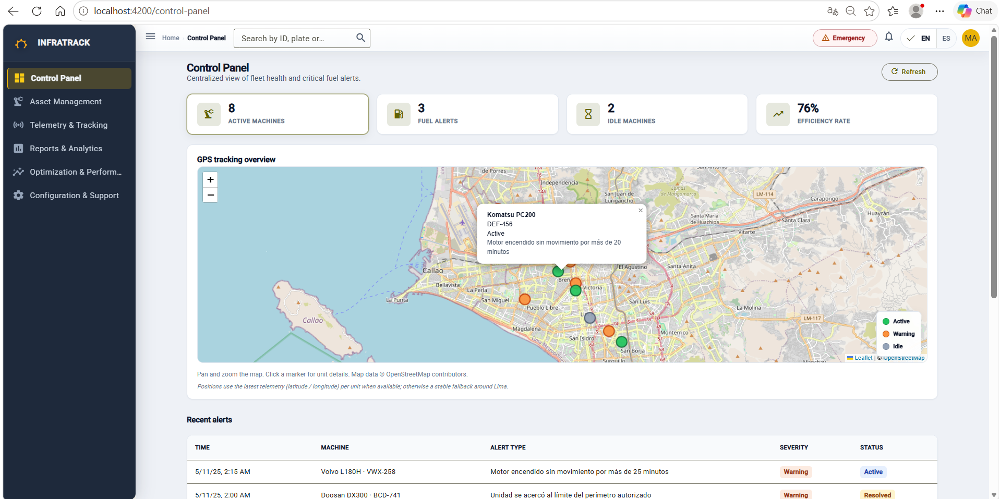
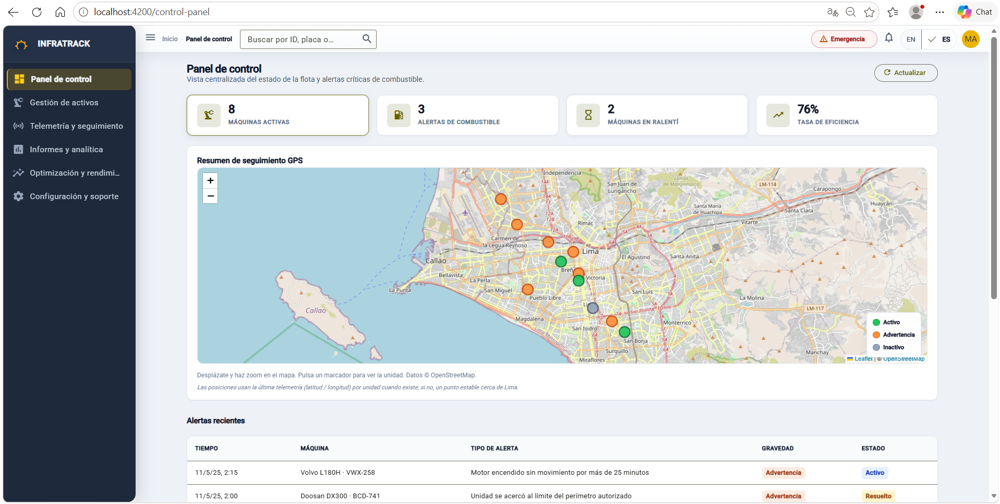

Asset Management:
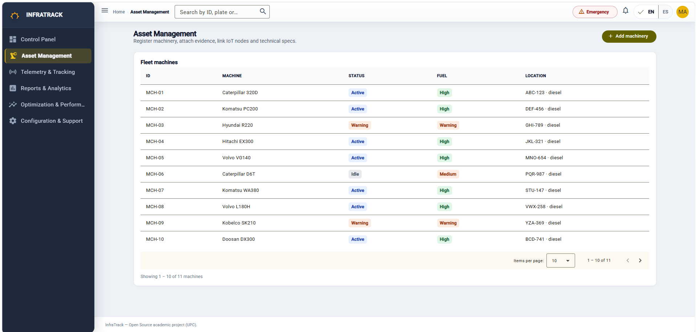
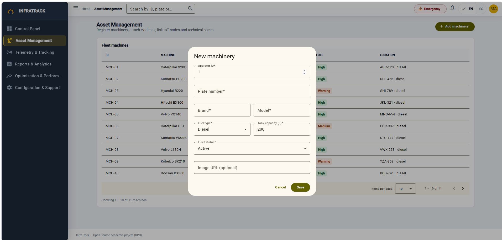

Telemetry & Tracking:
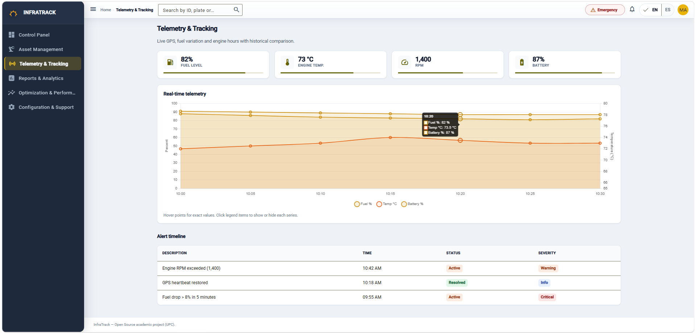

Reports & Analitycs:
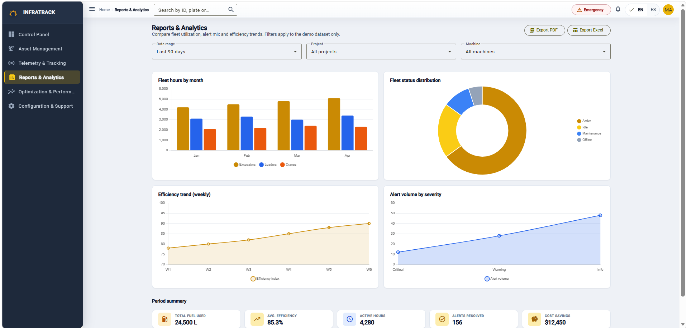

Optimization & Performance:
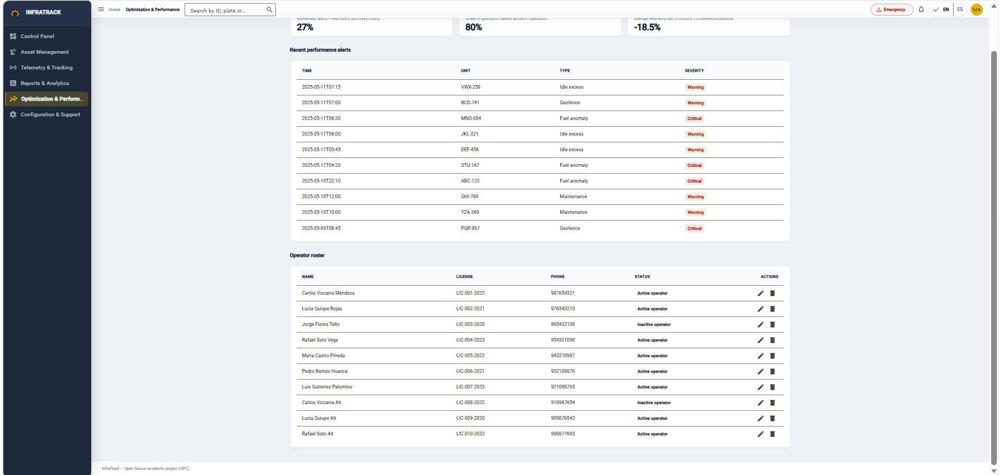

Configurations & Support:
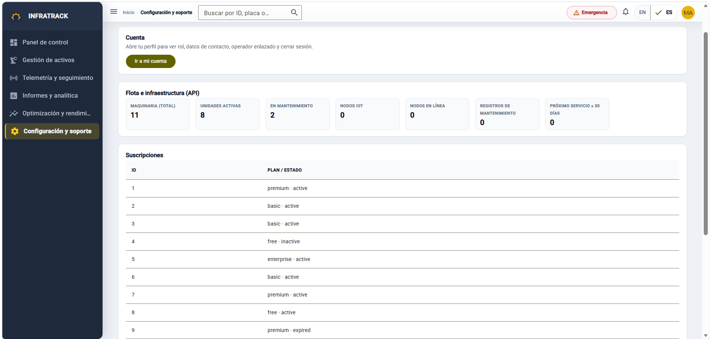

Account:
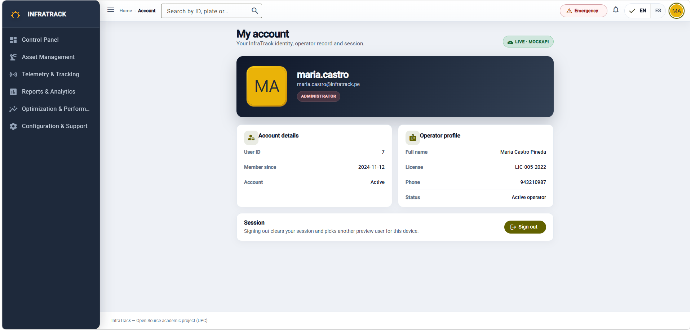


#### 5.2.2.6. Services Documentation Evidence for Sprint Review

#### 5.2.2.7. Software Deployment Evidence for Sprint Review

#### 5.2.2.8. Team Collaboration Insights during Sprint
Report:


Landing Page:

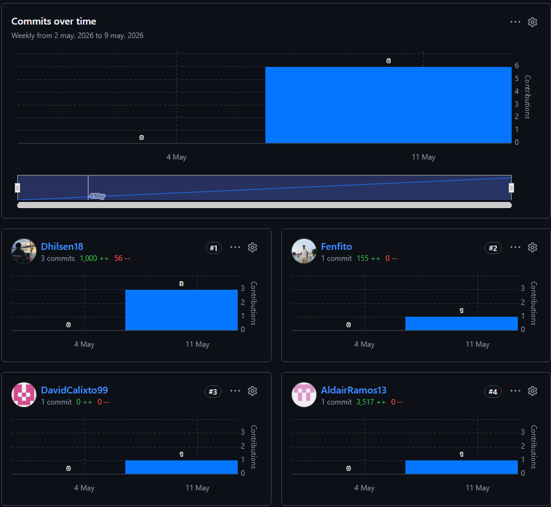


Frontend:

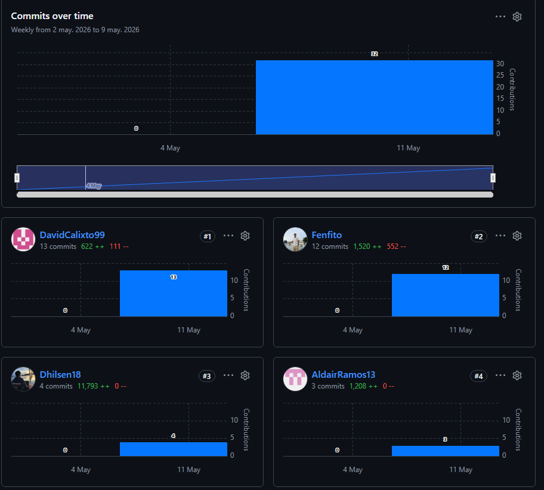


---

### 5.2.3. Sprint 3

#### 5.2.3.1. Sprint Planning 3
| Sprint # | Sprint 3 |
| :--- | :--- |
| Sprint Planning Background | |
| Date | 2026-06-15 |
| Time | 09:00 AM |
| Location | Universidad Peruana de Ciencias Aplicadas (Campus San Isidro), Reunión virtual |
| Prepared By | Mallqui Vilca, Dhilsen Armil |
| Attendees (to planning meeting) | Mallqui Vilca, Dhilsen Armil / Ramos Aguirre, Aldair Joaquin |
| Sprint Goal & User Stories | |
| Sprint 3 Goal | Nuestro enfoque está en desplegar la primera versión estable de Web Services en producción, completar autenticación IAM, documentar la API con OpenAPI y preparar las entrevistas de validación con usuarios del sector construcción. Esto se confirmará cuando la aplicación full-stack esté operativa en Render, los endpoints críticos estén documentados en Swagger y se registren las sesiones de validación. |
| Sprint 3 Velocity | 8 |
| Sum of Story Points | 42 |

#### 5.2.3.2. Aspect Leaders and Collaborators
| Team Member (Last Name, First Name) | GitHub Username | Backend Development (L/C) | Frontend Integration (L/C) | Deployment (L/C) | Validation & Docs (L/C) |
| :--- | :--- | :--- | :--- | :--- | :--- |
| Mallqui Vilca, Dhilsen Armil | Dhilsen18 | L | L | C | C |
| Ramos Aguirre, Aldair Joaquin | AldairRamos13 | C | C | L | L |

#### 5.2.3.3. Sprint Backlog 3

**Objetivo:** Desplegar Web Services en producción, completar módulo IAM, documentar API REST y ejecutar entrevistas de validación del producto Digital Machine.

**Board de control (Trello):** [InfraTrack — Sprint 3 Board](https://trello.com/b/PLACEHOLDER-sprint-3) *(actualizar con URL público del board)*

**(aquí va imagen: screenshot del board Trello — Sprint 3)**

**Duración:** 15 de Junio – 30 de Junio 2026 | **Capacidad de equipo:** 104 horas — 2 integrantes

<table>
  <thead>
    <tr>
      <th colspan="1" style="text-align:left; border: 1px solid black; padding: 8px;">Sprint #</th>
      <th colspan="7" style="text-align:left; border: 1px solid black; padding: 8px;">Sprint 3</th>
    </tr>
    <tr>
      <th colspan="2" style="text-align:left; border: 1px solid black; padding: 8px;">User Story</th>
      <th colspan="6" style="text-align:left; border: 1px solid black; padding: 8px;">Work-Item / Engineering Task</th>
    </tr>
    <tr>
      <th style="border: 1px solid black; padding: 8px;">Id</th>
      <th style="border: 1px solid black; padding: 8px;">Title</th>
      <th style="border: 1px solid black; padding: 8px;">Id</th>
      <th style="border: 1px solid black; padding: 8px;">Title</th>
      <th style="border: 1px solid black; padding: 8px;">Description</th>
      <th style="border: 1px solid black; padding: 8px;">Estimation (Hours)</th>
      <th style="border: 1px solid black; padding: 8px;">Assigned To</th>
      <th style="border: 1px solid black; padding: 8px;">Status</th>
    </tr>
  </thead>
  <tbody>
    <tr>
      <td rowspan="2" style="border: 1px solid black; padding: 12px;">HU-31</td>
      <td rowspan="2" style="border: 1px solid black; padding: 12px;">Login</td>
      <td style="border: 1px solid black; padding: 12px;">T-S3-01</td>
      <td style="border: 1px solid black; padding: 12px;">Implementar autenticación JWT en Spring Boot</td>
      <td style="border: 1px solid black; padding: 12px;">Desarrollar endpoints de sign-in/sign-up con generación de tokens y roles en bounded context IAM.</td>
      <td style="border: 1px solid black; padding: 12px;">6</td>
      <td style="border: 1px solid black; padding: 12px;">Mallqui Vilca, Dhilsen Armil</td>
      <td style="border: 1px solid black; padding: 12px;">Done</td>
    </tr>
    <tr>
      <td style="border: 1px solid black; padding: 12px;">T-S3-02</td>
      <td style="border: 1px solid black; padding: 12px;">Integrar login en Angular con guards de rol</td>
      <td style="border: 1px solid black; padding: 12px;">Conectar página de autenticación con API IAM y proteger rutas según rol owner/admin.</td>
      <td style="border: 1px solid black; padding: 12px;">5</td>
      <td style="border: 1px solid black; padding: 12px;">Ramos Aguirre, Aldair Joaquin</td>
      <td style="border: 1px solid black; padding: 12px;">Done</td>
    </tr>
    <tr>
      <td rowspan="2" style="border: 1px solid black; padding: 12px;">HU-38</td>
      <td rowspan="2" style="border: 1px solid black; padding: 12px;">Recepción de datos IoT</td>
      <td style="border: 1px solid black; padding: 12px;">T-S3-03</td>
      <td style="border: 1px solid black; padding: 12px;">Configurar base de datos en Filess.io</td>
      <td style="border: 1px solid black; padding: 12px;">Crear esquema relacional, tablas de telemetría y migraciones para persistencia de datos IoT.</td>
      <td style="border: 1px solid black; padding: 12px;">6</td>
      <td style="border: 1px solid black; padding: 12px;">Ramos Aguirre, Aldair Joaquin</td>
      <td style="border: 1px solid black; padding: 12px;">Done</td>
    </tr>
    <tr>
      <td style="border: 1px solid black; padding: 12px;">T-S3-04</td>
      <td style="border: 1px solid black; padding: 12px;">Implementar endpoint POST de telemetría</td>
      <td style="border: 1px solid black; padding: 12px;">Desarrollar recepción y validación de tramas de sensores GPS y combustible en Monitoring context.</td>
      <td style="border: 1px solid black; padding: 12px;">5</td>
      <td style="border: 1px solid black; padding: 12px;">Mallqui Vilca, Dhilsen Armil</td>
      <td style="border: 1px solid black; padding: 12px;">Done</td>
    </tr>
    <tr>
      <td rowspan="2" style="border: 1px solid black; padding: 12px;">HU-39</td>
      <td rowspan="2" style="border: 1px solid black; padding: 12px;">Consulta de datos API</td>
      <td style="border: 1px solid black; padding: 12px;">T-S3-05</td>
      <td style="border: 1px solid black; padding: 12px;">Documentar endpoints en Swagger/OpenAPI</td>
      <td style="border: 1px solid black; padding: 12px;">Publicar especificación OpenAPI con ejemplos de request/response para endpoints del Sprint 3.</td>
      <td style="border: 1px solid black; padding: 12px;">4</td>
      <td style="border: 1px solid black; padding: 12px;">Ramos Aguirre, Aldair Joaquin</td>
      <td style="border: 1px solid black; padding: 12px;">Done</td>
    </tr>
    <tr>
      <td style="border: 1px solid black; padding: 12px;">T-S3-06</td>
      <td style="border: 1px solid black; padding: 12px;">Capturar evidencias de documentación API</td>
      <td style="border: 1px solid black; padding: 12px;">Registrar screenshots de Swagger UI con datos de muestra para el informe de Sprint Review.</td>
      <td style="border: 1px solid black; padding: 12px;">4</td>
      <td style="border: 1px solid black; padding: 12px;">Ramos Aguirre, Aldair Joaquin</td>
      <td style="border: 1px solid black; padding: 12px;">Done</td>
    </tr>
    <tr>
      <td rowspan="2" style="border: 1px solid black; padding: 12px;">—</td>
      <td rowspan="2" style="border: 1px solid black; padding: 12px;">Constraint general</td>
      <td style="border: 1px solid black; padding: 12px;">T-S3-07</td>
      <td style="border: 1px solid black; padding: 12px;">Configurar despliegue en Render</td>
      <td style="border: 1px solid black; padding: 12px;">Desplegar backend Spring Boot con perfil de producción y variables de entorno en Render.</td>
      <td style="border: 1px solid black; padding: 12px;">6</td>
      <td style="border: 1px solid black; padding: 12px;">Mallqui Vilca, Dhilsen Armil</td>
      <td style="border: 1px solid black; padding: 12px;">Done</td>
    </tr>
    <tr>
      <td style="border: 1px solid black; padding: 12px;">T-S3-08</td>
      <td style="border: 1px solid black; padding: 12px;">Preparar guión de entrevistas de validación</td>
      <td style="border: 1px solid black; padding: 12px;">Diseñar protocolo de validación con tareas de usabilidad para segmentos objetivo del sector construcción.</td>
      <td style="border: 1px solid black; padding: 12px;">4</td>
      <td style="border: 1px solid black; padding: 12px;">Ramos Aguirre, Aldair Joaquin</td>
      <td style="border: 1px solid black; padding: 12px;">In-Process</td>
    </tr>
  </tbody>
</table>

#### 5.2.3.4. Development Evidence for Sprint Review

Los commits del Sprint 3 se documentan en la sección 5.2.2.4 (tablas Frontend y Backend), correspondientes a integración IAM, despliegue en Render, bounded contexts Fleet/Site Management y merges finales hacia `develop` y `main` (v1.0.0).

#### 5.2.3.5. Execution Evidence for Sprint Review

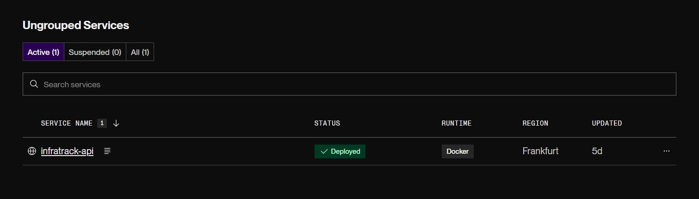
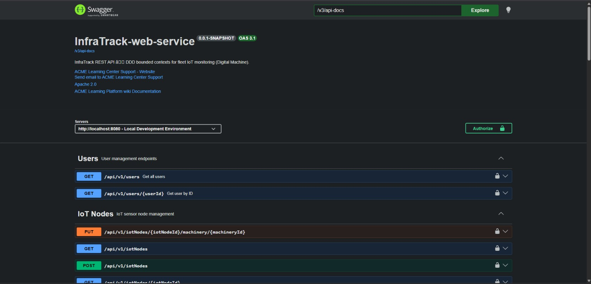

#### 5.2.3.6. Services Documentation Evidence for Sprint Review

| Endpoint | Método | Descripción | Documentación |
|---|---|---|---|
| `/api/v1/auth/sign-in` | POST | Autenticación de usuario con JWT | Swagger UI — *(aquí va imagen: Swagger-2.jpeg)* |
| `/api/v1/machinery` | POST/GET | CRUD de maquinaria | Swagger UI — *(aquí va imagen: Swagger-3.jpeg)* |
| `/api/v1/telemetry` | POST/GET | Recepción y consulta de telemetría IoT | Swagger UI — *(aquí va imagen: Swagger-4.jpeg)* |
| `/api/v1/alerts` | GET/PATCH | Listado y reconocimiento de alertas | Swagger UI |

#### 5.2.3.7. Software Deployment Evidence for Sprint Review

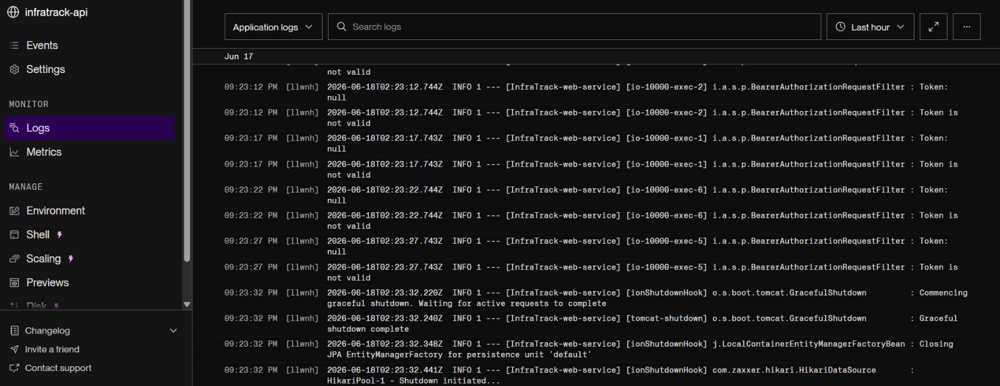
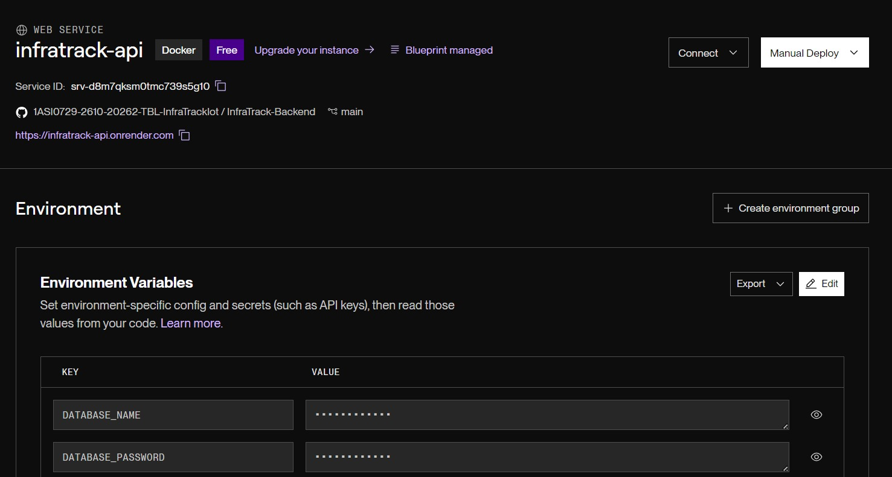
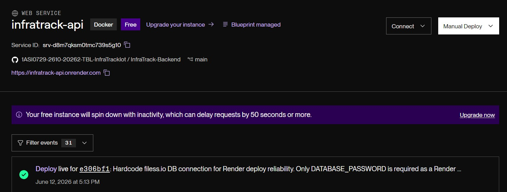
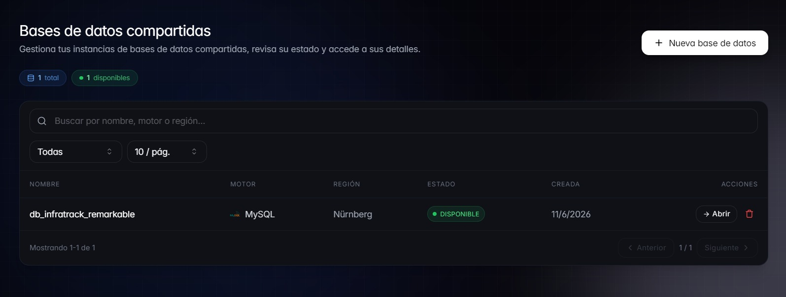
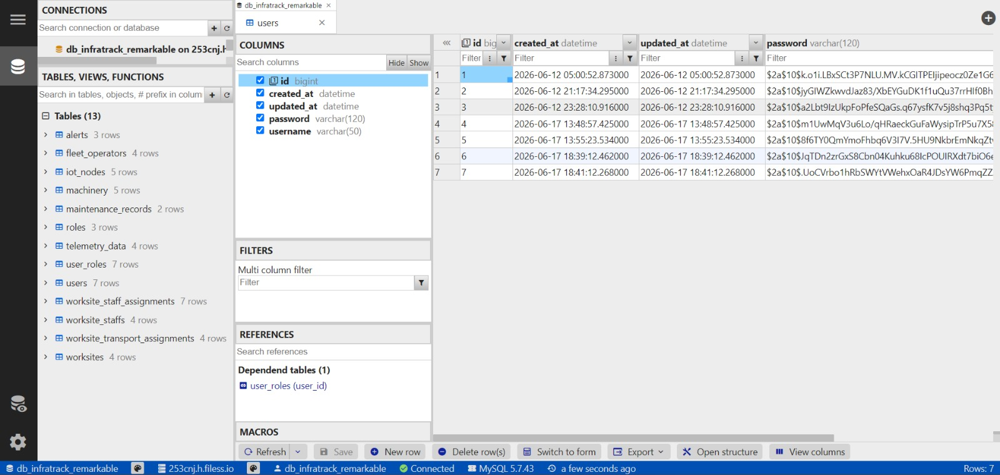

#### 5.2.3.8. Team Collaboration Insights during Sprint

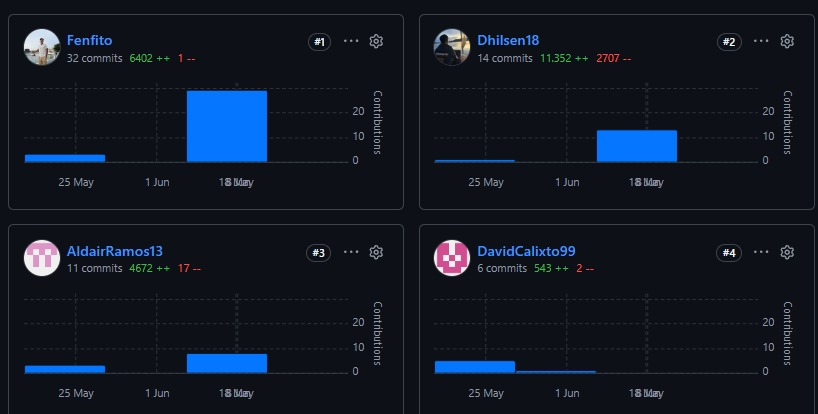

---

## 5.3. Validation Interviews

### 5.3.1. Diseño de Entrevistas

### 5.3.2. Registro de Entrevistas

### 5.3.3. Evaluaciones según heurísticas

La evaluación heurística de usabilidad se realizó sobre la aplicación web InfraTrack (Angular 21 + Angular Material), desplegada en el Sprint 2, analizando las vistas de Control Panel, gestión de flota (nodos IoT, transportes, conductores), telemetría GPS, reportes y alertas, configuración de activos, obras y perfil de usuario. Se aplicaron las diez heurísticas de Nielsen, priorizando los hallazgos con mayor impacto en la experiencia del propietario (*owner*) y del administrador de operaciones (*admin*).

**Alcance de la evaluación**

| Componente | Tecnología | Vistas evaluadas |
|---|---|---|
| Frontend | Angular 21, Material, ngx-translate (EN/ES) | Control Panel, Operaciones, Flota, Telemetría, Reportes, Configuración, Obras, Cuenta |
| Backend | Spring Boot 4, API REST `/api/v1` | Respuestas de error, validación y contratos de datos que condicionan la retroalimentación en UI |

---

#### Evaluación de Heurísticas de Usabilidad

**1. Descubrimiento y visibilidad de módulos críticos – Severidad: 4**

**Heurística violada:**
Visibilidad del estado del sistema / Flexibilidad y eficiencia de uso

**Descripción:**
Las rutas `/telemetry` (mapa GPS en tiempo real) y `/configuration` (vinculación de nodos IoT y mantenimiento) están implementadas y protegidas por guardas de rol, pero no aparecen en el menú lateral del `ShellLayout`. El propietario solo ve Control Panel, Obras, Mapa de establecimientos, Asignar personal y Reportes & Analytics. Funcionalidades centrales del producto —seguimiento geográfico y configuración de activos— quedan ocultas salvo que el usuario conozca la URL directamente, lo que contradice la arquitectura de información definida en el Sprint 2.

**Recomendación:**
Incorporar enlaces persistentes en la barra lateral para *Telemetría* y *Configuración*, usando las claves i18n ya existentes (`nav.telemetry`, `nav.configuration`), con iconografía coherente (`gps_fixed`, `settings`). Opcionalmente, añadir accesos rápidos desde el Control Panel hacia estas vistas para reforzar la navegación contextual.

---

**2. Correspondencia entre diseño y expectativas del usuario – Severidad: 3**

**Heurística violada:**
Correspondencia entre el sistema y el mundo real / Visibilidad del estado del sistema

**Descripción:**
En el Control Panel del propietario, las tarjetas KPI se renderizan como botones interactivos con estado `kpi-card--selected`, lo que sugiere filtrado o drill-down. Sin embargo, la acción `selectKpi()` solo alterna una selección visual sin modificar gráficos, tablas ni mapas. En el dashboard de operaciones (`OpsDashboard`), el panel de alertas muestra tres ítems estáticos con colores inline, desconectados del `FleetStore` y de la API `/api/v1/alerts`, mientras que el Control Panel y Reportes sí consumen alertas reales. El usuario puede interpretar datos de demostración como información operativa en vivo.

**Recomendación:**
Si los KPIs no filtran contenido, presentarlos como tarjetas informativas (`<article>`) sin affordance de clic, o conectar la selección a filtros reales en gráficos y tablas. Reemplazar las alertas estáticas del dashboard de operaciones por datos del backend, con estados vacío y de carga consistentes con el resto de la aplicación.

---

**3. Retroalimentación, estados vacíos y manejo de errores – Severidad: 3**

**Heurística violada:**
Visibilidad del estado del sistema / Prevención de errores

**Descripción:**
El Control Panel y la vista de Configuración implementan correctamente skeletons, banners `role="alert"` y spinners. En contraste, las listas de conductores, transportes, nodos IoT y obras (`DriverList`, `TransportList`, `IotDeviceList`, `WorksiteList`) renderizan encabezados de tabla con `<tbody>` vacío cuando no hay registros, sin mensaje de estado vacío ni llamada a la acción. `WorksiteList` no muestra `loadError()` aunque el store lo expone; `DriverList` carece de UI de error. En el perfil (`ProfilePage`), el contenido depende de `@if (userData())` sin indicador de carga, pudiendo dejar la pantalla en blanco temporalmente. En el backend, los GET por ID devuelven `404` sin cuerpo JSON, lo que obliga al frontend a manejar errores de forma inconsistente.

**Recomendación:**
Estandarizar el patrón `cp-empty` / `it-banner` en todas las listas: estado de carga (spinner o skeleton), estado vacío con CTA (*Registrar maquinaria*, *Crear obra*) y banner de error reutilizable. En formularios reactivos (`AddAlertDialog`, `AddIotNodeDialog`), mostrar `mat-error` por campo. Coordinar con backend respuestas `ErrorResource` uniformes también en GET 404.

---

**4. Consistencia visual, lingüística y de nomenclatura – Severidad: 2**

**Heurística violada:**
Consistencia y estándares / Reconocimiento antes que recuerdo

**Descripción:**
La aplicación mezcla segmentos de ruta en español (`/obras`, `/dispositivos`, `/conductores`) con rutas en inglés (`/control-panel`, `/telemetry`, `/configuration`, `/reports-analytics`), dificultando la predicción de URLs y la documentación. Conviven dos sistemas de iconos: `material-icons-outlined` en flota y obras frente a `<mat-icon>` en configuración y reportes. El selector de idioma (EN/ES) no persiste la preferencia: al recargar la página vuelve a inglés (`defaultLanguage: 'en'`). Algunos `aria-label` permanecen hardcodeados en español o inglés independientemente del idioma activo, y `<html lang="en">` no se actualiza al cambiar a español. En reportes, la columna *Máquina* muestra el `machineryId` numérico en lugar de placa o modelo.

**Recomendación:**
Unificar convención de rutas (preferiblemente inglés técnico o español según guía de estilo del Capítulo IV). Estandarizar un solo set de iconos Material. Persistir idioma en `localStorage` y sincronizar `document.documentElement.lang`. Resolver IDs de maquinaria a etiquetas legibles (placa/modelo) en tablas y filtros, consumiendo datos reales de `/api/v1/machinery` en lugar de opciones mock en `ReportsView`.

---

**5. Validación de formularios y prevención de errores – Severidad: 3**

**Heurística violada:**
Prevención de errores / Ayuda a los usuarios a reconocer, diagnosticar y recuperarse de errores

**Descripción:**
Los formularios de registro de obras, wizards de IoT/transporte y autenticación usan validación principalmente al enviar, con mensajes genéricos en banner (por ejemplo, reutilizando claves de `signup.errorRequired` en contextos no relacionados). Los diálogos reactivos marcan campos con `markAllAsTouched()` pero no muestran errores inline junto al campo inválido. En el backend, la validación es imperativa en servicios de comando sin `@Valid` en DTOs; los conflictos (placa duplicada, email existente) sí devuelven `details` útiles, pero los errores `NOT_FOUND` pierden contexto en el mensaje localizado. El botón de reconocimiento de alertas en Control Panel se deshabilita cuando `httpPutDeleteEnabled()` es falso, sin texto explicativo (a diferencia de la vista de Configuración que sí incluye `readOnlyHint`).

**Recomendación:**
Mostrar errores por campo con `mat-error` y mensajes semánticos por contexto (`worksite.errorNameRequired`). Añadir hints cuando acciones estén deshabilitadas por modo solo lectura o límites de plan. En backend, adoptar validación declarativa en DTOs y enriquecer respuestas 404 con `details` que identifiquen el recurso. Exponer en Reportes el flujo de creación de alertas mediante `AddAlertDialog`, actualmente implementado pero no enlazado desde la UI.

---

**6. Jerarquía visual y densidad informativa en paneles operativos – Severidad: 2**

**Heurística violada:**
Diseño estético y minimalista / Visibilidad del estado del sistema

**Descripción:**
El Control Panel concentra KPIs, gráficos Chart.js, mapa de obras, alertas recientes y tabla de mantenimiento en una sola vista. La jerarquía tipográfica entre eyebrow (nombre de empresa), título y secciones es adecuada gracias a `PageHeaderCard`, pero el botón de actualización usa la clave `controlPanel.load.retry` incluso en refrescos normales, transmitiendo la idea de error cuando no lo hay. En telemetría, el mapa Leaflet y el panel lateral comparten espacio sin indicador claro de carga global al obtener posiciones GPS. La marca lateral muestra subtítulo fijo *Sensor* mientras el login promociona *Digital Machine*, generando ligera disonancia de identidad visual.

**Recomendación:**
Separar etiquetas de *Actualizar* y *Reintentar* según contexto (`controlPanel.refresh` vs `controlPanel.load.retry`). Añadir indicador de carga en telemetría durante fetch de coordenadas. Unificar subtítulo de marca en sidebar, login y documentación. Considerar agrupación por pestañas o secciones colapsables en Control Panel para reducir carga cognitiva en pantallas medianas.

---

**Resumen de severidades**

| # | Hallazgo | Severidad (1–4) | Heurística principal |
|---|---|---|---|
| 1 | Módulos Telemetría y Configuración no visibles en navegación | 4 | Visibilidad del sistema |
| 2 | KPIs y alertas con affordance engañosa | 3 | Correspondencia sistema–mundo real |
| 3 | Estados vacío/carga/error inconsistentes | 3 | Visibilidad del sistema |
| 4 | Inconsistencia de rutas, iconos e i18n | 2 | Consistencia y estándares |
| 5 | Validación y mensajes de error débiles | 3 | Prevención de errores |
| 6 | Jerarquía y etiquetas en paneles densos | 2 | Diseño minimalista |

*Escala de severidad: 1 = cosmético; 2 = menor; 3 = mayor; 4 = crítico para completar tareas.*

---

## 5.4. Video About-the-Product

---

# Conclusiones

## Conclusiones y recomendaciones

### Conclusiones

La solución **InfraTrack — Digital Machine** ha logrado un alto nivel de alineación entre los objetivos iniciales del negocio (Lean UX) y la propuesta de diseño y arquitectura, la cual se sustenta en la validación temprana con los segmentos objetivo del sector construcción e infraestructura.

Los problemas centrales identificados en la gestión de flotas de maquinaria pesada —falta de visibilidad en tiempo real sobre ubicación, combustible y horas de motor; dificultad para coordinar múltiples obras y sedes; mantenimiento reactivo en lugar de preventivo; y asignación poco trazable de operadores y recursos— han sido abordados directamente por la propuesta de valor de InfraTrack. El diseño del producto, basado en **nodos IoT** conectados a un **dashboard web** y una **API REST** con arquitectura DDD, resuelve los *pain points* identificados al ofrecer telemetría GPS, alertas de combustible y mantenimiento, panel de control con KPIs, gestión de obras y un centro de reportes unificado para propietarios (*owner*) y administradores de operaciones (*admin*).

Las principales suposiciones de negocio y de funcionalidad se vieron validadas por el avance de los dos sprints, la evidencia de ejecución y la evaluación heurística documentada en la sección 5.3.3:

**Validación de necesidad y valor.** La suposición de que las constructoras y empresas de infraestructura necesitan monitoreo centralizado de su flota y que el principal valor reside en la **reducción de paradas no planificadas**, el **control de combustible** y la **visibilidad multi-obra** se refleja en las historias de usuario implementadas (HU-23, HU-11, HU-26, HU-12, HU-22). El Sprint 1 confirmó interés en la propuesta mediante la landing page desplegada en Vercel ([infratrack-iot-inky.vercel.app](https://infratrack-iot-inky.vercel.app/)), con secciones de propuesta de valor, planes de suscripción, dashboard IoT demostrativo y acceso a la aplicación. El Sprint 2 materializó esa promesa en una aplicación Angular 21 con Control Panel, gestión de flota, telemetría, reportes y módulo de obras.

**Arquitectura y escalabilidad.** La decisión de organizar el sistema en bounded contexts —IAM, Monitoring, Fleet y Site Management— permitió separar responsabilidades entre autenticación, telemetría/alertas, activos IoT y gestión de frentes de obra, facilitando el desarrollo paralelo del frontend y del backend Spring Boot 4. La documentación OpenAPI (`/swagger-ui.html`) y el uso de GitFlow con ramas `feature/`, `develop` y `main` sentaron bases sólidas para iteraciones posteriores.

**Disposición y barreras de adopción.** Si bien la necesidad del mercado y la disposición a adoptar soluciones digitales fueron respaldadas por el diseño de planes Básico, Premium y Enterprise, la evaluación heurística reveló barreras de adopción **dentro del propio producto**: módulos críticos como Telemetría y Configuración no son descubribles desde la navegación principal; algunas vistas muestran datos estáticos o affordances engañosas (KPIs clicables sin efecto, alertas de demostración en el dashboard de operaciones). Esto implica que la suposición sobre la **confiabilidad percibida del sistema** debe reforzarse no solo con hardware IoT calibrado, sino con coherencia entre lo que la interfaz promete y lo que efectivamente entrega.

**Consolidación del trabajo colaborativo.** Las gráficas de GitHub del informe, frontend y backend evidencian participación activa de Mallqui Vilca, Dhilsen Armil y Ramos Aguirre, Aldair Joaquin, con asignación de tareas por sprint, roles de líder y colaborador (L/C) y uso de Pull Requests hacia `develop`.

**Mejora en la organización y gestión de tareas.** La planificación por sprints con objetivos claros, backlog tabulado por historias de usuario y estimación en horas permitió dividir el trabajo en entregables manejables: Sprint 1 (landing page y primer contacto comercial) y Sprint 2 (aplicación web completa con backend). La matriz de aspectos L/C facilitó la distribución de responsabilidades según las fortalezas de cada integrante.

**Avance en la calidad del producto.** Se logró construir una **landing page completa** desplegada en producción, con propuesta de valor, planes, formulario de contacto y dashboard IoT de demostración. En el Sprint 2 se desarrolló la **aplicación Digital Machine** con vistas de Control Panel, gestión de maquinaria y nodos IoT, telemetría GPS (Leaflet), reportes y analíticas, configuración de activos, obras y perfil de cuenta, soportada por API REST documentada. El soporte bilingüe (EN/ES) mediante ngx-translate amplía el alcance a operadores y gerentes en contextos locales e internacionales.

**Aprendizaje sobre integración y control de versiones.** El equipo identificó dificultades en la sincronización de cambios entre múltiples repositorios (Landing Page, Frontend, Backend e Informe), lo que resalta la necesidad de reforzar buenas prácticas de integración continua, revisiones de PR y merges ordenados hacia `develop` antes de `main`, especialmente en el flujo `feature/chapter-5` → `develop` → `main` previsto para esta entrega.

**Enfoque en la experiencia del usuario.** Los sprints permitieron validar la importancia de la navegabilidad por roles, el diseño responsive, los llamados a la acción en la landing page y la consistencia de retroalimentación en la aplicación (estados de carga, vacío y error). La evaluación heurística de Nielsen aplicada al frontend identificó seis áreas de mejora priorizadas, que servirán como base para optimizar usabilidad y accesibilidad en los próximos incrementos del producto.

---

### Recomendaciones

**Validación en campo con constructoras.** Ejecutar formalmente las entrevistas de validación con los segmentos objetivo (gerentes de obra, jefes de flota y administradores de operaciones) y obtener métricas de éxito definidas en Lean UX (tiempo de respuesta ante alertas, reducción de paradas no planificadas, precisión de telemetría de combustible). Es crucial establecer una **fase piloto B2B** en al menos una constructora o empresa de infraestructura para obtener datos reales de nodos IoT en obra y demostrar la confiabilidad del hardware y del software, abordando la principal barrera de adopción identificada: la confianza en la precisión de los datos capturados en campo.

**Desarrollo de bounded contexts críticos.** Concentrar el desarrollo en los contextos **Monitoring** (telemetría, alertas, reportes y analíticas) y **Fleet** (maquinaria, nodos IoT, mantenimiento y operadores), valorados por gerentes y jefes de flota para la toma de decisiones operativas. Completar las historias de usuario del Sprint 2 aún en progreso (HU-11 alertas preventivas, HU-19 umbrales, HU-12 historial de mantenimiento, HU-29 perfil de operador, HU-22 horarios de operación) convertirá el producto de un prototipo funcional a una herramienta operativa de apoyo a la decisión en obra.

**Corrección de hallazgos heurísticos prioritarios.** Incorporar Telemetría y Configuración al menú lateral; conectar KPIs y alertas del dashboard a datos reales del backend; estandarizar estados vacío, carga y error en todas las listas; y unificar validación de formularios con mensajes por campo. Estas acciones, derivadas de la sección 5.3.3, tienen impacto directo en la adopción y deben priorizarse antes de ampliar el roadmap funcional.

**Expansión del roadmap B2B (piloto Enterprise).** Implementar un programa piloto pagado con el plan Enterprise (zonas de obra y transportes ilimitados, umbrales IoT personalizados por obra) en al menos un cliente del sector construcción, para validar la hipótesis de reducción de costos por mantenimiento reactivo y uso indebido de maquinaria fuera de horario, y obtener *case studies* que sirvan como evidencia comercial para futuras alianzas.

**Optimización de canales digitales.** Una vez contada con evidencia cuantitativa del piloto, activar la estrategia de captación B2B (alianzas con constructoras, ferias del sector, demostraciones en obra) y reforzar los CTAs de la landing page hacia registro y planes de suscripción. El contenido debe responder a las búsquedas de visibilidad de flota, control de combustible y trazabilidad multi-obra, alineado con el mensaje *"Inteligencia de flota de código abierto para maquinaria pesada"*.

**Fortalecimiento técnico de la API y la integración.** Adoptar validación declarativa en DTOs del backend, unificar respuestas de error (`ErrorResource`) en todos los endpoints incluidos los GET 404, y documentar en Swagger la metadata de InfraTrack (reemplazando referencias genéricas). En el frontend, persistir preferencia de idioma y completar la integración del flujo de creación de alertas (`AddAlertDialog`) en el centro de reportes, cerrando la brecha entre capacidades implementadas y expuestas al usuario.

---

## Video About-the-Team
