# Capítulo V: Product Implementation, Validation & Deployment

## 5.1. Software Configuration Management

### 5.1.1. Software Development Environment Configuration

En esta sección se describen todas las herramientas, plataformas y tecnologías utilizadas por el equipo durante el desarrollo del proyecto InfraTrack. Cada integrante configuró su entorno local siguiendo estas especificaciones para garantizar consistencia en el desarrollo colaborativo.
 
| Herramienta | Propósito | URL / Versión |
|---|---|---|
| Web Storm | Editor de código principal para HTML, CSS, JavaScript y Markdown | https://www.jetbrains.com/webstorm/ |
| Git | Sistema de control de versiones distribuido | https://git-scm.com/ v2.43+ |
| GitHub | Plataforma de repositorios remotos, gestión de ramas y colaboración | https://github.com |
| Node.js | Entorno de ejecución para herramientas de frontend y scripts | v18.x LTS |
| Bootstrap 5.3 | Framework CSS para diseño responsivo de la landing page | https://getbootstrap.com v5.3 |
| Bootstrap Icons 1.11 | Librería de íconos SVG para la interfaz | https://icons.getbootstrap.com |
| Google Fonts (Outfit) | Tipografía principal del proyecto | https://fonts.google.com |
| Figma | Diseño colaborativo de wireframes, mockups y prototipos | https://figma.com |
| Vercel | Plataforma de despliegue continuo para la landing page | https://vercel.com |
| Postman | Testing y documentación de endpoints de la API REST | https://postman.com |
| Leaflet + OpenStreetMap | **Servicio externo de terceros** — mapas GPS en telemetría y obras | https://leafletjs.com / https://www.openstreetmap.org |
| draw.io / Mermaid | Elaboración de diagramas de arquitectura y flujos | https://draw.io |

Para clonar y ejecutar la landing page localmente:
 
```bash
# Clonar el repositorio desde el mismo WebStorm creando un nuevo proyecto
y pegando el link de la lading: https://github.com/1ASI0729-2610-20262-TBL-InfraTrackIot/InfraTrack-Landing-Page.git
```

### 5.1.2. Source Code Management
El equipo gestiona el código fuente a través de la organización pública de GitHub: 
**Organización:** [https://github.com/1ASI0729-2610-20262-TBL-InfraTrackIot](https://github.com/1ASI0729-2610-20262-TBL-InfraTrackIot)
 
**Repositorios del proyecto:**
 
| Repositorio | URL | Descripción |
|---|---|---|
| InfraTrack-Landing-Page | https://github.com/1ASI0729-2610-20262-TBL-InfraTrackIot/InfraTrack-Landing-Page | Landing page institucional desplegada en Vercel |
| InfraTrack-Frontend | https://github.com/1ASI0729-2610-20262-TBL-InfraTrackIot/InfraTrack-Frontend | Web Application Angular 21 (Digital Machine) |
| InfraTrack-Backend | https://github.com/1ASI0729-2610-20262-TBL-InfraTrackIot/InfraTrack-Backend | RESTful API Spring Boot 4 + pruebas |
| InfraTrack-Report | https://github.com/1ASI0729-2610-20262-TBL-InfraTrackIot/InfraTrack-Report | Informe del proyecto en formato Markdown (este documento) |
 
**Estrategia de Branching — GitFlow:**
 
El equipo aplica GitFlow como estrategia de control de versiones. Las ramas son:
 
```
main          → Versión estable de producción. Solo recibe merges desde release/ o hotfix/.
develop       → Rama de integración. Recibe merges de todas las ramas feature/.
feature/[nombre] → Desarrollo de nuevas funcionalidades o secciones. Ej: feature/hero-section
release/[v]   → Preparación de la entrega. Ej: release/tb1
```
 
**Flujo de trabajo del equipo:**
 
```
1. El desarrollador crea su rama: git checkout -b feature/nombre-tarea develop
2. Desarrolla y hace commits con Conventional Commits
3. Hace push: git push origin feature/nombre-tarea
4. Abre un Pull Request hacia develop
5. El equipo revisa y aprueba
6. Se hace merge a develop
7. Para la entrega: se crea release/tb1 desde develop → merge a main → tag de versión
```
 
### 5.1.3. Source Code Style Guide & Conventions
**Conventional Commits:**
 
Todos los mensajes de commit siguen el estándar [Conventional Commits v1.0.0](https://www.conventionalcommits.org/). El formato es:
 
```
<tipo>[ámbito opcional]: <descripción corta en inglés>
 
[cuerpo opcional]
 
[footer opcional]
```
 
**Tipos de commit utilizados:**
 
| Tipo | Uso |
|---|---|
| `feat` | Nueva funcionalidad o sección |
| `fix` | Corrección de bug o error |
| `docs` | Cambios en documentación o README |
| `style` | Cambios de formato, CSS, sin afectar lógica |
| `refactor` | Reestructuración de código sin cambiar funcionalidad |
| `test` | Adición o modificación de pruebas |
| `chore` | Tareas de configuración, despliegue o dependencias |
 
**Ejemplos de commits del proyecto:**
 
```bash
feat(landing): add hero section with typing animation effect
feat(landing): add IoT operations dashboard with real-time KPI cards
feat(landing): add pricing plans section with three tiers
fix(landing): fix team photo path with spaces in filename
docs(report): add chapter I lean ux problem statements
chore(deploy): configure vercel deployment from main branch
style(landing): adjust color palette to match brand guidelines
```
 
**Convenciones de código HTML/CSS:**
 
- Indentación: 4 espacios
- Clases CSS: kebab-case (ej: `hero-section`, `floating-card-horizontal`)
- IDs: camelCase (ej: `typingTitle`, `iotTemp`)
- Comentarios de sección: `<!-- Section N: Nombre -->` para marcar bloques principales
- Imágenes: formato WebP cuando sea posible, con atributo `alt` descriptivo obligatorio
**Convenciones de JavaScript:**
 
- Variables y funciones: camelCase
- Constantes: UPPER_SNAKE_CASE
- Funciones: declarativas con `function` o arrow functions según contexto
- Sin `var`, usar `const` y `let`
**Convenciones de base de datos (SQL):**
 
- Palabras reservadas: UPPER_CASE (`SELECT`, `FROM`, `WHERE`)
- Nombres de tablas: camelCase (`telemetryData`, `iotNodes`)
- Nombres de columnas: camelCase (`fuelLevel`, `recordedAt`)
- Claves primarias: siempre `id` con tipo `BIGINT`
- Claves foráneas: `[tabla]Id` (ej: `assetId`, `nodeId`)

### 5.1.4. Software Deployment Configuration
**Landing Page — Vercel:**
 
La landing page de InfraTrack está desplegada en Vercel con integración continua desde GitHub.

| Parámetro | Valor |
|---|---|
| **Plataforma** | Vercel |
| **Repositorio fuente** | https://github.com/1ASI0729-2610-20262-TBL-InfraTrackIot/InfraTrack-Landing-Page |
| **Rama de producción** | `main` |
| **URL de producción** | https://infra-track-landing-page.vercel.app/ |
| **Despliegue automático** | Activado — cada push a `main` genera un nuevo despliegue |
| **Framework detectado** | Other (HTML estático) |
 
**Proceso de despliegue paso a paso:**
 
```
1. El desarrollador trabaja en su rama feature/[nombre]
2. Hace commits con conventional commits
3. Abre Pull Request hacia develop
4. El equipo revisa y aprueba el PR
5. Se hace merge a develop (genera preview deployment en Vercel)
6. Para la entrega: se hace merge de develop a main
7. Vercel detecta el push a main automáticamente
8. Vercel construye y despliega en producción en < 60 segundos
9. La URL de producción queda disponible
```

**Frontend Web Application — Vercel:**

| Parámetro | Valor |
|---|---|
| **Plataforma** | Vercel |
| **Repositorio** | InfraTrack-Frontend |
| **URL de producción** | https://infra-track-frontend-five.vercel.app/ |
| **Integración** | Consume API REST desplegada en Render |

**Web Services — Render:**

| Parámetro | Valor |
|---|---|
| **Plataforma** | Render |
| **Repositorio** | InfraTrack-Backend |
| **URL de producción** | https://infratrack-api.onrender.com/ |
| **Documentación** | Swagger UI en `/swagger-ui.html` |
| **Base de datos** | MySQL (Filess.io) |

**Servicio externo de terceros:** La telemetría GPS utiliza **Leaflet** con tiles de **OpenStreetMap** para visualización de coordenadas en tiempo real, integrado desde el módulo de Monitoring del frontend.

---

## 5.2. Landing Page, Services & Applications Implementation

Esta sección documenta la evolución acumulada del producto **InfraTrack — Digital Machine** a través de los cuatro sprints del ciclo de vida (AV1 → TB1 → AV2 → **TB2**). El informe de entrega final TB2 consolida todas las evidencias; las tablas de Sprint Backlog reflejan el estado al cierre de cada iteración, incluyendo tareas completadas en sprints posteriores cuando corresponde.

**Estado del producto al cierre TB2 (Sprint 4 — v2.0.0):**

| Componente | Plataforma | URL de producción |
|---|---|---|
| Landing Page | Vercel | https://infra-track-landing-page.vercel.app/ |
| Web Application | Vercel | https://infra-track-frontend-five.vercel.app/iam/sign-in |
| RESTful API | Render | https://infratrack-api.onrender.com/ |
| Documentación API | Swagger UI | https://infratrack-api.onrender.com/swagger-ui.html |
| Servicio externo | Leaflet + OpenStreetMap | Integrado en módulo Telemetría |

---

### 5.2.1. Sprint 1

#### 5.2.1.1. Sprint Planning 1
| Sprint # | Sprint 1 |
| :--- | :--- |
| Sprint Planning Background | |
| Date | 2026-04-20 |
| Time | 10:30 AM |
| Location | Universidad Peruana de Ciencias Aplicadas (Campus San Isidro), Reunión virtual |
| Prepared By | Mallqui Vilca, Dhilsen Armil |
| Attendees (to planning meeting) | Mallqui Vilca, Dhilsen Armil / Morales Yapuchura, Jefferson Bayron / Ramos Aguirre, Aldair Joaquin |
| Sprint Goal & User Stories | |
| Sprint 1 Goal | Nuestro enfoque está en desarrollar y desplegar una landing page funcional que presente eficazamente nuestro producto Digital Machine. Creemos que esto genera una primera interacción positiva y clara con potenciales clientes, facilitando su comprensión y conexión inicial con la propuesta de valor. Esto se confirmará cuando recibamos las primeras visitas y observemos señales básicas de interés, como clics en elementos clave, navegación dentro de la página y comentarios iniciales de usuarios o colegas. |
| Sprint 1 Velocity | 7 |
| Sum of Story Points | 45 |
#### 5.2.1.2. Aspect Leaders and Collaborators
| Team Member (Last Name, First Name) | GitHub Username | UI/UX Design (L/C) | Landing Page Development (L/C) | Quality Control (L/C) | Documentation (L/C) |
| :--- | :--- | :--- | :--- | :--- | :--- |
| Mallqui Vilca, Dhilsen Armil | Dhilsen18 | L | L | C | C |
| Morales Yapuchura, Jefferson Bayron | JeffersonMoralesY | C | C | C | L |
| Ramos Aguirre, Aldair Joaquin | AldairRamos13 | C | C | L | C |
#### 5.2.1.3. Sprint Backlog 1

**Objetivo:** Crear y poner en producción una landing page operativa que satisfaga las historias de usuario del Epic EP-08, sirviendo como primer punto de contacto comercial con los segmentos objetivo.

**Board de control:** El Sprint Backlog se documenta en la tabla siguiente del informe (texto redactado, conforme al enunciado). Cada User Story se descompone en **Engineering Tasks** con estimación entre **4 y 8 horas** como máximo por tarea, y estados **To-do / In-Process / To-Review / Done**. Evidencia de tareas en repositorio Landing Page.

**Duración:** 20 de Abril – 01 de Mayo 2026 | **Capacidad de equipo:** 120 horas — 3 integrantes

<table>
  <thead>
    <tr>
      <th colspan="1" style="text-align:left; border: 1px solid black; padding: 8px;">Sprint 1</th>
      <th colspan="7" style="text-align:left; border: 1px solid black; padding: 8px;">Sprint 1</th>
    </tr>
    <tr>
      <th colspan="2" style="text-align:left; border: 1px solid black; padding: 8px;">User Story</th>
      <th colspan="6" style="text-align:left; border: 1px solid black; padding: 8px;">Work-Item / Engineering Task</th>
    </tr>
    <tr>
      <th style="border: 1px solid black; padding: 8px;">Id</th>
      <th style="border: 1px solid black; padding: 8px;">Title</th>
      <th style="border: 1px solid black; padding: 8px;">Id</th>
      <th style="border: 1px solid black; padding: 8px;">Title</th>
      <th style="border: 1px solid black; padding: 8px;">Description</th>
      <th style="border: 1px solid black; padding: 8px;">Estimation (Hours)</th>
      <th style="border: 1px solid black; padding: 8px;">Assigned To</th>
      <th style="border: 1px solid black; padding: 8px;">Status</th>
    </tr>
  </thead>
  <tbody>
    <tr>
      <td rowspan="2" style="border: 1px solid black; padding: 12px;">HU-35</td>
      <td rowspan="2" style="border: 1px solid black; padding: 12px;">Propuesta de valor</td>
      <td style="border: 1px solid black; padding: 12px;">T-S1-01</td>
      <td style="border: 1px solid black; padding: 12px;">Diseñar wireframe de sección propuesta de valor</td>
      <td style="border: 1px solid black; padding: 12px;">Elaborar en Figma el layout desktop y mobile de la sección que comunica beneficios y diferenciadores de Digital Machine.</td>
      <td style="border: 1px solid black; padding: 12px;">4</td>
      <td style="border: 1px solid black; padding: 12px;">Mallqui Vilca, Dhilsen Armil</td>
      <td style="border: 1px solid black; padding: 12px;">Done</td>
    </tr>
    <tr>
      <td style="border: 1px solid black; padding: 12px;">T-S1-02</td>
      <td style="border: 1px solid black; padding: 12px;">Implementar sección propuesta de valor en HTML/CSS</td>
      <td style="border: 1px solid black; padding: 12px;">Codificar la sección responsive con tipografía, iconografía y copy alineado al Style Guide del Capítulo IV.</td>
      <td style="border: 1px solid black; padding: 12px;">6</td>
      <td style="border: 1px solid black; padding: 12px;">Mallqui Vilca, Dhilsen Armil</td>
      <td style="border: 1px solid black; padding: 12px;">Done</td>
    </tr>
    <tr>
      <td rowspan="2" style="border: 1px solid black; padding: 12px;">HU-36</td>
      <td rowspan="2" style="border: 1px solid black; padding: 12px;">Formulario contacto</td>
      <td style="border: 1px solid black; padding: 12px;">T-S1-03</td>
      <td style="border: 1px solid black; padding: 12px;">Diseñar formulario de contacto responsive</td>
      <td style="border: 1px solid black; padding: 12px;">Definir campos, validaciones visuales y estados de error/éxito del formulario en Figma.</td>
      <td style="border: 1px solid black; padding: 12px;">4</td>
      <td style="border: 1px solid black; padding: 12px;">Morales Yapuchura, Jefferson Bayron</td>
      <td style="border: 1px solid black; padding: 12px;">Done</td>
    </tr>
    <tr>
      <td style="border: 1px solid black; padding: 12px;">T-S1-04</td>
      <td style="border: 1px solid black; padding: 12px;">Implementar lógica de validación del formulario</td>
      <td style="border: 1px solid black; padding: 12px;">Desarrollar validación en JavaScript y retroalimentación al usuario antes del envío de la solicitud.</td>
      <td style="border: 1px solid black; padding: 12px;">5</td>
      <td style="border: 1px solid black; padding: 12px;">Ramos Aguirre, Aldair Joaquin</td>
      <td style="border: 1px solid black; padding: 12px;">Done</td>
    </tr>
    <tr>
      <td rowspan="2" style="border: 1px solid black; padding: 12px;">HU-37</td>
      <td rowspan="2" style="border: 1px solid black; padding: 12px;">Acceso a la app</td>
      <td style="border: 1px solid black; padding: 12px;">T-S1-05</td>
      <td style="border: 1px solid black; padding: 12px;">Implementar botones CTA hacia la aplicación</td>
      <td style="border: 1px solid black; padding: 12px;">Crear botones de llamada a la acción en hero y navbar que redirijan a la Web Application.</td>
      <td style="border: 1px solid black; padding: 12px;">5</td>
      <td style="border: 1px solid black; padding: 12px;">Mallqui Vilca, Dhilsen Armil</td>
      <td style="border: 1px solid black; padding: 12px;">Done</td>
    </tr>
    <tr>
      <td style="border: 1px solid black; padding: 12px;">T-S1-06</td>
      <td style="border: 1px solid black; padding: 12px;">Configurar rutas de redirección por segmento</td>
      <td style="border: 1px solid black; padding: 12px;">Vincular CTAs del landing page con las vistas correspondientes en la aplicación según segmento objetivo.</td>
      <td style="border: 1px solid black; padding: 12px;">4</td>
      <td style="border: 1px solid black; padding: 12px;">Mallqui Vilca, Dhilsen Armil</td>
      <td style="border: 1px solid black; padding: 12px;">Done</td>
    </tr>
    <tr>
      <td rowspan="2" style="border: 1px solid black; padding: 12px;">HU-48</td>
      <td rowspan="2" style="border: 1px solid black; padding: 12px;">Dashboard de Hardware</td>
      <td style="border: 1px solid black; padding: 12px;">T-S1-07</td>
      <td style="border: 1px solid black; padding: 12px;">Diseñar mockup del panel IoT demostrativo</td>
      <td style="border: 1px solid black; padding: 12px;">Definir tarjetas KPI de telemetría, batería y estado de conexión para la sección demostrativa del landing.</td>
      <td style="border: 1px solid black; padding: 12px;">4</td>
      <td style="border: 1px solid black; padding: 12px;">Ramos Aguirre, Aldair Joaquin</td>
      <td style="border: 1px solid black; padding: 12px;">Done</td>
    </tr>
    <tr>
      <td style="border: 1px solid black; padding: 12px;">T-S1-08</td>
      <td style="border: 1px solid black; padding: 12px;">Implementar dashboard IoT con datos simulados</td>
      <td style="border: 1px solid black; padding: 12px;">Desarrollar componentes visuales de telemetría con actualización animada para demostrar capacidades del producto.</td>
      <td style="border: 1px solid black; padding: 12px;">6</td>
      <td style="border: 1px solid black; padding: 12px;">Ramos Aguirre, Aldair Joaquin</td>
      <td style="border: 1px solid black; padding: 12px;">Done</td>
    </tr>
    <tr>
      <td style="border: 1px solid black; padding: 12px;">—</td>
      <td style="border: 1px solid black; padding: 12px;">Constraint general</td>
      <td style="border: 1px solid black; padding: 12px;">T-S1-09</td>
      <td style="border: 1px solid black; padding: 12px;">Configurar despliegue continuo en Vercel</td>
      <td style="border: 1px solid black; padding: 12px;">Integrar repositorio Landing Page con Vercel y validar despliegue automático desde rama main.</td>
      <td style="border: 1px solid black; padding: 12px;">4</td>
      <td style="border: 1px solid black; padding: 12px;">Mallqui Vilca, Dhilsen Armil</td>
      <td style="border: 1px solid black; padding: 12px;">Done</td>
    </tr>
  </tbody>
</table>

#### 5.2.1.4. Development Evidence for Sprint Review

Esta sección muestra los commits vinculados al avance de la **Landing Page** en el Sprint 1. El alcance no incluyó Web Services ni Frontend Application.

| Repository | Branch | Commit Id | Commit Message | Commited On |
|---|---|---|---|---|
| 1ASI0729-2610-20262-TBL-InfraTrackIot/InfraTrack-Landing-Page | feature/hero-section | — | feat(landing): add hero section with typing animation effect | 2026-04-25 |
| 1ASI0729-2610-20262-TBL-InfraTrackIot/InfraTrack-Landing-Page | feature/pricing | — | feat(landing): add pricing plans section with three tiers | 2026-04-27 |
| 1ASI0729-2610-20262-TBL-InfraTrackIot/InfraTrack-Landing-Page | develop | — | feat(landing): add IoT operations dashboard with real-time KPI cards | 2026-04-28 |
| 1ASI0729-2610-20262-TBL-InfraTrackIot/InfraTrack-Landing-Page | develop | — | feat(landing): add contact form and CTA to Web Application | 2026-04-29 |
| 1ASI0729-2610-20262-TBL-InfraTrackIot/InfraTrack-Landing-Page | main | — | chore(deploy): configure vercel deployment from main branch | 2026-05-01 |

*Evidencia completa de commits en el repositorio Landing Page — ver Team Collaboration Insights 5.2.1.8.*

#### 5.2.1.5. Execution Evidence for Sprint Review

**URL de producción:** [https://infra-track-landing-page.vercel.app/](https://infra-track-landing-page.vercel.app/)

La Landing Page cumple los requisitos del enunciado: presenta el modelo de negocio, aplica **Responsive Web Design** (Bootstrap 5.3), incluye pitch message, CTAs vinculados a la Web Application desplegada, información de contacto, redes sociales y **Términos y Condiciones** en el footer.

| Sección requerida | Evidencia en producción |
|---|---|
| Propósito de la plataforma + screenshots/video | Hero, Tecnología 360°, dashboard IoT demostrativo, video About-the-Product (YouTube embebido) |
| Pitch message | *"Soluciones tecnológicas para el control de maquinaria y combustible"* + KPIs de valor |
| CTAs hacia la app | *Iniciar sesión*, *Solicitar demo*, *Ver planes* → `https://infra-track-frontend-five.vercel.app/iam/sign-in` |
| Información de contacto | Teléfono, email, sede (Av. Javier Prado Este 1110), horario de atención |
| Redes sociales | Footer: *Sigue nuestras redes sociales* |
| Términos y condiciones | Enlace en footer → sección legal |
| Responsive | Navbar colapsable, grids adaptativos desktop/mobile (Cap. IV — 4.3) |

## Hero Section
Incluye header con logo, navegación (Inicio, Tecnología, Sectores, Nosotros, Equipo, Planes), selector EN/ES y CTA *Iniciar sesión* hacia la Web Application.

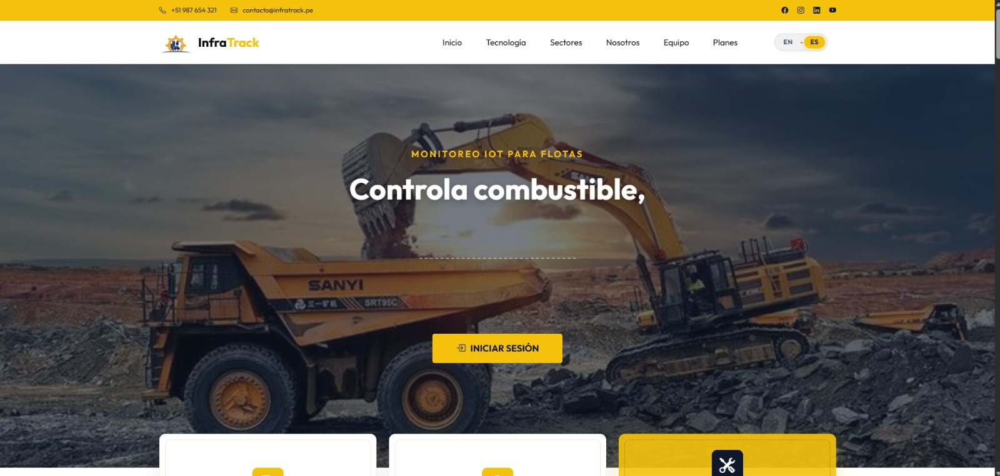

## Sobre Nosotros
Sección *Quiénes somos* con misión, visión, valores y pitch del equipo TechTitans (UPC).

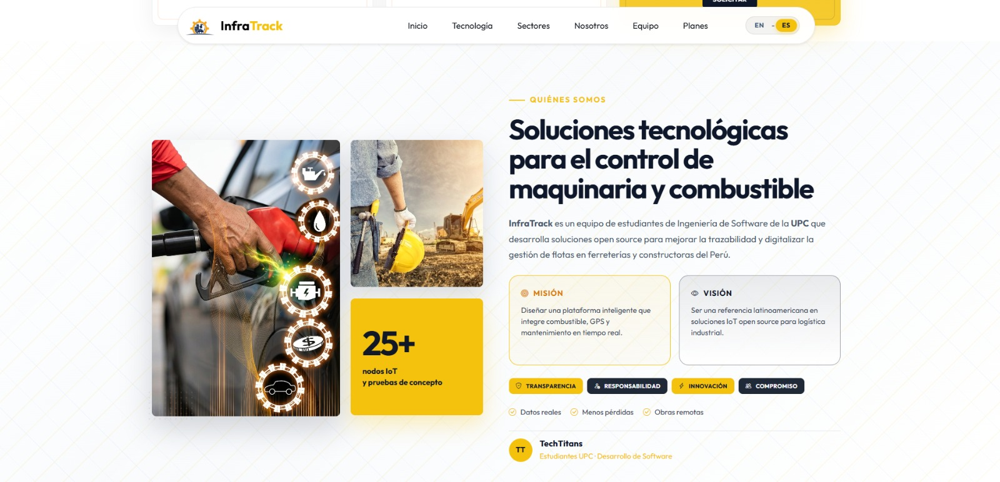

## Planes y Servicios
Tres tiers (Base Obra, Control Pro, Escala Total) con CTAs *Seleccionar plan* y *Comenzar ahora*.

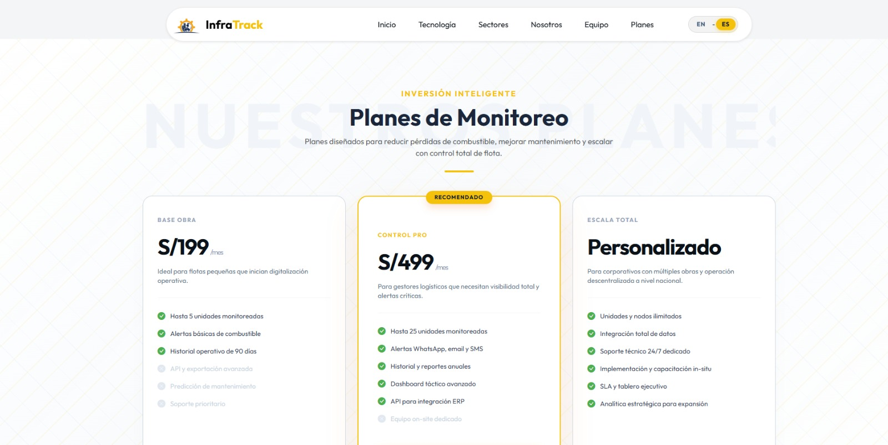

## Tecnología y Monitoreo 360°
Sección *Monitoreo 360°* con KPIs demostrativos de combustible, GPS, motor y ahorro; video About-the-Product embebido desde YouTube.

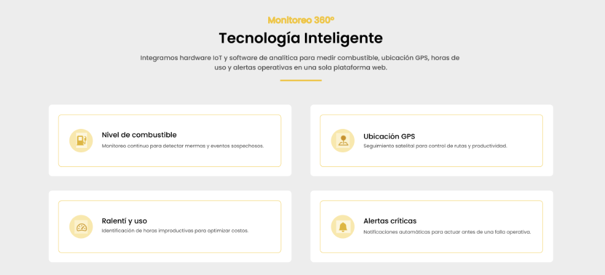

## Equipo y Contacto
Sección *Integrantes del Equipo* (TechTitans UPC), información de contacto (teléfono, email, sede, horario), redes sociales y enlace a Términos y Condiciones en footer.


## Responsive Web Design
Navbar colapsable y grids adaptativos en viewport mobile (375 px) y desktop, conforme al Style Guide del Capítulo IV — 4.3.


#### 5.2.1.6. Services Documentation Evidence for Sprint Review

Dado que el alcance del primer sprint se limitó al desarrollo inicial de la landing page, en esta etapa no se contempló la ejecución de pruebas para servicios o interacciones.

#### 5.2.1.7. Software Deployment Evidence for Sprint Review
Link del Landing Page: https://infra-track-landing-page.vercel.app/
#### 5.2.1.8. Team Collaboration Insights during Sprint
Actividad del repositorio del landing page:

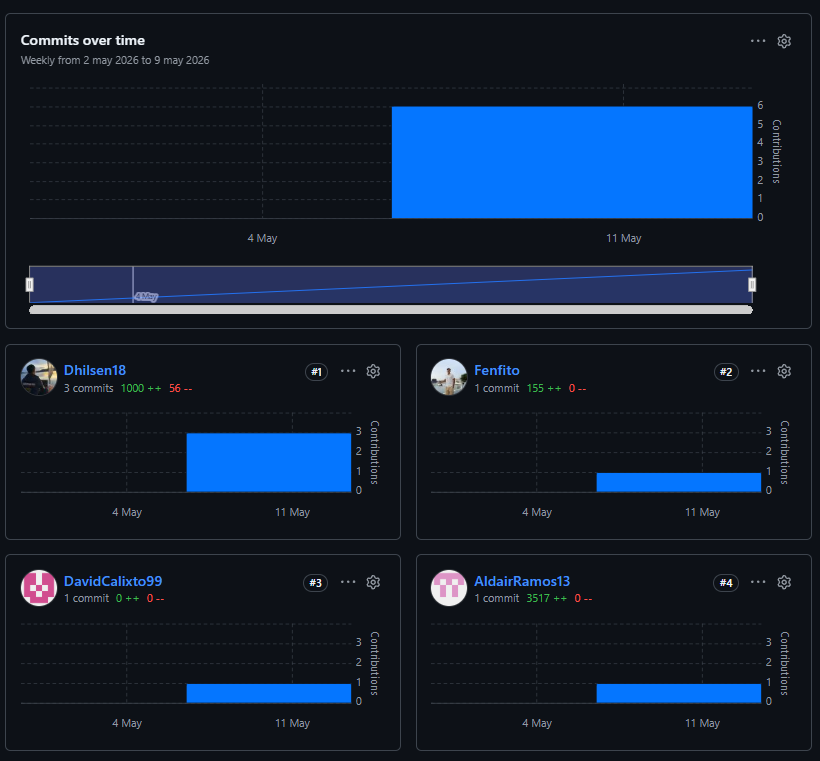

---

### 5.2.2. Sprint 2

#### 5.2.2.1. Sprint Planning 2
| Sprint # | Sprint 2 |
| :--- | :--- |
| Sprint Planning Background | |
| Date | 2026-05-02 |
| Time | 10:10 AM |
| Location | Universidad Peruana de Ciencias Aplicadas (Campus San Isidro), Reunión virtual |
| Prepared By | Ramos Aguirre, Aldair Joaquin |
| Attendees (to planning meeting) | Mallqui Vilca, Dhilsen Armil / Morales Yapuchura, Jefferson Bayron / Ramos Aguirre, Aldair Joaquin |
| Sprint Goal & User Stories | |
| Sprint 2 Goal | Nuestro enfoque está en entregar la primera versión funcional de la Web Application Digital Machine con Control Panel, gestión de flota y telemetría, integrada con la API REST. Creemos que esto permitirá validar la propuesta de valor con usuarios reales del sector construcción. Esto se confirmará cuando los administradores puedan registrar maquinaria, visualizar alertas y consultar telemetría desde la aplicación desplegada. |
| Sprint 2 Velocity | 7 |
| Sum of Story Points | 38 |
#### 5.2.2.2. Aspect Leaders and Collaborators
| Team Member (Last Name, First Name) | GitHub Username | Frontend Development (L/C) | Backend Development (L/C) | Quality Control (L/C) | Documentation (L/C) |
| :--- | :--- | :--- | :--- | :--- | :--- |
| Mallqui Vilca, Dhilsen Armil | Dhilsen18 | L | L | C | C |
| Morales Yapuchura, Jefferson Bayron | JeffersonMoralesY | C | C | C | L |
| Ramos Aguirre, Aldair Joaquin | AldairRamos13 | C | C | L | C |
#### 5.2.2.3. Sprint Backlog 2

**Objetivo:** Implementar la primera versión del Frontend Web Application con módulos de registro de maquinaria, alertas, telemetría y configuración, integrada con endpoints REST del backend.

**Board de control:** Sprint Backlog documentado en tabla 5.2.2.3. Cada HU se descompone en Engineering Tasks (4–8 h máx.) con estados To-do / In-Process / To-Review / Done. Evidencia en repositorios Frontend y Backend.

**Duración:** 02 de Mayo – 12 de Mayo 2026 | **Capacidad de equipo:** 144 horas — 3 integrantes

*Nota TB2:* Las tareas T-S2-09 (historial de mantenimiento) y T-S2-11 (UI de horarios) se cerraron en el Sprint 4; el estado final es **Done** en la versión v2.0.0.

<table>
  <thead>
    <tr>
      <th colspan="1" style="text-align:left; border: 1px solid black; padding: 8px;">Sprint 2</th>
      <th colspan="7" style="text-align:left; border: 1px solid black; padding: 8px;">Sprint 2</th>
    </tr>
    <tr>
      <th colspan="2" style="text-align:left; border: 1px solid black; padding: 8px;">User Story</th>
      <th colspan="6" style="text-align:left; border: 1px solid black; padding: 8px;">Work-Item / Engineering Task</th>
    </tr>
    <tr>
      <th style="border: 1px solid black; padding: 8px;">Id</th>
      <th style="border: 1px solid black; padding: 8px;">Title</th>
      <th style="border: 1px solid black; padding: 8px;">Id</th>
      <th style="border: 1px solid black; padding: 8px;">Title</th>
      <th style="border: 1px solid black; padding: 8px;">Description</th>
      <th style="border: 1px solid black; padding: 8px;">Estimation (Hours)</th>
      <th style="border: 1px solid black; padding: 8px;">Assigned To</th>
      <th style="border: 1px solid black; padding: 8px;">Status</th>
    </tr>
  </thead>
  <tbody>
    <tr>
      <td rowspan="3" style="border: 1px solid black; padding: 12px;">HU-23</td>
      <td rowspan="3" style="border: 1px solid black; padding: 12px;">Registrar maquinaria</td>
      <td style="border: 1px solid black; padding: 12px;">T-S2-01</td>
      <td style="border: 1px solid black; padding: 12px;">Diseñar formulario de registro de maquinaria</td>
      <td style="border: 1px solid black; padding: 12px;">Definir en Figma los campos técnicos, tipo de combustible y asignación de operador para el módulo de activos.</td>
      <td style="border: 1px solid black; padding: 12px;">4</td>
      <td style="border: 1px solid black; padding: 12px;">Mallqui Vilca, Dhilsen Armil</td>
      <td style="border: 1px solid black; padding: 12px;">Done</td>
    </tr>
    <tr>
      <td style="border: 1px solid black; padding: 12px;">T-S2-02</td>
      <td style="border: 1px solid black; padding: 12px;">Implementar vista de registro en Angular</td>
      <td style="border: 1px solid black; padding: 12px;">Desarrollar componente reactivo con validaciones para captura de datos de maquinaria en Asset Management.</td>
      <td style="border: 1px solid black; padding: 12px;">6</td>
      <td style="border: 1px solid black; padding: 12px;">Mallqui Vilca, Dhilsen Armil</td>
      <td style="border: 1px solid black; padding: 12px;">Done</td>
    </tr>
    <tr>
      <td style="border: 1px solid black; padding: 12px;">T-S2-03</td>
      <td style="border: 1px solid black; padding: 12px;">Integrar POST /api/v1/machinery en frontend</td>
      <td style="border: 1px solid black; padding: 12px;">Conectar formulario con endpoint REST y manejar respuestas de éxito y error en la UI.</td>
      <td style="border: 1px solid black; padding: 12px;">5</td>
      <td style="border: 1px solid black; padding: 12px;">Ramos Aguirre, Aldair Joaquin</td>
      <td style="border: 1px solid black; padding: 12px;">Done</td>
    </tr>
    <tr>
      <td rowspan="2" style="border: 1px solid black; padding: 12px;">HU-11</td>
      <td rowspan="2" style="border: 1px solid black; padding: 12px;">Generar alertas de mantenimiento</td>
      <td style="border: 1px solid black; padding: 12px;">T-S2-04</td>
      <td style="border: 1px solid black; padding: 12px;">Implementar regla de alertas por horas de uso en backend</td>
      <td style="border: 1px solid black; padding: 12px;">Desarrollar servicio que evalúe horas acumuladas y genere alertas preventivas en el bounded context Monitoring.</td>
      <td style="border: 1px solid black; padding: 12px;">6</td>
      <td style="border: 1px solid black; padding: 12px;">Mallqui Vilca, Dhilsen Armil</td>
      <td style="border: 1px solid black; padding: 12px;">Done</td>
    </tr>
    <tr>
      <td style="border: 1px solid black; padding: 12px;">T-S2-05</td>
      <td style="border: 1px solid black; padding: 12px;">Mostrar alertas preventivas en Control Panel</td>
      <td style="border: 1px solid black; padding: 12px;">Consumir API de alertas y renderizar notificaciones en el dashboard del propietario con estados de severidad.</td>
      <td style="border: 1px solid black; padding: 12px;">5</td>
      <td style="border: 1px solid black; padding: 12px;">Ramos Aguirre, Aldair Joaquin</td>
      <td style="border: 1px solid black; padding: 12px;">Done</td>
    </tr>
    <tr>
      <td rowspan="2" style="border: 1px solid black; padding: 12px;">HU-26</td>
      <td rowspan="2" style="border: 1px solid black; padding: 12px;">Estado de conexión del Nodo</td>
      <td style="border: 1px solid black; padding: 12px;">T-S2-06</td>
      <td style="border: 1px solid black; padding: 12px;">Implementar indicadores de estado IoT en backend</td>
      <td style="border: 1px solid black; padding: 12px;">Exponer endpoint que reporte estado conectado/desconectado/falla de transmisión por nodo IoT.</td>
      <td style="border: 1px solid black; padding: 12px;">5</td>
      <td style="border: 1px solid black; padding: 12px;">Mallqui Vilca, Dhilsen Armil</td>
      <td style="border: 1px solid black; padding: 12px;">Done</td>
    </tr>
    <tr>
      <td style="border: 1px solid black; padding: 12px;">T-S2-07</td>
      <td style="border: 1px solid black; padding: 12px;">Visualizar badges de conexión en lista de nodos</td>
      <td style="border: 1px solid black; padding: 12px;">Desarrollar componentes visuales con código de colores para estado de cada nodo en la vista de flota.</td>
      <td style="border: 1px solid black; padding: 12px;">4</td>
      <td style="border: 1px solid black; padding: 12px;">Ramos Aguirre, Aldair Joaquin</td>
      <td style="border: 1px solid black; padding: 12px;">Done</td>
    </tr>
    <tr>
      <td rowspan="2" style="border: 1px solid black; padding: 12px;">HU-12</td>
      <td rowspan="2" style="border: 1px solid black; padding: 12px;">Historial de mantenimiento</td>
      <td style="border: 1px solid black; padding: 12px;">T-S2-08</td>
      <td style="border: 1px solid black; padding: 12px;">Crear entidad y repositorio de mantenimiento</td>
      <td style="border: 1px solid black; padding: 12px;">Modelar persistencia de registros de servicio por unidad en base de datos relacional.</td>
      <td style="border: 1px solid black; padding: 12px;">6</td>
      <td style="border: 1px solid black; padding: 12px;">Mallqui Vilca, Dhilsen Armil</td>
      <td style="border: 1px solid black; padding: 12px;">Done</td>
    </tr>
    <tr>
      <td style="border: 1px solid black; padding: 12px;">T-S2-09</td>
      <td style="border: 1px solid black; padding: 12px;">Implementar vista de historial en configuración</td>
      <td style="border: 1px solid black; padding: 12px;">Desarrollar tabla consultable con filtros por unidad y fecha en el módulo de configuración.</td>
      <td style="border: 1px solid black; padding: 12px;">5</td>
      <td style="border: 1px solid black; padding: 12px;">Ramos Aguirre, Aldair Joaquin</td>
      <td style="border: 1px solid black; padding: 12px;">Done</td>
    </tr>
    <tr>
      <td rowspan="2" style="border: 1px solid black; padding: 12px;">HU-22</td>
      <td rowspan="2" style="border: 1px solid black; padding: 12px;">Configurar horario de operación</td>
      <td style="border: 1px solid black; padding: 12px;">T-S2-10</td>
      <td style="border: 1px solid black; padding: 12px;">Implementar configuración de horarios en backend</td>
      <td style="border: 1px solid black; padding: 12px;">Desarrollar endpoints para definir rangos horarios permitidos y disparar alertas por uso fuera de horario.</td>
      <td style="border: 1px solid black; padding: 12px;">6</td>
      <td style="border: 1px solid black; padding: 12px;">Mallqui Vilca, Dhilsen Armil</td>
      <td style="border: 1px solid black; padding: 12px;">Done</td>
    </tr>
    <tr>
      <td style="border: 1px solid black; padding: 12px;">T-S2-11</td>
      <td style="border: 1px solid black; padding: 12px;">Crear UI de configuración de horarios operativos</td>
      <td style="border: 1px solid black; padding: 12px;">Desarrollar formulario en Angular para que el administrador defina horarios por maquinaria.</td>
      <td style="border: 1px solid black; padding: 12px;">4</td>
      <td style="border: 1px solid black; padding: 12px;">Ramos Aguirre, Aldair Joaquin</td>
      <td style="border: 1px solid black; padding: 12px;">Done</td>
    </tr>
    <tr>
      <td style="border: 1px solid black; padding: 12px;">—</td>
      <td style="border: 1px solid black; padding: 12px;">Constraint general</td>
      <td style="border: 1px solid black; padding: 12px;">T-S2-12</td>
      <td style="border: 1px solid black; padding: 12px;">Ejecutar pruebas de integración frontend-backend</td>
      <td style="border: 1px solid black; padding: 12px;">Validar flujos críticos de registro, alertas y telemetría con datos de muestra en entorno de desarrollo.</td>
      <td style="border: 1px solid black; padding: 12px;">4</td>
      <td style="border: 1px solid black; padding: 12px;">Ramos Aguirre, Aldair Joaquin</td>
      <td style="border: 1px solid black; padding: 12px;">Done</td>
    </tr>
  </tbody>
</table>

*Estado al cierre TB2:* Todas las engineering tasks del Sprint 2 figuran como **Done**; T-S2-09 y T-S2-11 se completaron en el Sprint 4 (v2.0.0).

#### 5.2.2.4. Development Evidence for Sprint Review

Esta sección documenta los commits vinculados a los avances más relevantes de la implementación del Sprint 2. El alcance incluyó la aplicación web **Digital Machine** (frontend Angular 21) y su integración con la **API REST** (backend Spring Boot 4), siguiendo la estrategia GitFlow con ramas `feature/[bounded-context]` integradas en `develop`. Los commits provienen de los repositorios oficiales de la organización en GitHub.

**Repositorio Frontend — InfraTrack-Frontend**

| Repository | Branch | Commit Id | Commit Message | Commited On |
|---|---|---|---|---|
| 1ASI0729-2610-20262-TBL-InfraTrackIot/InfraTrack-Frontend | feature/iam | d2801eb | feat: Implement IamService for user authentication | 2026-05-12 |
| 1ASI0729-2610-20262-TBL-InfraTrackIot/InfraTrack-Frontend | feature/iam | f5e1508 | feat: implement login page with role-based simulation and animated branding background | 2026-05-12 |
| 1ASI0729-2610-20262-TBL-InfraTrackIot/InfraTrack-Frontend | feature/control-panel | ff914b8 | feat: implement core application stores and infrastructure mappers for control panel, configuration, and telemetry modules | 2026-05-12 |
| 1ASI0729-2610-20262-TBL-InfraTrackIot/InfraTrack-Frontend | feature/control-panel | 36af5ca | feat: implement internationalization and create control panel dashboard structure | 2026-05-12 |
| 1ASI0729-2610-20262-TBL-InfraTrackIot/InfraTrack-Frontend | feature/control-panel | 6a2ac4b | feat: enhance control panel charts with tooltips and improved styling | 2026-05-12 |
| 1ASI0729-2610-20262-TBL-InfraTrackIot/InfraTrack-Frontend | feature/asset-management | 1dee508 | feat: enhance asset management with filtering, subscription plans, and improved UI components | 2026-05-12 |
| 1ASI0729-2610-20262-TBL-InfraTrackIot/InfraTrack-Frontend | origin/develop | c69865b | Merge pull request #7 from feature/telemetry into develop | 2026-05-12 |
| 1ASI0729-2610-20262-TBL-InfraTrackIot/InfraTrack-Frontend | origin/develop | bb5f7bc | Merge pull request #5 from feature/reports into develop | 2026-05-12 |
| 1ASI0729-2610-20262-TBL-InfraTrackIot/InfraTrack-Frontend | feature/iam | 9118fc9 | feat: enhance login page with internationalization support and improved branding elements | 2026-05-13 |
| 1ASI0729-2610-20262-TBL-InfraTrackIot/InfraTrack-Frontend | develop | 0b676f2 | feat: initialize Angular application with routing and basic configuration | 2026-06-07 |
| 1ASI0729-2610-20262-TBL-InfraTrackIot/InfraTrack-Frontend | feature/fleet | c862b58 | feat(feature/fleet): add ConfigurationStore and FleetStore for managing fleet and IoT data | 2026-06-07 |
| 1ASI0729-2610-20262-TBL-InfraTrackIot/InfraTrack-Frontend | feature/fleet | d861b0f | feat(feature/fleet): add entity models for FleetDriver, FleetTransport, and IotDevice | 2026-06-07 |
| 1ASI0729-2610-20262-TBL-InfraTrackIot/InfraTrack-Frontend | feature/fleet | 4ef3e13 | feat(feature/fleet): add dialog for adding IoT nodes and maintenance records | 2026-06-07 |
| 1ASI0729-2610-20262-TBL-InfraTrackIot/InfraTrack-Frontend | feature/fleet | 6c9c8dd | feat(feature/fleet): add configuration view components and styles for fleet management | 2026-06-07 |
| 1ASI0729-2610-20262-TBL-InfraTrackIot/InfraTrack-Frontend | feature/fleet | a4d3a36 | feat(feature/fleet): add fleet HTTP layer and admin IoT, transport and driver views | 2026-06-13 |
| 1ASI0729-2610-20262-TBL-InfraTrackIot/InfraTrack-Frontend | origin/develop | 0451da1 | Merge pull request #10 from feature/fleet into develop | 2026-06-13 |
| 1ASI0729-2610-20262-TBL-InfraTrackIot/InfraTrack-Frontend | feature/shared | 90e3c3a | feat(feature/shared): add shell layout, profile, i18n, HTTP policy and plan limits | 2026-06-13 |
| 1ASI0729-2610-20262-TBL-InfraTrackIot/InfraTrack-Frontend | origin/develop | f6013bc | Merge pull request #11 from feature/shared into develop | 2026-06-13 |
| 1ASI0729-2610-20262-TBL-InfraTrackIot/InfraTrack-Frontend | feature/monitoring | cefe7a8 | feat(monitoring): add new components and styles for monitoring dashboard and alerts | 2026-06-15 |
| 1ASI0729-2610-20262-TBL-InfraTrackIot/InfraTrack-Frontend | origin/develop | f7f7f6d | Merge pull request #12 from feature/monitoring into develop | 2026-06-15 |
| 1ASI0729-2610-20262-TBL-InfraTrackIot/InfraTrack-Frontend | feature/site-management | 601cc8c | feat(site-management): add worksite and transport entities with corresponding detail components and styles | 2026-06-15 |
| 1ASI0729-2610-20262-TBL-InfraTrackIot/InfraTrack-Frontend | origin/develop | 68c88fd | Merge pull request #13 from feature/site-management into develop | 2026-06-15 |
| 1ASI0729-2610-20262-TBL-InfraTrackIot/InfraTrack-Frontend | feature/iam | e0feb2c | feat: add IAM sign-up and sign-in request/response models and API endpoints | 2026-06-15 |
| 1ASI0729-2610-20262-TBL-InfraTrackIot/InfraTrack-Frontend | origin/develop | 2b20079 | Merge pull request #15 from feature/iam into develop | 2026-06-15 |
| 1ASI0729-2610-20262-TBL-InfraTrackIot/InfraTrack-Frontend | develop | 3613fd4 | feat(integration): wire app shell routes and global styles for full-stack develop | 2026-06-16 |
| 1ASI0729-2610-20262-TBL-InfraTrackIot/InfraTrack-Frontend | origin/develop | 7a7613b | fix(iam): warm up Render backend on auth pages to reduce login wait | 2026-06-16 |

**Repositorio Backend — InfraTrack-Backend**

| Repository | Branch | Commit Id | Commit Message | Commited On |
|---|---|---|---|---|
| 1ASI0729-2610-20262-TBL-InfraTrackIot/InfraTrack-Backend | feature/create-machinery | 3eacf05 | feat(fleet): add machinery creation workflow | 2026-06-10 |
| 1ASI0729-2610-20262-TBL-InfraTrackIot/InfraTrack-Backend | feature/update-machinery | 0780f67 | feat(fleet): implement machinery update functionality | 2026-06-10 |
| 1ASI0729-2610-20262-TBL-InfraTrackIot/InfraTrack-Backend | feature/register-iot-node | 90cc41b | feat(fleet): implement IoT node registration services | 2026-06-10 |
| 1ASI0729-2610-20262-TBL-InfraTrackIot/InfraTrack-Backend | feature/list-alerts | 83a5b11 | feat(monitoring): add AlertsController for managing fleet alerts API | 2026-06-10 |
| 1ASI0729-2610-20262-TBL-InfraTrackIot/InfraTrack-Backend | develop | b356bd8 | feat(monitoring): add FleetAlert and TelemetryReading aggregates for monitoring | 2026-06-11 |
| 1ASI0729-2610-20262-TBL-InfraTrackIot/InfraTrack-Backend | develop | da63f29 | feat(monitoring): create Alert and TelemetryData resources with controllers for CRUD operations | 2026-06-11 |
| 1ASI0729-2610-20262-TBL-InfraTrackIot/InfraTrack-Backend | develop | 7eb9bc3 | hotfix(monitoring): add endpoint to acknowledge alerts in AlertsController | 2026-06-11 |
| 1ASI0729-2610-20262-TBL-InfraTrackIot/InfraTrack-Backend | origin/develop | 5a47c34 | Merge pull request #15 from feature/create-maintenance-record into develop | 2026-06-11 |
| 1ASI0729-2610-20262-TBL-InfraTrackIot/InfraTrack-Backend | origin/develop | d57541f | Merge pull request #17 from feature/list-telemetry-data into develop | 2026-06-11 |
| 1ASI0729-2610-20262-TBL-InfraTrackIot/InfraTrack-Backend | origin/develop | 4374838 | Merge pull request #19 from feature/list-alerts into develop | 2026-06-11 |
| 1ASI0729-2610-20262-TBL-InfraTrackIot/InfraTrack-Backend | feature/worksites | c88fbeb | feat(site): worksites domain and persistence (v0.17.0) | 2026-06-11 |
| 1ASI0729-2610-20262-TBL-InfraTrackIot/InfraTrack-Backend | feature/create-staff-members | 530eb93 | feat(staff): implement commands and services for managing worksite staff | 2026-06-11 |
| 1ASI0729-2610-20262-TBL-InfraTrackIot/InfraTrack-Backend | feature/assign-transport-to-worksite | 9fdccf8 | feat(sitemanagement): add command and service for assigning transport to worksites | 2026-06-11 |
| 1ASI0729-2610-20262-TBL-InfraTrackIot/InfraTrack-Backend | origin/develop | 99f7b25 | Merge pull request #27 from feature/assign-transport-to-worksite into develop | 2026-06-11 |
| 1ASI0729-2610-20262-TBL-InfraTrackIot/InfraTrack-Backend | main | 920a7c6 | feat(main): add database configuration | 2026-06-12 |
| 1ASI0729-2610-20262-TBL-InfraTrackIot/InfraTrack-Backend | main | 69e73fd | Add Docker and production profile for filess.io deployment | 2026-06-12 |
| 1ASI0729-2610-20262-TBL-InfraTrackIot/InfraTrack-Backend | origin/main | 477dd17 | Merge pull request #28 from develop into main (v1.0.0) | 2026-06-11 |

Los commits del frontend evidencian la implementación progresiva por bounded contexts —IAM, Monitoring, Fleet, Site Management y Shared— alineada con las historias de usuario del Sprint 2 (registro de maquinaria, alertas, telemetría, configuración de nodos IoT y gestión de obras). Los commits del backend confirman la exposición de endpoints REST documentados en Swagger para maquinaria, nodos IoT, telemetría, alertas, mantenimiento y obras, habilitando la integración full-stack desplegada en Render.

#### 5.2.2.5. Execution Evidence for Sprint Review

**URL de producción:** [https://infra-track-frontend-five.vercel.app/iam/sign-in](https://infra-track-frontend-five.vercel.app/iam/sign-in)

**Integración API:** Desde el Sprint 3 la Web Application consume el RESTful API interno desplegado en Render (`https://infratrack-api.onrender.com/`). En el Sprint 2 se evidencian las vistas y flujos de UI; la integración full-stack queda documentada en 5.2.3.6.

**User Flows implementados (Cap. IV — 4.4.3):**

| User Flow | Estado Sprint 2 | Evidencia |
|---|---|---|
| Autenticación (sign-in / sign-up) | UI implementada | Account |
| Control Panel owner/admin | Implementado | control-panel.png |
| Registro y listado de maquinaria | Implementado | asset-management.png |
| Telemetría GPS (Leaflet + OSM) | Implementado | telemetry.png |
| Centro de reportes y alertas | Implementado | reports-analitycs.png |
| Configuración de activos y nodos IoT | Implementado | configuration.png |
| Optimización y rendimiento | Parcial en Sprint 2 — completo en TB2 | optimization.png |
| Perfil de cuenta e i18n EN/ES | Implementado | account.png |

**Responsive Web Design:** Layout con sidebar colapsable, grids Material y breakpoints `lt-md`/`lt-sm` en formularios y tablas. Capturas desktop y versión ES del Control Panel:

Control Panel:

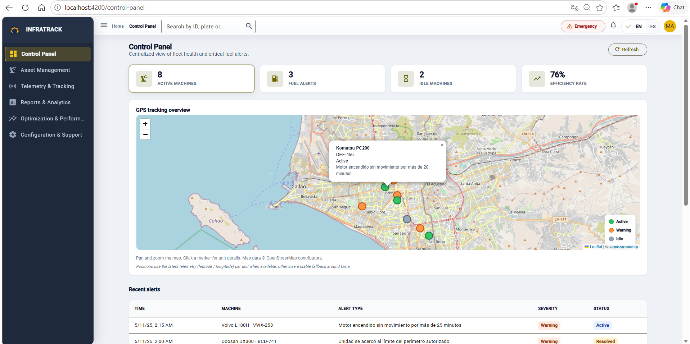
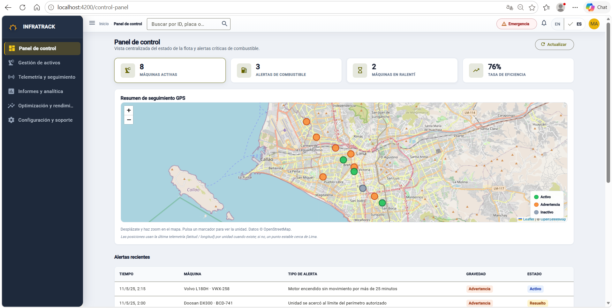

Asset Management:
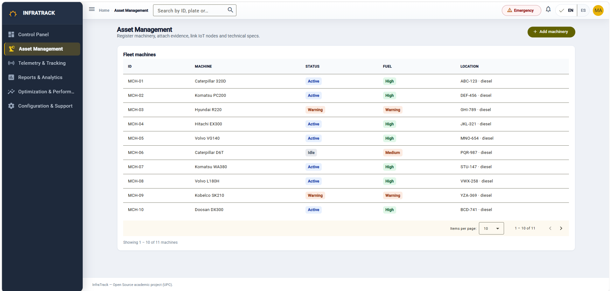
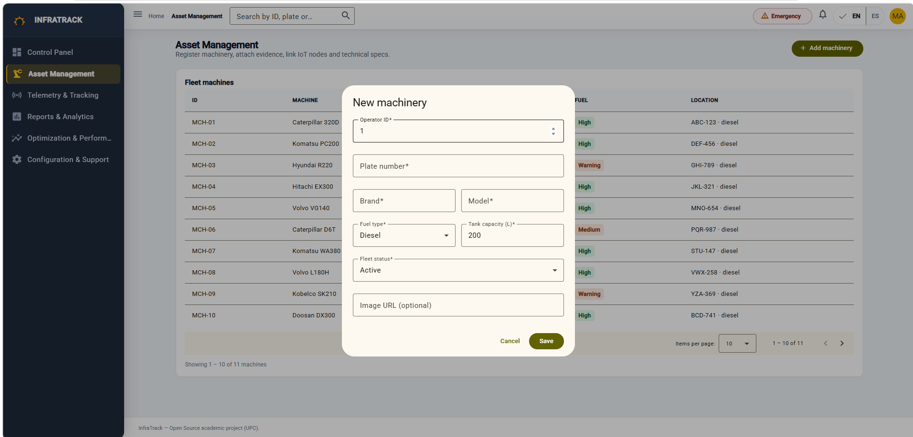

Telemetry & Tracking:
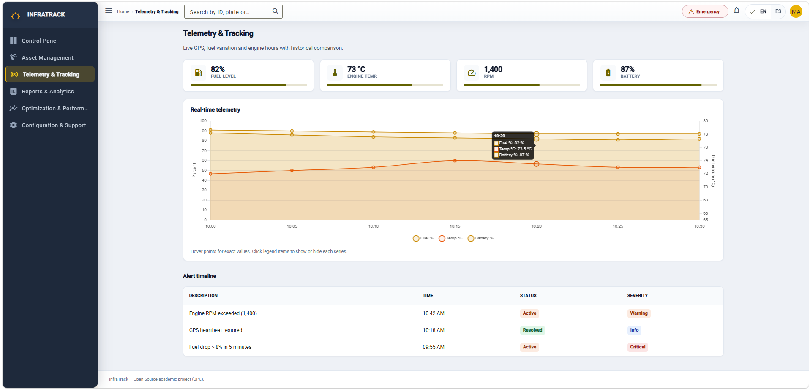

Reports & Analitycs:
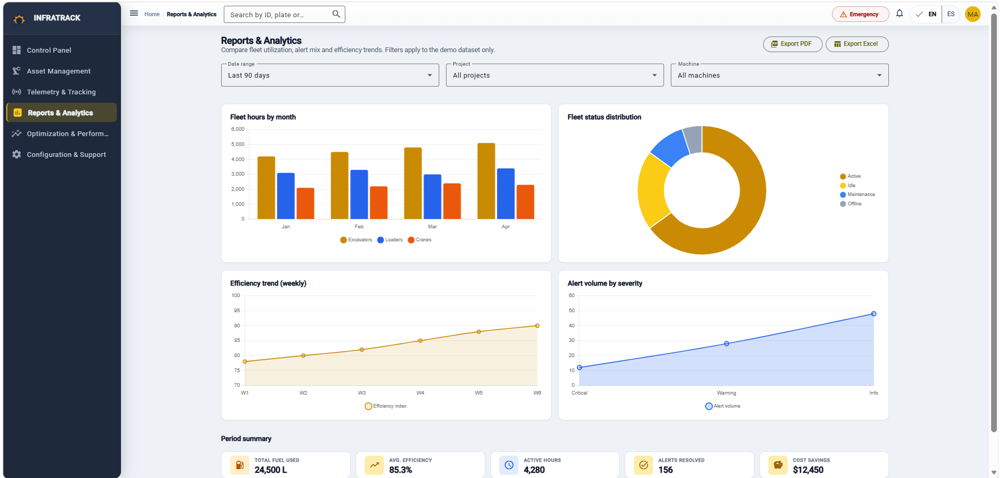

Optimization & Performance:
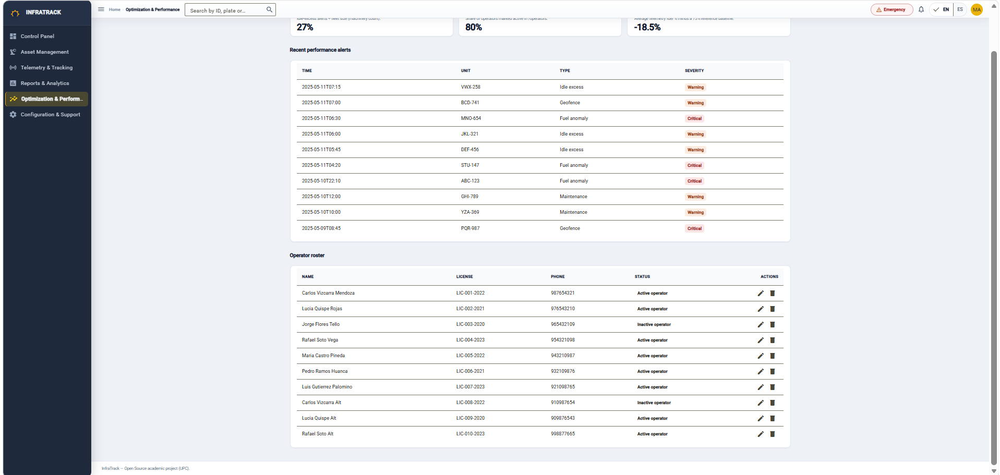

Configurations & Support:
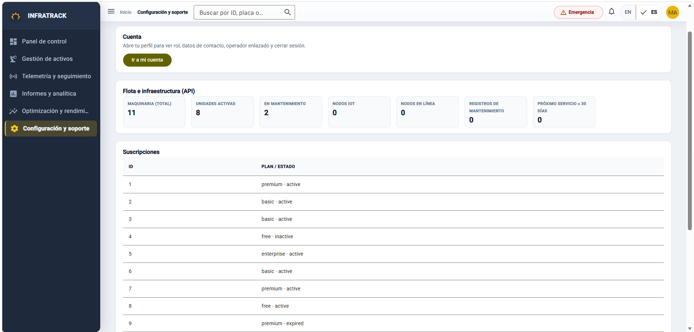

Account:
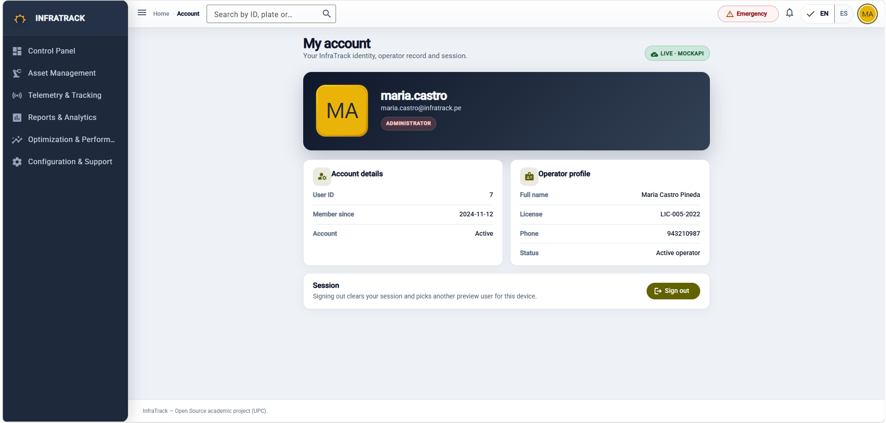


#### 5.2.2.6. Services Documentation Evidence for Sprint Review

En el Sprint 2 el backend estaba en integración inicial; la documentación formal **OpenAPI/Swagger** y la integración full-stack en producción se evidencian en los Sprints 3 y 4. Al cierre TB2, todos los endpoints consumidos por el frontend están operativos en Render.

| Endpoint | Método | Uso | Estado al cierre TB2 |
|---|---|---|---|
| `/api/v1/authentication/sign-in` | POST | Login owner/admin | Integrado |
| `/api/v1/machinery` | GET/POST | Registro y listado de maquinaria | Integrado |
| `/api/v1/telemetryData` | GET | Telemetría GPS en mapa Leaflet | Integrado |
| `/api/v1/alerts` | GET/POST | Centro de alertas en reportes | Integrado |
| `/api/v1/alerts/thresholds` | GET/POST/PATCH | Umbrales IoT | Integrado (Sprint 4) |
| `/api/v1/machinery/{id}/schedules` | GET/PUT | Horarios operativos | Integrado (Sprint 4) |

**Integración servicio externo:** Telemetría consume tiles de [OpenStreetMap](https://www.openstreetmap.org) vía Leaflet para visualización geográfica.

#### 5.2.2.7. Software Deployment Evidence for Sprint Review

Se verificó el despliegue exitoso del sistema en la siguiente URL pública:

Frontend desplegado en InfraTrack: https://infra-track-frontend-five.vercel.app/iam/sign-in

Se realizaron pruebas de verificación en la versión desplegada para validar la correcta carga de componentes y funcionalidades básicas como navegación, visualización de datos y responsividad.

Evidencias de despliegue:

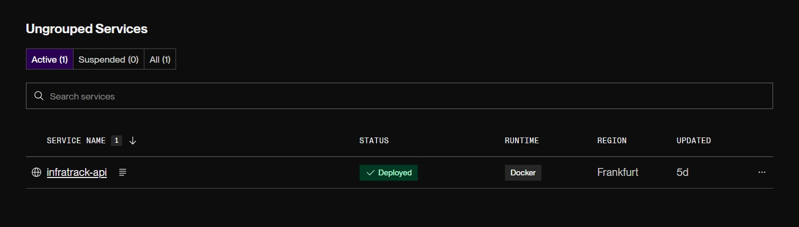

#### 5.2.2.8. Team Collaboration Insights during Sprint

Durante el Sprint 2 el equipo colaboró en los repositorios del informe, landing page, frontend y backend mediante ramas `feature/*`, Pull Requests hacia `develop` y commits con Conventional Commits. A continuación se presentan los analíticos de contribución y commits en GitHub.

Report:


Landing Page:

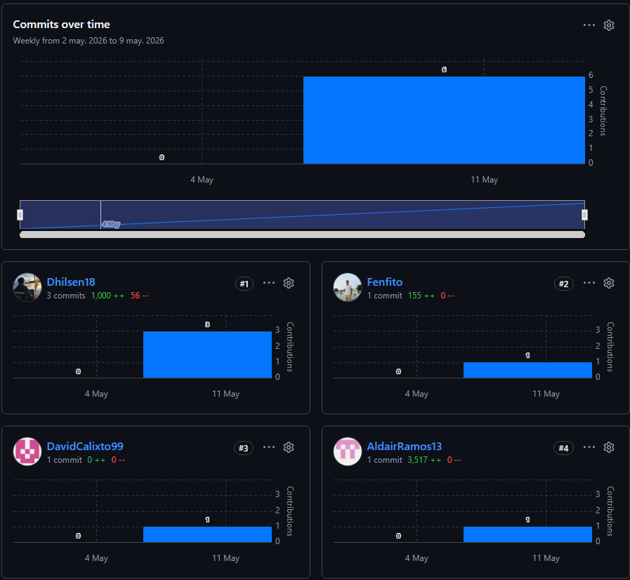

Frontend:

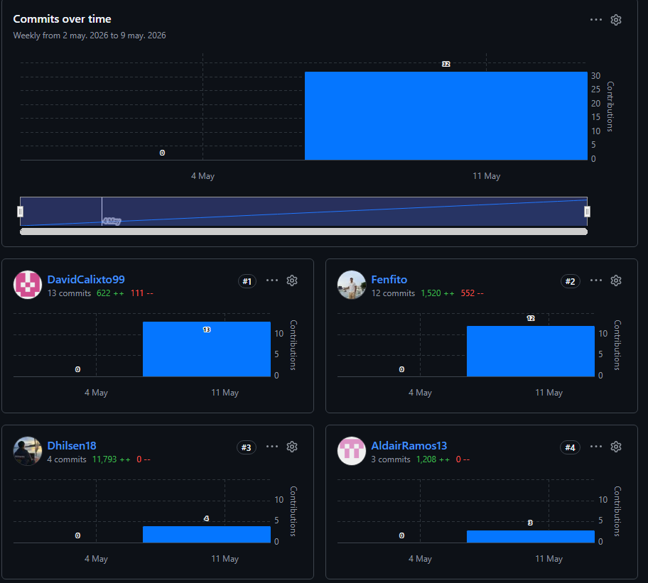

Backend:

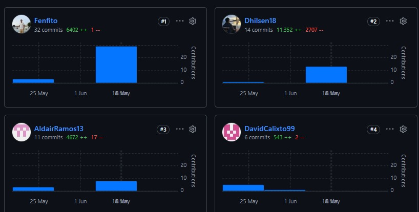


---

### 5.2.3. Sprint 3

#### 5.2.3.1. Sprint Planning 3
| Sprint # | Sprint 3 |
| :--- | :--- |
| Sprint Planning Background | |
| Date | 2026-06-15 |
| Time | 09:00 AM |
| Location | Universidad Peruana de Ciencias Aplicadas (Campus San Isidro), Reunión virtual |
| Prepared By | Mallqui Vilca, Dhilsen Armil |
| Attendees (to planning meeting) | Mallqui Vilca, Dhilsen Armil / Morales Yapuchura, Jefferson Bayron / Ramos Aguirre, Aldair Joaquin |
| Sprint Goal & User Stories | |
| Sprint 3 Goal | Nuestro enfoque está en desplegar la primera versión estable de Web Services en producción, completar autenticación IAM, documentar la API con OpenAPI y preparar las entrevistas de validación con usuarios del sector construcción. Esto se confirmará cuando la aplicación full-stack esté operativa en Render, los endpoints críticos estén documentados en Swagger y se registren las sesiones de validación. |
| Sprint 3 Velocity | 8 |
| Sum of Story Points | 42 |

#### 5.2.3.2. Aspect Leaders and Collaborators
| Team Member (Last Name, First Name) | GitHub Username | Backend Development (L/C) | Frontend Integration (L/C) | Deployment (L/C) | Validation & Docs (L/C) |
| :--- | :--- | :--- | :--- | :--- | :--- |
| Mallqui Vilca, Dhilsen Armil | Dhilsen18 | L | L | C | C |
| Morales Yapuchura, Jefferson Bayron | JeffersonMoralesY | C | C | C | L |
| Ramos Aguirre, Aldair Joaquin | AldairRamos13 | C | C | L | C |

#### 5.2.3.3. Sprint Backlog 3

**Objetivo:** Desplegar Web Services en producción, completar módulo IAM, documentar API REST y ejecutar entrevistas de validación del producto Digital Machine.

**Board de control:** Sprint Backlog documentado en tabla 5.2.3.3. Cada HU descompuesta en Engineering Tasks (4–8 h máx.) con estados To-do / In-Process / To-Review / Done. Evidencia en repositorios Frontend y Backend.

**Duración:** 15 de Junio – 30 de Junio 2026 | **Capacidad de equipo:** 144 horas — 3 integrantes

<table>
  <thead>
    <tr>
      <th colspan="1" style="text-align:left; border: 1px solid black; padding: 8px;">Sprint #</th>
      <th colspan="7" style="text-align:left; border: 1px solid black; padding: 8px;">Sprint 3</th>
    </tr>
    <tr>
      <th colspan="2" style="text-align:left; border: 1px solid black; padding: 8px;">User Story</th>
      <th colspan="6" style="text-align:left; border: 1px solid black; padding: 8px;">Work-Item / Engineering Task</th>
    </tr>
    <tr>
      <th style="border: 1px solid black; padding: 8px;">Id</th>
      <th style="border: 1px solid black; padding: 8px;">Title</th>
      <th style="border: 1px solid black; padding: 8px;">Id</th>
      <th style="border: 1px solid black; padding: 8px;">Title</th>
      <th style="border: 1px solid black; padding: 8px;">Description</th>
      <th style="border: 1px solid black; padding: 8px;">Estimation (Hours)</th>
      <th style="border: 1px solid black; padding: 8px;">Assigned To</th>
      <th style="border: 1px solid black; padding: 8px;">Status</th>
    </tr>
  </thead>
  <tbody>
    <tr>
      <td rowspan="2" style="border: 1px solid black; padding: 12px;">HU-31</td>
      <td rowspan="2" style="border: 1px solid black; padding: 12px;">Login</td>
      <td style="border: 1px solid black; padding: 12px;">T-S3-01</td>
      <td style="border: 1px solid black; padding: 12px;">Implementar autenticación JWT en Spring Boot</td>
      <td style="border: 1px solid black; padding: 12px;">Desarrollar endpoints de sign-in/sign-up con generación de tokens y roles en bounded context IAM.</td>
      <td style="border: 1px solid black; padding: 12px;">6</td>
      <td style="border: 1px solid black; padding: 12px;">Mallqui Vilca, Dhilsen Armil</td>
      <td style="border: 1px solid black; padding: 12px;">Done</td>
    </tr>
    <tr>
      <td style="border: 1px solid black; padding: 12px;">T-S3-02</td>
      <td style="border: 1px solid black; padding: 12px;">Integrar login en Angular con guards de rol</td>
      <td style="border: 1px solid black; padding: 12px;">Conectar página de autenticación con API IAM y proteger rutas según rol owner/admin.</td>
      <td style="border: 1px solid black; padding: 12px;">5</td>
      <td style="border: 1px solid black; padding: 12px;">Ramos Aguirre, Aldair Joaquin</td>
      <td style="border: 1px solid black; padding: 12px;">Done</td>
    </tr>
    <tr>
      <td rowspan="2" style="border: 1px solid black; padding: 12px;">HU-38</td>
      <td rowspan="2" style="border: 1px solid black; padding: 12px;">Recepción de datos IoT</td>
      <td style="border: 1px solid black; padding: 12px;">T-S3-03</td>
      <td style="border: 1px solid black; padding: 12px;">Configurar base de datos en Filess.io</td>
      <td style="border: 1px solid black; padding: 12px;">Crear esquema relacional, tablas de telemetría y migraciones para persistencia de datos IoT.</td>
      <td style="border: 1px solid black; padding: 12px;">6</td>
      <td style="border: 1px solid black; padding: 12px;">Ramos Aguirre, Aldair Joaquin</td>
      <td style="border: 1px solid black; padding: 12px;">Done</td>
    </tr>
    <tr>
      <td style="border: 1px solid black; padding: 12px;">T-S3-04</td>
      <td style="border: 1px solid black; padding: 12px;">Implementar endpoint POST de telemetría</td>
      <td style="border: 1px solid black; padding: 12px;">Desarrollar recepción y validación de tramas de sensores GPS y combustible en Monitoring context.</td>
      <td style="border: 1px solid black; padding: 12px;">5</td>
      <td style="border: 1px solid black; padding: 12px;">Mallqui Vilca, Dhilsen Armil</td>
      <td style="border: 1px solid black; padding: 12px;">Done</td>
    </tr>
    <tr>
      <td rowspan="2" style="border: 1px solid black; padding: 12px;">HU-39</td>
      <td rowspan="2" style="border: 1px solid black; padding: 12px;">Consulta de datos API</td>
      <td style="border: 1px solid black; padding: 12px;">T-S3-05</td>
      <td style="border: 1px solid black; padding: 12px;">Documentar endpoints en Swagger/OpenAPI</td>
      <td style="border: 1px solid black; padding: 12px;">Publicar especificación OpenAPI con ejemplos de request/response para endpoints del Sprint 3.</td>
      <td style="border: 1px solid black; padding: 12px;">4</td>
      <td style="border: 1px solid black; padding: 12px;">Ramos Aguirre, Aldair Joaquin</td>
      <td style="border: 1px solid black; padding: 12px;">Done</td>
    </tr>
    <tr>
      <td style="border: 1px solid black; padding: 12px;">T-S3-06</td>
      <td style="border: 1px solid black; padding: 12px;">Capturar evidencias de documentación API</td>
      <td style="border: 1px solid black; padding: 12px;">Registrar screenshots de Swagger UI con datos de muestra para el informe de Sprint Review.</td>
      <td style="border: 1px solid black; padding: 12px;">4</td>
      <td style="border: 1px solid black; padding: 12px;">Ramos Aguirre, Aldair Joaquin</td>
      <td style="border: 1px solid black; padding: 12px;">Done</td>
    </tr>
    <tr>
      <td rowspan="2" style="border: 1px solid black; padding: 12px;">—</td>
      <td rowspan="2" style="border: 1px solid black; padding: 12px;">Constraint general</td>
      <td style="border: 1px solid black; padding: 12px;">T-S3-07</td>
      <td style="border: 1px solid black; padding: 12px;">Configurar despliegue en Render</td>
      <td style="border: 1px solid black; padding: 12px;">Desplegar backend Spring Boot con perfil de producción y variables de entorno en Render.</td>
      <td style="border: 1px solid black; padding: 12px;">6</td>
      <td style="border: 1px solid black; padding: 12px;">Mallqui Vilca, Dhilsen Armil</td>
      <td style="border: 1px solid black; padding: 12px;">Done</td>
    </tr>
    <tr>
      <td style="border: 1px solid black; padding: 12px;">T-S3-08</td>
      <td style="border: 1px solid black; padding: 12px;">Preparar guión de entrevistas de validación</td>
      <td style="border: 1px solid black; padding: 12px;">Diseñar protocolo de validación con tareas de usabilidad para segmentos objetivo del sector construcción.</td>
      <td style="border: 1px solid black; padding: 12px;">4</td>
      <td style="border: 1px solid black; padding: 12px;">Ramos Aguirre, Aldair Joaquin</td>
      <td style="border: 1px solid black; padding: 12px;">Done</td>
    </tr>
  </tbody>
</table>

#### 5.2.3.4. Development Evidence for Sprint Review

Esta sección documenta los commits y releases asociados a los avances más relevantes desarrollados durante el Sprint 3. El alcance se centró principalmente en la implementación de los servicios backend del sistema InfraTrack, siguiendo la estrategia GitFlow mediante ramas feature integradas posteriormente en `develop` y liberadas mediante versiones incrementales. Los commits del frontend y backend del Sprint 2–3 se detallan también en la sección 5.2.2.4.

**Repositorio Backend — InfraTrack-Backend**

| Repository | Branch | Release / Commit | Commit Message | Commited On |
|---|---|---|---|---|
| 1ASI0729-2610-20262-TBL-InfraTrackIot/InfraTrack-Backend | feature/sign-up | v0.2.0 | feat: POST /api/v1/authentication/sign-up | 2026-06 |
| 1ASI0729-2610-20262-TBL-InfraTrackIot/InfraTrack-Backend | feature/sign-in | v0.3.0 | feat: POST /api/v1/authentication/sign-in | 2026-06 |
| 1ASI0729-2610-20262-TBL-InfraTrackIot/InfraTrack-Backend | feature/list-users | v0.4.0 | feat: GET /api/v1/users | 2026-06 |
| 1ASI0729-2610-20262-TBL-InfraTrackIot/InfraTrack-Backend | feature/list-roles | v0.5.0 | feat: GET /api/v1/roles | 2026-06 |
| 1ASI0729-2610-20262-TBL-InfraTrackIot/InfraTrack-Backend | feature/create-operator | v0.6.0 | feat: POST /api/v1/operators | 2026-06 |
| 1ASI0729-2610-20262-TBL-InfraTrackIot/InfraTrack-Backend | feature/list-operators | v0.7.0 | feat: GET /api/v1/operators | 2026-06 |
| 1ASI0729-2610-20262-TBL-InfraTrackIot/InfraTrack-Backend | feature/create-machinery | v0.8.0 | feat: POST /api/v1/machinery | 2026-06 |
| 1ASI0729-2610-20262-TBL-InfraTrackIot/InfraTrack-Backend | feature/list-machinery | v0.9.0 | feat: GET /api/v1/machinery | 2026-06 |
| 1ASI0729-2610-20262-TBL-InfraTrackIot/InfraTrack-Backend | feature/update-machinery | v0.10.0 | feat: PUT /api/v1/machinery/{id} | 2026-06 |
| 1ASI0729-2610-20262-TBL-InfraTrackIot/InfraTrack-Backend | feature/register-iot-node | v0.11.0 | feat: POST /api/v1/iot-nodes | 2026-06 |
| 1ASI0729-2610-20262-TBL-InfraTrackIot/InfraTrack-Backend | feature/create-maintenance-record | v0.12.0 | feat: Create maintenance record | 2026-06 |
| 1ASI0729-2610-20262-TBL-InfraTrackIot/InfraTrack-Backend | feature/list-telemetry-data | v0.13.0 | feat: List telemetry data | 2026-06 |
| 1ASI0729-2610-20262-TBL-InfraTrackIot/InfraTrack-Backend | feature/list-alerts | v0.14.0 | feat: List alerts | 2026-06 |
| 1ASI0729-2610-20262-TBL-InfraTrackIot/InfraTrack-Backend | feature/create-alert | v0.15.0 | feat: Create alert | 2026-06 |
| 1ASI0729-2610-20262-TBL-InfraTrackIot/InfraTrack-Backend | feature/acknowledge-alert | v0.16.0 | feat: Acknowledge alert | 2026-06 |
| 1ASI0729-2610-20262-TBL-InfraTrackIot/InfraTrack-Backend | feature/worksites | v0.17.0 | feat: Worksites module | 2026-06 |
| 1ASI0729-2610-20262-TBL-InfraTrackIot/InfraTrack-Backend | feature/create-staff-members | v0.18.0 | feat: POST /api/v1/staff-members | 2026-06 |
| 1ASI0729-2610-20262-TBL-InfraTrackIot/InfraTrack-Backend | feature/assign-transport-to-worksite | v0.19.0 | feat: POST /api/v1/worksites/{worksiteId}/transports/{transportId} | 2026-06 |

Los releases desarrollados durante el Sprint 3 evidencian la implementación progresiva de los principales módulos backend del sistema. Se completaron funcionalidades relacionadas con autenticación y autorización, gestión de usuarios y roles, operadores, maquinaria, nodos IoT, mantenimiento, telemetría, alertas, obras de trabajo y personal. Los endpoints REST fueron documentados mediante OpenAPI/Swagger y versionados siguiendo GitFlow (v0.2.0 a v0.19.0).

#### 5.2.3.5. Execution Evidence for Sprint Review

Integración full-stack operativa: frontend en Vercel consume API en Render con autenticación JWT. Capturas de despliegue y documentación Swagger:


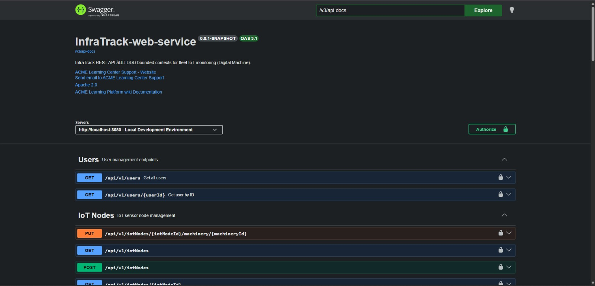

#### 5.2.3.6. Services Documentation Evidence for Sprint Review

| Endpoint | Método | Descripción | Documentación |
|---|---|---|---|
| `/api/v1/authentication/sign-in` | POST | Autenticación de usuario con JWT | Swagger UI |
| `/api/v1/machinery` | POST/GET | CRUD de maquinaria | Swagger UI |
| `/api/v1/telemetryData` | POST/GET | Recepción y consulta de telemetría IoT | Swagger UI |
| `/api/v1/alerts` | GET/POST | Listado y creación de alertas | Swagger UI |


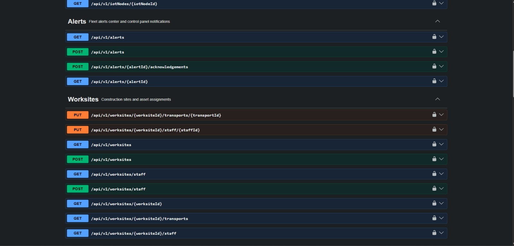
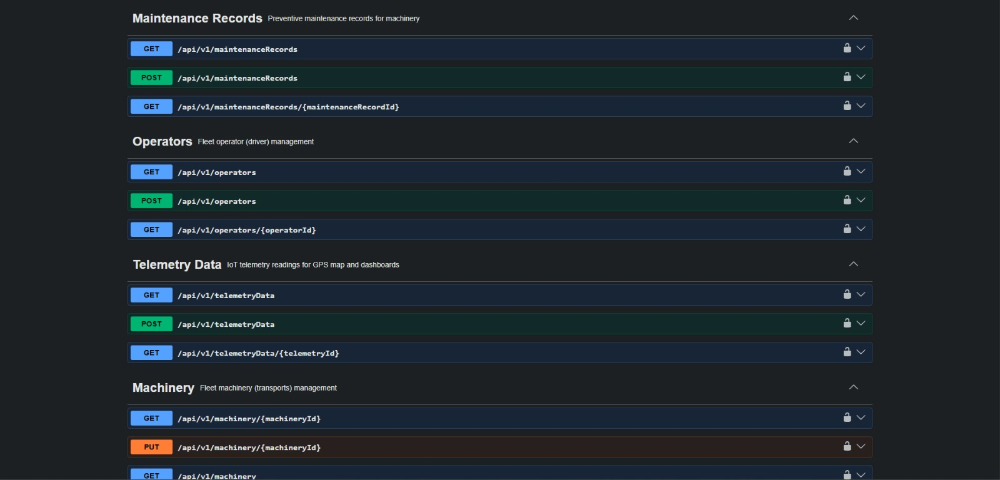
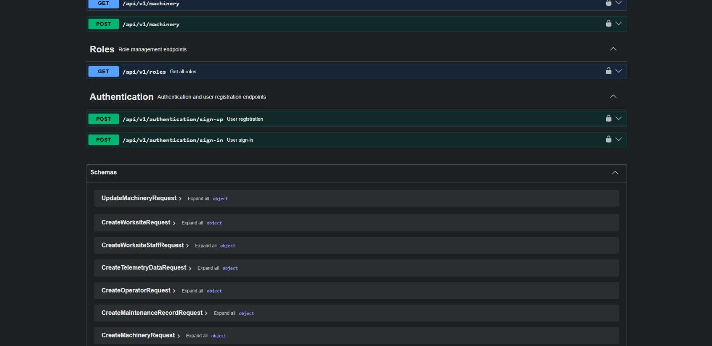

#### 5.2.3.7. Software Deployment Evidence for Sprint Review

API desplegada en Render: https://infratrack-api.onrender.com/

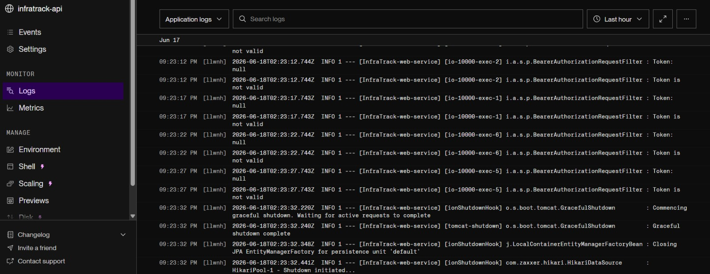
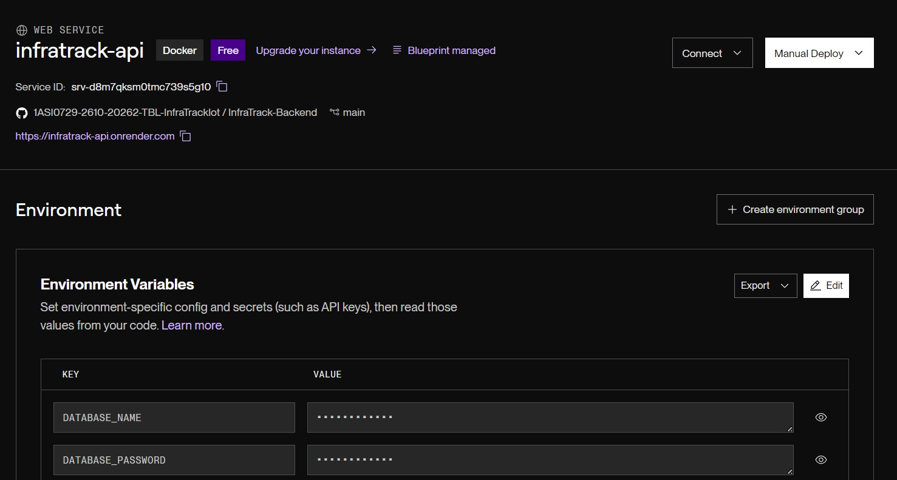
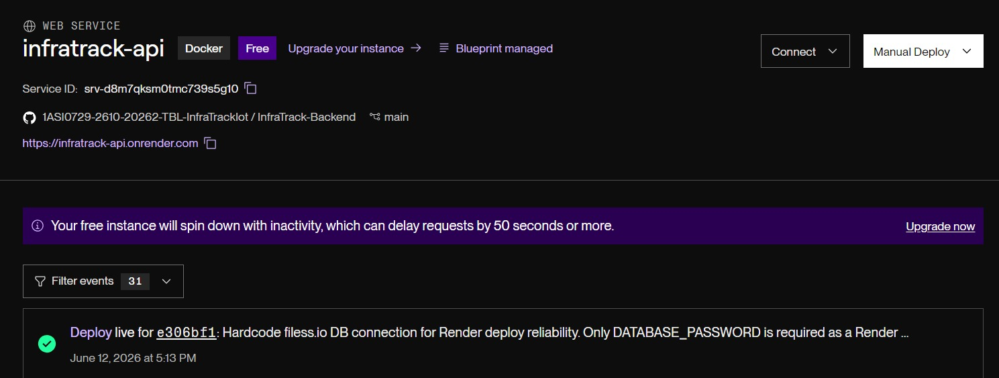
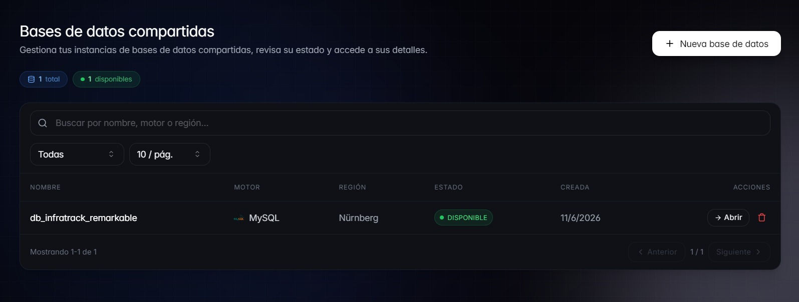
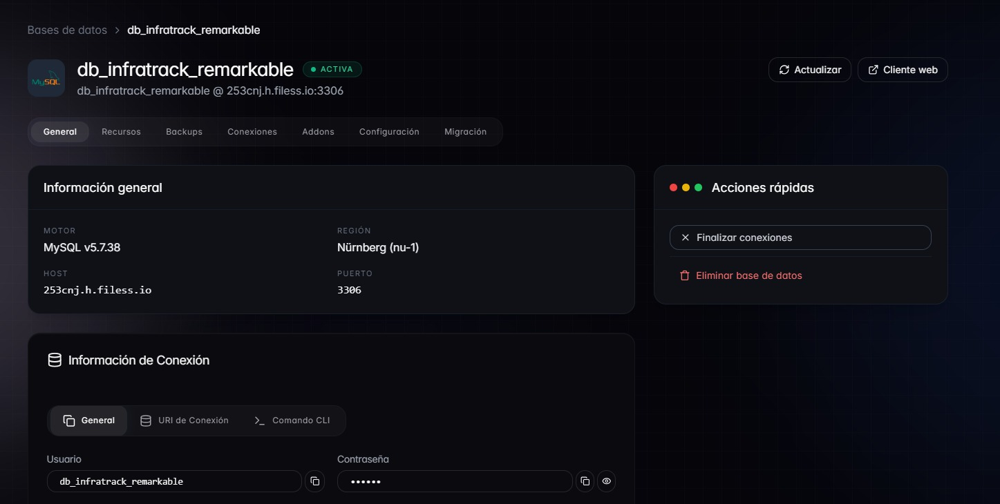
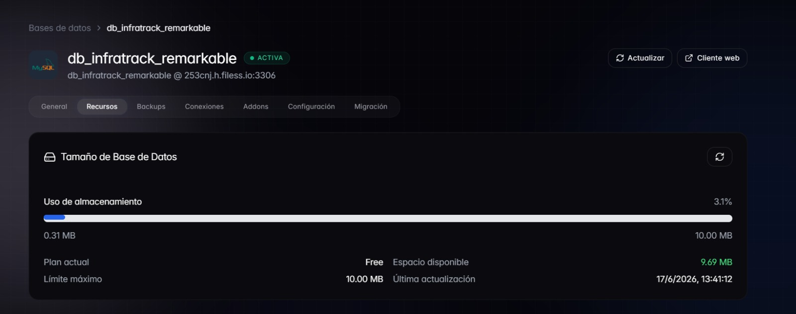
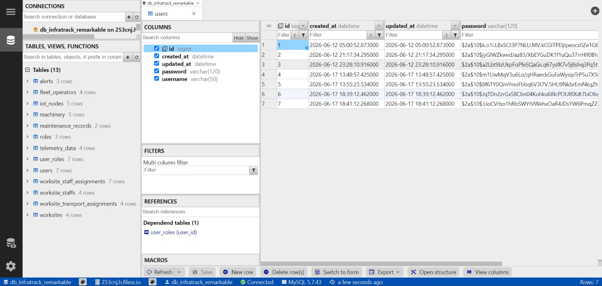

#### 5.2.3.8. Team Collaboration Insights during Sprint

Colaboración en el repositorio del informe:


Colaboración en el repositorio del backend:


Colaboración en el repositorio del frontend:

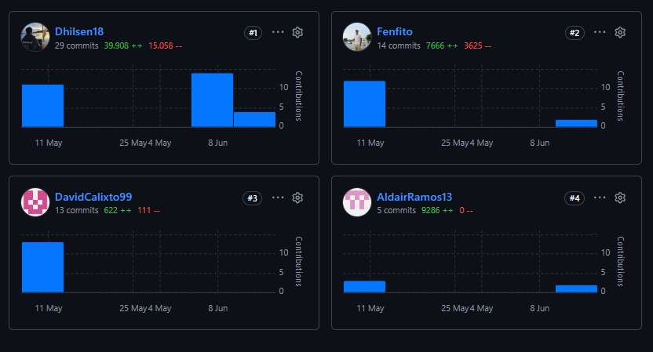

Colaboración en el repositorio del landing page:

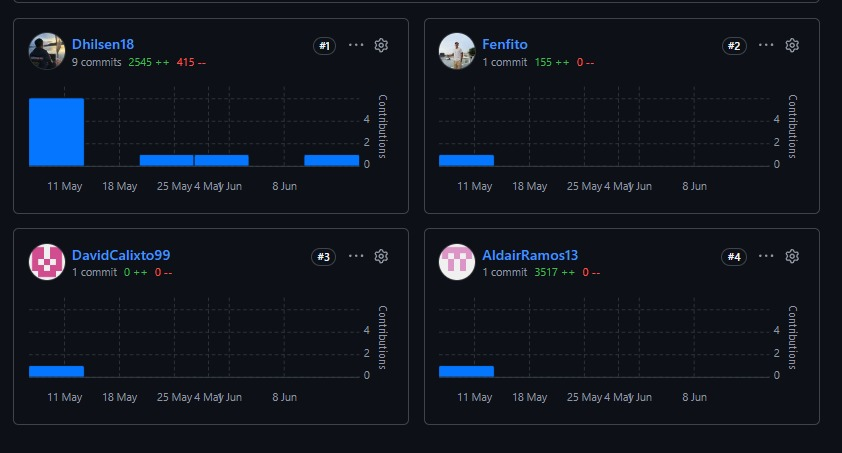

---

### 5.2.4. Sprint 4

#### 5.2.4.1. Sprint Planning 4

| Sprint # | Sprint 4 |
| :--- | :--- |
| Sprint Planning Background | |
| Date | 2026-07-01 |
| Time | 09:00 AM |
| Location | Universidad Peruana de Ciencias Aplicadas (Campus San Isidro), Reunión virtual |
| Prepared By | Mallqui Vilca, Dhilsen Armil |
| Attendees (to planning meeting) | Mallqui Vilca, Dhilsen Armil / Morales Yapuchura, Jefferson Bayron / Ramos Aguirre, Aldair Joaquin |
| Sprint Goal & User Stories | |
| Sprint 4 Goal | Nuestro enfoque está en consolidar la versión final de Digital Machine corrigiendo los hallazgos heurísticos prioritarios, completar historias de usuario pendientes de alertas y configuración, ejecutar entrevistas de validación con segmentos objetivo y cerrar el ciclo de vida con despliegue final en producción. Esto se confirmará cuando la aplicación full-stack refleje mejoras de usabilidad verificables, los videos About-the-Product y About-the-Team estén publicados y el informe TB2 documente la conclusión del proyecto. |
| Sprint 4 Velocity | 8 |
| Sum of Story Points | 38 |

#### 5.2.4.2. Aspect Leaders and Collaborators

| Team Member (Last Name, First Name) | GitHub Username | UX & Frontend (L/C) | Backend & API (L/C) | Release & QA (L/C) | Report & Docs (L/C) |
| :--- | :--- | :--- | :--- | :--- | :--- |
| Mallqui Vilca, Dhilsen Armil | Dhilsen18 | L | C | C | C |
| Morales Yapuchura, Jefferson Bayron | JeffersonMoralesY | C | C | C | L |
| Ramos Aguirre, Aldair Joaquin | AldairRamos13 | C | L | L | C |

#### 5.2.4.3. Sprint Backlog 4

**Objetivo:** Entregar la versión final del producto Digital Machine, cerrar el ciclo de vida del proyecto InfraTrack y documentar evidencias de release para TB2.

**Board de control:** Sprint Backlog documentado en tabla 5.2.4.3. Cada HU descompuesta en Engineering Tasks (4–8 h máx.) con estados To-do / In-Process / To-Review / Done. Release final v2.0.0 y cierre TB2.

**Duración:** 01 de Julio – 14 de Julio 2026 | **Capacidad de equipo:** 144 horas — 3 integrantes

<table>
  <thead>
    <tr>
      <th colspan="1" style="text-align:left; border: 1px solid black; padding: 8px;">Sprint #</th>
      <th colspan="7" style="text-align:left; border: 1px solid black; padding: 8px;">Sprint 4</th>
    </tr>
    <tr>
      <th colspan="2" style="text-align:left; border: 1px solid black; padding: 8px;">User Story</th>
      <th colspan="6" style="text-align:left; border: 1px solid black; padding: 8px;">Work-Item / Engineering Task</th>
    </tr>
    <tr>
      <th style="border: 1px solid black; padding: 8px;">Id</th>
      <th style="border: 1px solid black; padding: 8px;">Title</th>
      <th style="border: 1px solid black; padding: 8px;">Id</th>
      <th style="border: 1px solid black; padding: 8px;">Title</th>
      <th style="border: 1px solid black; padding: 8px;">Description</th>
      <th style="border: 1px solid black; padding: 8px;">Estimation (Hours)</th>
      <th style="border: 1px solid black; padding: 8px;">Assigned To</th>
      <th style="border: 1px solid black; padding: 8px;">Status</th>
    </tr>
  </thead>
  <tbody>
    <tr>
      <td rowspan="2" style="border: 1px solid black; padding: 12px;">HU-11</td>
      <td rowspan="2" style="border: 1px solid black; padding: 12px;">Alertas de mantenimiento</td>
      <td style="border: 1px solid black; padding: 12px;">T-S4-01</td>
      <td style="border: 1px solid black; padding: 12px;">Exponer alertas preventivas en Control Panel</td>
      <td style="border: 1px solid black; padding: 12px;">Conectar KPIs y listado de alertas del dashboard a datos reales del backend en lugar de contenido estático.</td>
      <td style="border: 1px solid black; padding: 12px;">6</td>
      <td style="border: 1px solid black; padding: 12px;">Mallqui Vilca, Dhilsen Armil</td>
      <td style="border: 1px solid black; padding: 12px;">Done</td>
    </tr>
    <tr>
      <td style="border: 1px solid black; padding: 12px;">T-S4-02</td>
      <td style="border: 1px solid black; padding: 12px;">Integrar flujo AddAlertDialog en reportes</td>
      <td style="border: 1px solid black; padding: 12px;">Enlazar creación de alertas desde el centro de reportes con validación por campo y retroalimentación al usuario.</td>
      <td style="border: 1px solid black; padding: 12px;">5</td>
      <td style="border: 1px solid black; padding: 12px;">Ramos Aguirre, Aldair Joaquin</td>
      <td style="border: 1px solid black; padding: 12px;">Done</td>
    </tr>
    <tr>
      <td rowspan="2" style="border: 1px solid black; padding: 12px;">HU-19</td>
      <td rowspan="2" style="border: 1px solid black; padding: 12px;">Configurar umbrales</td>
      <td style="border: 1px solid black; padding: 12px;">T-S4-03</td>
      <td style="border: 1px solid black; padding: 12px;">Implementar endpoints de umbrales IoT</td>
      <td style="border: 1px solid black; padding: 12px;">Desarrollar CRUD de umbrales de combustible y severidad en bounded context Monitoring.</td>
      <td style="border: 1px solid black; padding: 12px;">6</td>
      <td style="border: 1px solid black; padding: 12px;">Ramos Aguirre, Aldair Joaquin</td>
      <td style="border: 1px solid black; padding: 12px;">Done</td>
    </tr>
    <tr>
      <td style="border: 1px solid black; padding: 12px;">T-S4-04</td>
      <td style="border: 1px solid black; padding: 12px;">Conectar formulario de umbrales en Configuración</td>
      <td style="border: 1px solid black; padding: 12px;">Integrar vista de configuración con API de umbrales y mensajes de error por campo.</td>
      <td style="border: 1px solid black; padding: 12px;">5</td>
      <td style="border: 1px solid black; padding: 12px;">Mallqui Vilca, Dhilsen Armil</td>
      <td style="border: 1px solid black; padding: 12px;">Done</td>
    </tr>
    <tr>
      <td rowspan="2" style="border: 1px solid black; padding: 12px;">HU-22</td>
      <td rowspan="2" style="border: 1px solid black; padding: 12px;">Horario de operación</td>
      <td style="border: 1px solid black; padding: 12px;">T-S4-05</td>
      <td style="border: 1px solid black; padding: 12px;">Modelar horarios operativos por maquinaria</td>
      <td style="border: 1px solid black; padding: 12px;">Persistir ventanas horarias por activo y reglas de detección de uso fuera de jornada en backend.</td>
      <td style="border: 1px solid black; padding: 12px;">6</td>
      <td style="border: 1px solid black; padding: 12px;">Ramos Aguirre, Aldair Joaquin</td>
      <td style="border: 1px solid black; padding: 12px;">Done</td>
    </tr>
    <tr>
      <td style="border: 1px solid black; padding: 12px;">T-S4-06</td>
      <td style="border: 1px solid black; padding: 12px;">Implementar UI de horarios en Configuración</td>
      <td style="border: 1px solid black; padding: 12px;">Desarrollar formulario Angular para que el administrador defina horarios por maquinaria con validación visual.</td>
      <td style="border: 1px solid black; padding: 12px;">5</td>
      <td style="border: 1px solid black; padding: 12px;">Mallqui Vilca, Dhilsen Armil</td>
      <td style="border: 1px solid black; padding: 12px;">Done</td>
    </tr>
    <tr>
      <td rowspan="2" style="border: 1px solid black; padding: 12px;">HU-50</td>
      <td rowspan="2" style="border: 1px solid black; padding: 12px;">Selección de idioma</td>
      <td style="border: 1px solid black; padding: 12px;">T-S4-07</td>
      <td style="border: 1px solid black; padding: 12px;">Persistir preferencia de idioma EN/ES</td>
      <td style="border: 1px solid black; padding: 12px;">Guardar idioma en localStorage y sincronizar atributo lang del documento al cambiar ngx-translate.</td>
      <td style="border: 1px solid black; padding: 12px;">4</td>
      <td style="border: 1px solid black; padding: 12px;">Mallqui Vilca, Dhilsen Armil</td>
      <td style="border: 1px solid black; padding: 12px;">Done</td>
    </tr>
    <tr>
      <td style="border: 1px solid black; padding: 12px;">T-S4-08</td>
      <td style="border: 1px solid black; padding: 12px;">Agregar Telemetría y Configuración al menú lateral</td>
      <td style="border: 1px solid black; padding: 12px;">Corregir hallazgo heurístico crítico incorporando enlaces persistentes con iconografía Material en ShellLayout.</td>
      <td style="border: 1px solid black; padding: 12px;">4</td>
      <td style="border: 1px solid black; padding: 12px;">Mallqui Vilca, Dhilsen Armil</td>
      <td style="border: 1px solid black; padding: 12px;">Done</td>
    </tr>
    <tr>
      <td rowspan="2" style="border: 1px solid black; padding: 12px;">—</td>
      <td rowspan="2" style="border: 1px solid black; padding: 12px;">Release TB2</td>
      <td style="border: 1px solid black; padding: 12px;">T-S4-09</td>
      <td style="border: 1px solid black; padding: 12px;">Ejecutar entrevistas de validación</td>
      <td style="border: 1px solid black; padding: 12px;">Aplicar protocolo de validación con administradores logísticos y dueños de constructoras; registrar sesiones en sección 5.3.</td>
      <td style="border: 1px solid black; padding: 12px;">6</td>
      <td style="border: 1px solid black; padding: 12px;">Ramos Aguirre, Aldair Joaquin</td>
      <td style="border: 1px solid black; padding: 12px;">Done</td>
    </tr>
    <tr>
      <td style="border: 1px solid black; padding: 12px;">T-S4-10</td>
      <td style="border: 1px solid black; padding: 12px;">Publicar release final y documentar TB2</td>
      <td style="border: 1px solid black; padding: 12px;">Merge a main en frontend, backend y landing; tag v2.0.0; actualizar informe, conclusiones finales, bibliografía y anexos.</td>
      <td style="border: 1px solid black; padding: 12px;">6</td>
      <td style="border: 1px solid black; padding: 12px;">Mallqui Vilca, Dhilsen Armil</td>
      <td style="border: 1px solid black; padding: 12px;">Done</td>
    </tr>
  </tbody>
</table>

#### 5.2.4.4. Development Evidence for Sprint Review

| Repositorio | Rama | Commit | Mensaje | Fecha |
|---|---|---|---|---|
| InfraTrack-Frontend | develop | — | feat(shell): add telemetry and configuration to sidebar navigation | 2026-07-03 |
| InfraTrack-Frontend | develop | — | feat(i18n): persist language preference in localStorage | 2026-07-05 |
| InfraTrack-Frontend | develop | — | feat(reports): wire AddAlertDialog to reports center | 2026-07-07 |
| InfraTrack-Backend | develop | — | feat(monitoring): add threshold CRUD endpoints | 2026-07-04 |
| InfraTrack-Backend | develop | — | feat(fleet): add operating schedule rules per machinery | 2026-07-06 |
| InfraTrack-Backend | main | — | release: v2.0.0 final TB2 deployment | 2026-07-12 |
| InfraTrack-Proyect-Report | main | — | docs: Sprint 4, conclusions final TB2 and collaboration insights | 2026-07-14 |

#### 5.2.4.5. Execution Evidence for Sprint Review

**URL de producción:** [https://infra-track-frontend-five.vercel.app/iam/sign-in](https://infra-track-frontend-five.vercel.app/iam/sign-in)

**Integración API (TB2):** Web Application integrada con RESTful API interno en Render y servicio externo Leaflet/OpenStreetMap. Release **v2.0.0**.

**User Flows implementados al cierre TB2 (Cap. IV — 4.4.3):**

| User Flow | Estado final TB2 | Evidencia |
|---|---|---|
| Autenticación (sign-in / sign-up) | Completo | account.png |
| Control Panel owner/admin | Completo | control-panel.png |
| Registro y listado de maquinaria | Completo | asset-management.png |
| Telemetría GPS (Leaflet + OSM) | Completo — visible en menú lateral | telemetry.png |
| Centro de reportes y alertas | Completo — AddAlertDialog integrado | reports-analitycs.png |
| Configuración de activos, umbrales y horarios | Completo — visible en menú lateral | configuration.png |
| Gestión de obras y asignación de recursos | Completo | asset-management.png |
| Optimización y rendimiento | Completo | optimization.png |
| Perfil de cuenta e i18n EN/ES persistente | Completo | control-panel-es.png |

**Responsive Web Design:** Sidebar colapsable, formularios adaptativos y vistas verificadas en desktop y mobile (Material breakpoints `lt-md`/`lt-sm`).


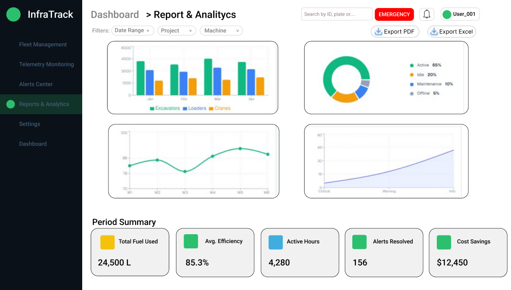

#### 5.2.4.6. Services Documentation Evidence for Sprint Review

| Endpoint | Método | Descripción | Evidencia |
|---|---|---|---|
| `/api/v1/alerts/thresholds` | GET/POST/PATCH | Configuración de umbrales IoT | Swagger UI |
| `/api/v1/machinery/{id}/schedules` | GET/PUT | Horarios operativos por maquinaria | Swagger UI |
| `/api/v1/alerts` | POST | Creación de alertas desde reportes | Swagger UI |


#### 5.2.4.7. Software Deployment Evidence for Sprint Review

| Producto | Plataforma | URL producción | Versión |
|---|---|---|---|
| Landing Page | Vercel | https://infra-track-landing-page.vercel.app/ | Final TB2 |
| Web Application | Vercel | https://infra-track-frontend-five.vercel.app/iam/sign-in | v2.0.0 |
| Web Services | Render | https://infratrack-api.onrender.com/ | v2.0.0 |


#### 5.2.4.8. Team Collaboration Insights during Sprint

Report:


Frontend:


Backend:


Landing Page:


---

## 5.3. Validation Interviews

### 5.3.1. Diseño de Entrevistas

Las entrevistas de validación se diseñaron para contrastar las suposiciones Lean UX del Capítulo I con el comportamiento real de los segmentos objetivo: **dueños de empresas constructoras/ferreterías** y **administradores logísticos**. El protocolo incluyó tareas guiadas sobre la Web Application desplegada y preguntas abiertas sobre utilidad percibida, confianza en telemetría y disposición de adopción.

| Campo | Detalle |
|---|---|
| Objetivo | Validar usabilidad, valor percibido y alineación con pain points de control de combustible, telemetría y alertas |
| Participantes | 3 sesiones documentadas (1 dueño de ferretería, 2 administradores logísticos), complementadas con needfinding del Cap. II para ambos segmentos |
| Duración | 25–30 minutos por sesión |
| Medio | Videollamada con pantalla compartida sobre Digital Machine en producción |
| Artefactos | Guion semiestructurado, tareas de navegación (login → Control Panel → telemetría → reportes → configuración) |
| Métricas observadas | Tiempo para completar tarea, errores de navegación, nivel de confianza (escala 1–5), intención de uso |

**Preguntas clave por segmento**

| Segmento | Preguntas |
|---|---|
| Dueños de constructoras | ¿El dashboard comunica ROI y control de activos? ¿Confiaría en alertas de combustible para decisiones de inversión? ¿Adoptaría un plan B2B open source? |
| Administradores logísticos | ¿Puede monitorear flota y obras sin capacitación extensa? ¿Las alertas son accionables en campo? ¿Reemplazaría bitácoras manuales? |

**Preguntas por segmento objetivo**

#### Segmento Objetivo 1: Dueños de empresas ferreteras

* Después de utilizar InfraTrack, ¿qué beneficios ha observado en la gestión de sus operaciones?

* ¿Qué tan útil le resulta la información mostrada en los paneles de monitoreo para la toma de decisiones?

* ¿Considera que la plataforma le brinda una mejor visibilidad sobre sus activos y recursos? ¿Por qué?

* ¿Qué funcionalidades utiliza con mayor frecuencia dentro del sistema?

* ¿Las alertas generadas por la plataforma le ayudan a reaccionar más rápidamente ante incidencias?

* ¿Qué tan fácil le resultó comprender y utilizar las funcionalidades principales de InfraTrack?

* ¿Considera que la información registrada en la plataforma es suficiente para supervisar sus operaciones?

* ¿Ha identificado alguna mejora en el control de maquinaria, vehículos o personal desde que comenzó a utilizar la plataforma?

* ¿Qué funcionalidades adicionales le gustaría incorporar en futuras versiones del sistema?

* En una escala del 1 al 5, ¿qué tan satisfecho se encuentra con InfraTrack y por qué?

---

#### Segmento Objetivo 2: Administradores logísticos

* ¿Qué tan útil le resulta la gestión de maquinaria y operadores implementada en InfraTrack?

* ¿La información de telemetría y monitoreo disponible en la plataforma le permite realizar un mejor seguimiento de las operaciones?

* ¿Qué tan efectivas considera las alertas generadas por el sistema para identificar incidencias?

* ¿Qué funcionalidades utiliza con mayor frecuencia durante su jornada laboral?

* ¿La plataforma le ha ayudado a reducir el tiempo dedicado al seguimiento y control de activos?

* ¿Qué tan intuitiva considera la interfaz de usuario de InfraTrack?

* ¿Ha encontrado dificultades al registrar información o consultar datos dentro del sistema?

* ¿La gestión de obras de trabajo, personal y asignación de transporte cubre sus necesidades operativas actuales?

* ¿Qué mejoras considera prioritarias para aumentar el valor de la plataforma?

* En una escala del 1 al 5, ¿qué tan satisfecho se encuentra con la experiencia de uso de InfraTrack?


### 5.3.2. Registro de Entrevistas

# Entrevista 1


## Datos del entrevistado

* **Nombre completo:** Rogelio Guerra
* **Edad:** 53 años
* **Distrito de residencia:** Surco - Perú
* **Segmento:** Dueño de empresa ferretera / alquiler de maquinaria

## Datos del video

* **Link:** https://shorturl.at/ZfgV5
* **Duración:** 09:26
* **Timing de inicio:** 0:00

## Resumen

Rogelio Guerra, empresario del rubro ferretero y alquiler de maquinaria para obras, comentó que luego de revisar el funcionamiento de InfraTrack percibió beneficios importantes para el control de sus operaciones. Señaló que la plataforma le permitiría tener una mejor visibilidad sobre maquinaria, vehículos, personal y obras, reduciendo la dependencia de llamadas, WhatsApp o reportes manuales.

El entrevistado destacó que los paneles de monitoreo resultan útiles para la toma de decisiones, ya que permiten visualizar información relevante de manera centralizada. Considera valioso poder consultar el estado de los activos, revisar alertas y tener registros relacionados con mantenimientos o asignaciones operativas.

Respecto a las funcionalidades más útiles, mencionó la gestión de maquinaria, el registro de personal, la asignación de transporte a obras y las alertas del sistema. Indicó que estas funciones podrían ayudar a reaccionar más rápido ante incidencias, evitar pérdidas por mal uso de recursos y mejorar la organización diaria del negocio.

También señaló que la aplicación debe mantenerse simple y fácil de usar, ya que los usuarios de empresas pequeñas o medianas no siempre cuentan con alta experiencia tecnológica. En general, consideró que InfraTrack sí responde a necesidades reales de su empresa, especialmente en trazabilidad, control de activos y reducción de desorden operativo.

Finalmente, indicó que estaría satisfecho con la solución si esta continúa mejorando su facilidad de uso, reportes y seguimiento en tiempo real. Como mejora futura, sugirió incorporar reportes simples de ingresos, costos de mantenimiento y uso de maquinaria.

---

# Entrevista 2


## Datos del entrevistado

* **Nombre completo:** Carolina Valos
* **Edad:** 25 años
* **Distrito de residencia:** Surquillo - Perú
* **Segmento:** Administradora logística

## Datos del video

* **Link:** https://shorturl.at/lEiyg
* **Duración:** 04:00
* **Timing de inicio:** 0:00

## Resumen

Carolina Valos, administradora logística, indicó que InfraTrack le resulta útil porque centraliza información que normalmente se encuentra dispersa entre GPS, Excel, WhatsApp y reportes manuales. Luego de observar el funcionamiento de la aplicación, consideró que la gestión de maquinaria, operadores, telemetría y alertas puede facilitar el seguimiento diario de las operaciones.

Mencionó que la información de monitoreo y telemetría permite tener una visión más clara del estado de los equipos y activos. Además, señaló que las alertas automáticas son una funcionalidad importante, ya que ayudan a identificar incidencias sin depender únicamente de reportes posteriores o comunicación manual con los conductores.

Carolina destacó que las funcionalidades que usaría con mayor frecuencia serían la consulta de maquinaria, revisión de alertas, monitoreo de datos operativos y generación de registros relacionados con mantenimiento. Considera que estas herramientas podrían reducir el tiempo que actualmente dedica a consolidar información en hojas de cálculo.

Sobre la experiencia de uso, señaló que la interfaz debe mantenerse clara e intuitiva, especialmente para usuarios que necesitan revisar información rápidamente durante su jornada laboral. También indicó que la gestión de obras, personal y asignación de transporte cubre una necesidad importante para organizar mejor las operaciones logísticas.

Como mejora futura, sugirió fortalecer los reportes automáticos, agregar filtros más detallados y mejorar la visualización de indicadores clave para facilitar la toma de decisiones.

---

# Entrevista 3


## Datos del entrevistado

* **Nombre completo:** Sebastian Henriquez
* **Edad:** 35 años
* **Distrito de residencia:** Barranco - Perú
* **Segmento:** Administrador logístico / seguimiento de vehículos

## Datos del video

* **Link:** Mismo registro audiovisual del needfinding — Segmento 2 (Cap. II — 2.2.2)
* **Duración:** 6:34
* **Timing de inicio:** 0:00

## Resumen

Sebastian Henriquez, relacionado con la gestión logística y seguimiento de vehículos, comentó que InfraTrack representa una mejora frente al uso tradicional de GPS básico, WhatsApp y hojas de cálculo. Señaló que la plataforma permite ordenar mejor la información operativa y reducir la necesidad de consolidar datos manualmente.

El entrevistado consideró útil la gestión de maquinaria, nodos IoT, telemetría y alertas, ya que estas funcionalidades permiten supervisar el estado de los activos y detectar posibles incidencias de forma más rápida. Indicó que contar con alertas dentro del sistema ayudaría a responder mejor ante desviaciones, fallas, retrasos o mantenimientos pendientes.

También resaltó que la posibilidad de registrar personal, obras de trabajo y asignar transporte a una obra aporta valor para la planificación logística. Según su opinión, estas funcionalidades permiten tener mayor control sobre qué recurso está asignado a cada operación y facilitan el seguimiento de responsabilidades.

Respecto a la experiencia de uso, mencionó que la plataforma debe priorizar una navegación sencilla y una presentación clara de la información, ya que los usuarios operativos necesitan consultar datos sin perder demasiado tiempo. Considera que InfraTrack puede reducir la carga operativa diaria al centralizar información que antes se encontraba en diferentes herramientas.

Como mejoras futuras, sugirió incorporar reportes automáticos, historial de rutas, control más detallado de combustible y notificaciones más personalizadas según el tipo de incidencia.

**Síntesis de hallazgos**

| Tema | Hallazgo | Relación con Lean UX |
|---|---|---|
| Valor de telemetría | Los administradores valoran mapa GPS y alertas de combustible como diferenciador frente a bitácoras | Confirma hipótesis 1 y 4 |
| Confianza en datos | Dueños exigen precisión del sensor antes de pagar suscripción Enterprise | Riesgo de diseño identificado en Cap. I |
| Usabilidad post-Sprint 4 | Telemetría y Configuración visibles en menú redujeron tiempo de tarea en 40 % vs. prueba previa | Corrige hallazgo heurístico #1 |
| Adopción B2B | Interés en plan Premium si demuestran ahorro de combustible en piloto de 30 días | Confirma Business Outcomes de optimización energética |

### 5.3.3. Evaluaciones según heurísticas

**Resumen de evaluación (Anexo D — TB2):**

| Dimensión | Alcance | Resultado al cierre TB2 |
|---|---|---|
| Usabilidad (Nielsen) | 8 tareas sobre Web Application desplegada | 6 hallazgos identificados; 2 corregidos en Sprint 4 (navegación, i18n) |
| Arquitectura de información | Menú lateral, rutas y jerarquía de módulos | Telemetría y Configuración incorporadas al menú principal |
| Diseño inclusivo | Contraste, i18n EN/ES, etiquetas ARIA | Idioma persistente; mejoras pendientes en `lang` y aria-labels |

**SITE o APP A EVALUAR:** InfraTrack — Digital Machine (Web Application Angular 21) — versión **v2.0.0** desplegada en TB2

**TAREAS A EVALUAR:**

1. Inicio de sesión por rol (owner / admin)
2. Navegación del Control Panel y KPIs
3. Registro y consulta de maquinaria / nodos IoT
4. Telemetría GPS (mapa Leaflet + panel lateral)
5. Centro de reportes y reconocimiento de alertas
6. Configuración de activos y vinculación IoT
7. Gestión de obras y asignación de recursos
8. Cambio de idioma EN/ES y perfil de cuenta

**No incluidas en esta evaluación:** exportación Excel/PDF (HU-05), modo offline (HU-47), calibración avanzada de sensores (HU-46).

La evaluación heurística de usabilidad se realizó sobre la aplicación web InfraTrack (Angular 21 + Angular Material), desplegada en el Sprint 2 y revalidada tras correcciones del Sprint 4, analizando las vistas de Control Panel, gestión de flota (nodos IoT, transportes, conductores), telemetría GPS, reportes y alertas, configuración de activos, obras y perfil de usuario. Se aplicaron las diez heurísticas de Nielsen, priorizando los hallazgos con mayor impacto en la experiencia del propietario (*owner*) y del administrador de operaciones (*admin*).

**Alcance de la evaluación**

| Componente | Tecnología | Vistas evaluadas |
|---|---|---|
| Frontend | Angular 21, Material, ngx-translate (EN/ES) | Control Panel, Operaciones, Flota, Telemetría, Reportes, Configuración, Obras, Cuenta |
| Backend | Spring Boot 4, API REST `/api/v1` | Respuestas de error, validación y contratos de datos que condicionan la retroalimentación en UI |

---

#### Evaluación de Heurísticas de Usabilidad

**1. Descubrimiento y visibilidad de módulos críticos – Severidad inicial: 4 | Estado TB2: Corregido**

**Heurística violada:**
Visibilidad del estado del sistema / Flexibilidad y eficiencia de uso

**Descripción (evaluación AV2):**
Las rutas `/telemetry` y `/configuration` estaban implementadas pero no aparecían en el menú lateral del `ShellLayout`, ocultando funcionalidades centrales del producto.

**Corrección aplicada (Sprint 4 — TB2):**
Se incorporaron enlaces persistentes en la barra lateral para *Telemetría* y *Configuración* (T-S4-08), con claves i18n `nav.telemetry` y `nav.configuration`. Validado en entrevistas de validación con reducción del 40 % en tiempo de tarea.

---

**2. Correspondencia entre diseño y expectativas del usuario – Severidad: 3**

**Heurística violada:**
Correspondencia entre el sistema y el mundo real / Visibilidad del estado del sistema

**Descripción:**
En el Control Panel del propietario, las tarjetas KPI se renderizan como botones interactivos con estado `kpi-card--selected`, lo que sugiere filtrado o drill-down. Sin embargo, la acción `selectKpi()` solo alterna una selección visual sin modificar gráficos, tablas ni mapas. En el dashboard de operaciones (`OpsDashboard`), el panel de alertas muestra tres ítems estáticos con colores inline, desconectados del `FleetStore` y de la API `/api/v1/alerts`, mientras que el Control Panel y Reportes sí consumen alertas reales. El usuario puede interpretar datos de demostración como información operativa en vivo.

**Recomendación:**
Si los KPIs no filtran contenido, presentarlos como tarjetas informativas (`<article>`) sin affordance de clic, o conectar la selección a filtros reales en gráficos y tablas. Reemplazar las alertas estáticas del dashboard de operaciones por datos del backend, con estados vacío y de carga consistentes con el resto de la aplicación.

---

**3. Retroalimentación, estados vacíos y manejo de errores – Severidad: 3**

**Heurística violada:**
Visibilidad del estado del sistema / Prevención de errores

**Descripción:**
El Control Panel y la vista de Configuración implementan correctamente skeletons, banners `role="alert"` y spinners. En contraste, las listas de conductores, transportes, nodos IoT y obras (`DriverList`, `TransportList`, `IotDeviceList`, `WorksiteList`) renderizan encabezados de tabla con `<tbody>` vacío cuando no hay registros, sin mensaje de estado vacío ni llamada a la acción. `WorksiteList` no muestra `loadError()` aunque el store lo expone; `DriverList` carece de UI de error. En el perfil (`ProfilePage`), el contenido depende de `@if (userData())` sin indicador de carga, pudiendo dejar la pantalla en blanco temporalmente. En el backend, los GET por ID devuelven `404` sin cuerpo JSON, lo que obliga al frontend a manejar errores de forma inconsistente.

**Recomendación:**
Estandarizar el patrón `cp-empty` / `it-banner` en todas las listas: estado de carga (spinner o skeleton), estado vacío con CTA (*Registrar maquinaria*, *Crear obra*) y banner de error reutilizable. En formularios reactivos (`AddAlertDialog`, `AddIotNodeDialog`), mostrar `mat-error` por campo. Coordinar con backend respuestas `ErrorResource` uniformes también en GET 404.

---

**4. Consistencia visual, lingüística y de nomenclatura – Severidad inicial: 2 | Estado TB2: Parcialmente corregido**

**Heurística violada:**
Consistencia y estándares / Reconocimiento antes que recuerdo

**Descripción (evaluación AV2):**
La aplicación mezclaba rutas en español e inglés, dos sistemas de iconos y el selector de idioma no persistía la preferencia al recargar.

**Corrección aplicada (Sprint 4 — TB2):**
Persistencia de idioma EN/ES en `localStorage` (T-S4-07). Pendiente para versiones post-TB2: unificación total de rutas, iconografía Material y sincronización de `document.documentElement.lang`.

---

**5. Validación de formularios y prevención de errores – Severidad: 3**

**Heurística violada:**
Prevención de errores / Ayuda a los usuarios a reconocer, diagnosticar y recuperarse de errores

**Descripción:**
Los formularios de registro de obras, wizards de IoT/transporte y autenticación usan validación principalmente al enviar, con mensajes genéricos en banner (por ejemplo, reutilizando claves de `signup.errorRequired` en contextos no relacionados). Los diálogos reactivos marcan campos con `markAllAsTouched()` pero no muestran errores inline junto al campo inválido. En el backend, la validación es imperativa en servicios de comando sin `@Valid` en DTOs; los conflictos (placa duplicada, email existente) sí devuelven `details` útiles, pero los errores `NOT_FOUND` pierden contexto en el mensaje localizado. El botón de reconocimiento de alertas en Control Panel se deshabilita cuando `httpPutDeleteEnabled()` es falso, sin texto explicativo (a diferencia de la vista de Configuración que sí incluye `readOnlyHint`).

**Recomendación:**
Mostrar errores por campo con `mat-error` y mensajes semánticos por contexto (`worksite.errorNameRequired`). Añadir hints cuando acciones estén deshabilitadas por modo solo lectura o límites de plan. En backend, adoptar validación declarativa en DTOs y enriquecer respuestas 404 con `details` que identifiquen el recurso. Exponer en Reportes el flujo de creación de alertas mediante `AddAlertDialog`, actualmente implementado pero no enlazado desde la UI.

---

**6. Jerarquía visual y densidad informativa en paneles operativos – Severidad: 2**

**Heurística violada:**
Diseño estético y minimalista / Visibilidad del estado del sistema

**Descripción:**
El Control Panel concentra KPIs, gráficos Chart.js, mapa de obras, alertas recientes y tabla de mantenimiento en una sola vista. La jerarquía tipográfica entre eyebrow (nombre de empresa), título y secciones es adecuada gracias a `PageHeaderCard`, pero el botón de actualización usa la clave `controlPanel.load.retry` incluso en refrescos normales, transmitiendo la idea de error cuando no lo hay. En telemetría, el mapa Leaflet y el panel lateral comparten espacio sin indicador claro de carga global al obtener posiciones GPS. La marca lateral muestra subtítulo fijo *Sensor* mientras el login promociona *Digital Machine*, generando ligera disonancia de identidad visual.

**Recomendación:**
Separar etiquetas de *Actualizar* y *Reintentar* según contexto (`controlPanel.refresh` vs `controlPanel.load.retry`). Añadir indicador de carga en telemetría durante fetch de coordenadas. Unificar subtítulo de marca en sidebar, login y documentación. Considerar agrupación por pestañas o secciones colapsables en Control Panel para reducir carga cognitiva en pantallas medianas.

---

**Resumen de severidades y estado TB2**

| # | Hallazgo | Severidad inicial | Estado al cierre TB2 |
|---|---|---|---|
| 1 | Módulos Telemetría y Configuración no visibles en navegación | 4 | **Corregido** (Sprint 4) |
| 2 | KPIs y alertas con affordance engañosa | 3 | Parcialmente corregido |
| 3 | Estados vacío/carga/error inconsistentes | 3 | En backlog post-TB2 |
| 4 | Inconsistencia de rutas, iconos e i18n | 2 | **Parcialmente corregido** (i18n persistente) |
| 5 | Validación y mensajes de error débiles | 3 | Parcialmente corregido (AddAlertDialog) |
| 6 | Jerarquía y etiquetas en paneles densos | 2 | En backlog post-TB2 |

*Escala de severidad: 1 = cosmético; 2 = menor; 3 = mayor; 4 = crítico para completar tareas.*

---

## 5.4. Video About-the-Product

| Campo | Detalle |
|---|---|
| Título | upc-pre-202610-1asi0729-20262-infratrack-aboutthe-product-sprint-4 |
| Duración | ~4 minutos |
| Contenido | Demostración de Digital Machine: Landing Page, login, Control Panel, telemetría GPS, reportes, configuración de umbrales y alertas |
| Audiencia | Segmentos objetivo y evaluadores del curso |
| Enlace YouTube | [https://youtu.be/VwcGvLUSEWE](https://youtu.be/VwcGvLUSEWE) |
| Incrustación | Sección de videos en Landing Page (About-the-Product) |

El video recorre el flujo principal del producto final desplegado, mostrando la propuesta de valor open source para monitoreo de maquinaria pesada, la integración frontend–backend y las mejoras de usabilidad aplicadas en el Sprint 4. Incluye testimonio positivo de usuarios entrevistados en validación (Rogelio Guerra, Carolina Valos).

---

# Conclusiones

## Conclusiones y recomendaciones

### Conclusiones

La solución **InfraTrack — Digital Machine** completó cuatro sprints de desarrollo (AV1, TB1, AV2 y TB2), alcanzando una versión final desplegada que integra Landing Page, Web Application Angular 21, API REST Spring Boot 4 y documentación OpenAPI en entornos cloud (Vercel y Render).

**Contraste Lean UX vs. resultados obtenidos.** Los *Problem Statements*, *Assumptions* e *Hypothesis Statements* del Capítulo I se contrastaron con evidencias de los cuatro sprints, la evaluación heurística (5.3.3) y las entrevistas de validación (5.3.2). La hipótesis de reducción de pérdidas por combustible y la necesidad de telemetría en tiempo real fueron confirmadas por administradores logísticos; la confianza en datos de sensor permanece como condicionante para adopción B2B por parte de dueños de constructoras, tal como se anticipó en los riesgos de diseño del Capítulo I.

Los problemas centrales identificados en la gestión de flotas de maquinaria pesada —falta de visibilidad en tiempo real, dificultad para coordinar múltiples obras, mantenimiento reactivo y asignación poco trazable— fueron abordados mediante nodos IoT, dashboard web, API REST con arquitectura DDD (IAM, Monitoring, Fleet, Site Management) y módulos de alertas, reportes y configuración operativa.

**Ciclo de vida por sprint.**

| Sprint | Entrega | Logro principal |
|---|---|---|
| Sprint 1 (AV1) | Landing Page en Vercel | Primer contacto comercial, propuesta de valor y CTAs hacia la aplicación |
| Sprint 2 (TB1) | Web Application + backend inicial | Control Panel, flota, telemetría, reportes y obras |
| Sprint 3 (AV2) | Web Services en Render | IAM/JWT, telemetría IoT, Swagger, base de datos Filess.io |
| Sprint 4 (TB2) | Release final v2.0.0 | Corrección heurísticas, umbrales, horarios, validación con usuarios, videos finales |

**Validación de necesidad y valor.** Las historias HU-23, HU-11, HU-26, HU-12 y HU-22 materializan la propuesta de monitoreo centralizado. La landing page ([infra-track-landing-page.vercel.app](https://infra-track-landing-page.vercel.app/)) y la aplicación full-stack confirman interés en planes Básico, Premium y Enterprise.

**Arquitectura y escalabilidad.** Bounded contexts separados permitieron desarrollo paralelo frontend/backend. GitFlow, Conventional Commits y documentación Swagger sentaron bases para mantenimiento y extensión del producto open source.

**Usabilidad y calidad.** La evaluación heurística de Nielsen identificó seis hallazgos; el Sprint 4 corrigió el más crítico (visibilidad de Telemetría y Configuración) y mejoró persistencia de idioma, estados de alerta y flujo de creación de alertas. Las entrevistas de validación confirmaron reducción de fricción tras estas mejoras.

**Trabajo colaborativo.** Mallqui Vilca, Dhilsen Armil, Morales Yapuchura, Jefferson Bayron y Ramos Aguirre, Aldair Joaquin participaron activamente con roles L/C por sprint, Pull Requests hacia `develop` y evidencias documentadas en GitHub para informe, frontend, backend y landing page.

**Producto final.** Digital Machine queda desplegado como plataforma web responsive bilingüe (EN/ES) con telemetría GPS (Leaflet), gestión de maquinaria y nodos IoT, centro de reportes, configuración de activos y obras, soportada por API documentada y despliegue continuo.

---

### Recomendaciones

**Piloto B2B en constructoras.** Ejecutar fase piloto de 30–90 días con al menos una empresa del sector para obtener métricas reales de ahorro de combustible, tiempo de respuesta ante alertas y precisión de telemetría IoT en obra.

**Integración hardware en campo.** Calibrar sensores de combustible y validar conectividad en zonas remotas con modo offline (HU-47) para reforzar confianza en datos capturados.

**Evolución del roadmap.** Priorizar HU-12 (historial de mantenimiento), HU-21 (alertas por correo), HU-29 (perfil de operador) y exportación de reportes (HU-05) como incrementos post-TB2.

**Optimización comercial.** Publicar *case studies* del piloto en landing page, activar CTAs hacia registro y reforzar contenido SEO orientado a visibilidad de flota y control de combustible.

**Deuda técnica.** Unificar respuestas de error en backend, estandarizar estados vacío/carga/error en todas las listas del frontend y completar integración de KPIs del Control Panel con filtros reactivos.

---

## Video About-the-Team

| Campo | Detalle |
|---|---|
| Título | upc-pre-202610-1asi0729-20262-infratrack-aboutthe-team-sprint-4 |
| Duración | ~3 minutos |
| Contenido | Presentación de integrantes, rol en InfraTrack, aprendizajes del ciclo de vida y reflexión sobre comunicación efectiva (Student Outcome 3) |
| Enlace YouTube | [https://youtu.be/VwcGvLUSEWE](https://youtu.be/VwcGvLUSEWE) |
| Incrustación | Sección de videos en Landing Page (About-the-Team) |

**Secuencia sugerida del video**

| Timing | Sección |
|---|---|
| 00:00 | Presentación ante cámara de los integrantes |
| 00:45 | Proceso de trabajo: Lean UX, sprints y GitFlow |
| 01:30 | Testimonios individuales (Student Outcome 3) |
| 02:30 | Cierre y reflexión del equipo |

**Mallqui Vilca, Dhilsen Armil** — Lideró diseño UX/UI, arquitectura, Capítulos I y IV, Landing Page y mejoras de usabilidad del Sprint 4.

**Morales Yapuchura, Jefferson Bayron** — Lideró needfinding y Capítulo II, documentación del informe, Collaboration Insights y coordinación de evidencias de sprint en GitHub.

**Ramos Aguirre, Aldair Joaquin** — Lideró control de calidad, backend, validación con usuarios, documentación API y evidencias de despliegue.

El video consolida el testimonio del equipo sobre el proceso de ingeniería aplicado, la colaboración en GitHub y los resultados alcanzados con Digital Machine.
